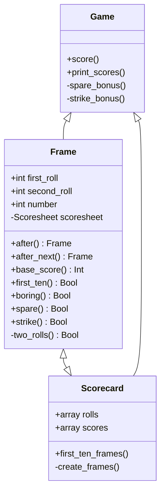

```mermaid 
 classDiagram
      class Frame{
          +int first_roll
          +int second_roll
          +int number
          -Scoresheet scoresheet
          
          +after() Frame
          +after_next() Frame
          +base_score() Int
          +first_ten() Bool
          +boring() Bool
          +spare() Bool
          +strike() Bool

          -two_rolls() Bool
      }

      class Scorecard{
          +array rolls
          +array scores

          +first_ten_frames()
          -create_frames()
      }

      class Game{
        +score()
        +print_scores()
        -spare_bonus()
        -strike_bonus()
      }

      Frame <|--|> Scorecard
      Game <|-- Frame
      Game <|-- Scorecard
```
