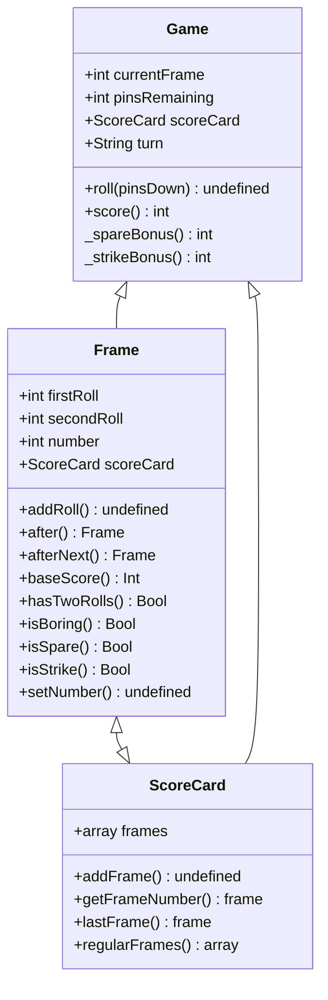

```mermaid 
 classDiagram
      class Frame{
          +int firstRoll
          +int secondRoll
          +int number
          +ScoreCard scoreCard
          
          +addRoll() undefined
          +after() Frame
          +afterNext() Frame
          +baseScore() Int
          +hasTwoRolls() Bool
          +isBoring() Bool
          +isSpare() Bool
          +isStrike() Bool
          +setNumber() undefined

      }

      class ScoreCard{
          +array frames

          +addFrame() undefined
          +getFrameNumber() frame
          +lastFrame() frame
          +regularFrames() array
      }

      class Game{
        +int currentFrame
        +int pinsRemaining
        +ScoreCard scoreCard
        +String turn

        +roll(pinsDown) undefined
        +score() int

        _spareBonus() int
        _strikeBonus() int
      }

      Frame <|--|> ScoreCard
      Game <|-- Frame
      Game <|-- ScoreCard
```
