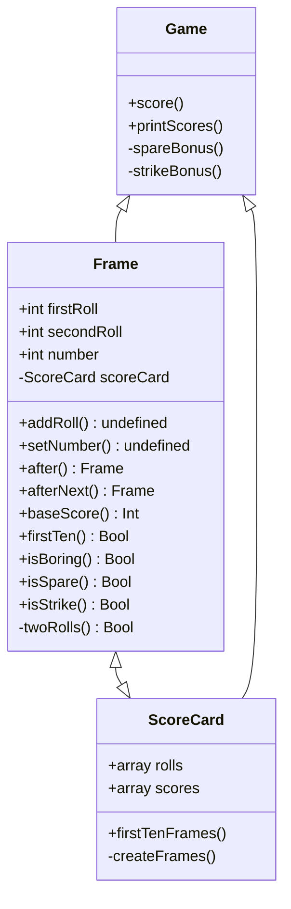

```mermaid 
 classDiagram
      class Frame{
          +int firstRoll
          +int secondRoll
          +int number

          -ScoreCard scoreCard
          
          +addRoll() undefined
          +setNumber() undefined
          +after() Frame
          +afterNext() Frame
          +baseScore() Int
          +firstTen() Bool
          +isBoring() Bool
          +isSpare() Bool
          +isStrike() Bool

          -twoRolls() Bool
      }

      class ScoreCard{
          +array rolls
          +array scores

          +firstTenFrames()

          -createFrames()
      }

      class Game{
        +score()
        +printScores()

        -spareBonus()
        -strikeBonus()
      }

      Frame <|--|> ScoreCard
      Game <|-- Frame
      Game <|-- ScoreCard
```
