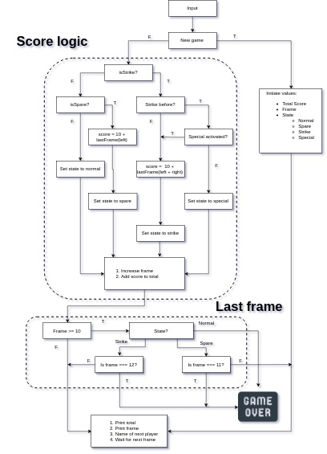

# Javascript Bowling

> This is based off the Makers Academy weeks 5 & 6 weekend challenge.
> 
> The challenge was to build a bowling score counter with an interface.

## Scoring system

The scoring system is based on this flowchart. 

### **Step 1:** Check if a game has already been started

The game checks if a game has already been started.
If not, initializes the values and creates the environment.
It then prints all the values.

### **Step 2:** Check what has happened in the frame

If a game has already been started, it goes to the game logic.
There it checks on what has happened in the frame.
Those include:

Gutter ball (When no pins were hit. An empty frame)

[Open Frame](https://en.wikipedia.org/wiki/Open_frame) (Where less then 10 pins have been knocked down)

[Spare](https://en.wikipedia.org/wiki/Spare_(bowling)) (Where all the pins have been knocked down in **two** rolls)

[Strike](https://en.wikipedia.org/wiki/Strike_(bowling)) (Where all the pins have been knocked down in **one** roll)

Double strike/Barney Rubble (When there are 2 strikes in a row)

Triple strike/Turkey (When there are 3 strikes in a row).
**This should not be mistaken for the actual sport of [Turkey bowling](https://en.wikipedia.org/wiki/Turkey_bowling)**

The terms for all the consequent strikes in a row can be [found here](https://www.thoughtco.com/strings-of-strikes-4147592)

### **Step 3:** Check if the last frame

There are some special rules where the last frame is involved.
- If an `Open Frame` is rolled, the game ends.
- If a `Spare` is rolled, you get one extra roll to finish the game.
- If a `Strike` is rolled, you get 2 extra rolls.
- If a `Spare or a Strike` is rolled within the extra roll(s), the game is not extended. Those totals will only be added to your overall score.

### **Step 4:** Display values

If the game is still in play, the values will be displayed at this point.
The include:

- The current `Frame`
- The frame values in numbers or with a `Spare` being represented with a **' /  '** and a `Strike` being represented with a **' X '**
- The players names and who is due to go next

### **Step 5:** Game over

If the last frame conditions are met the game will end. 
Totals will be displayed with ranking system for gloating purposes.
