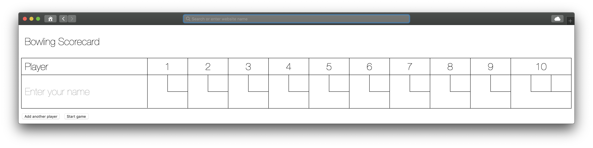
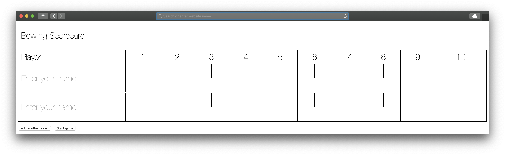
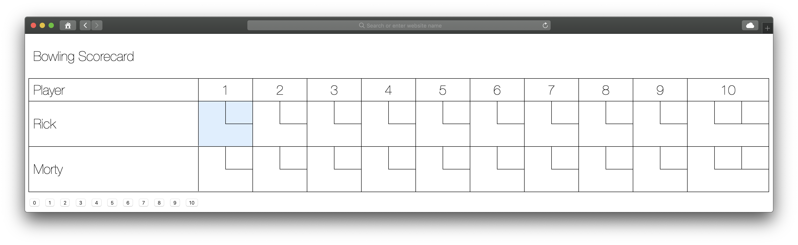

# Bowling Challenge

Makers Week 5 (Friday) - This project is a web app to count and sum the scores of a bowling game using JavaScript.
Initially for one player, extended to allow for any number of players.

## Getting started

In the location of your choice, in Terminal:

`git clone git@github.com:alittlecross/bowling-scorecard-challenge.git`

`cd` into the `bowling-scorecard-challenge` folder.

In that location, in Terminal:

`open src/index.html`

You should see this page:

Clicking `Add another player` will append an additional line to the scorecard:

The player(s) enters their name beside each scorecard line.

Clicking `Start game` will highlight whose turn it is to throw:

Click the numbered buttons to record the number of pins knocked down.

### Testing

In that same location, in Terminal:

`open SpecRunner.html`

## Linting

Assuming you have Node.js and NPM installed, in that same location, in Terminal:

`npm install`

In that same location, in Terminal:

`./node_modules/.bin/eslint src`

## Bowling rules taken from Makers bowling-challenge readme.md

### Strikes

The player has a strike if he knocks down all 10 pins with the first roll in a frame. The frame ends immediately (since there are no pins left for a second roll). The bonus for that frame is the number of pins knocked down by the next two rolls. That would be the next frame, unless the player rolls another strike.

### Spares

The player has a spare if the knocks down all 10 pins with the two rolls of a frame. The bonus for that frame is the number of pins knocked down by the next roll (first roll of next frame).

### 10th frame

If the player rolls a strike or spare in the 10th frame they can roll the additional balls for the bonus. But they can never roll more than 3 balls in the 10th frame. The additional rolls only count for the bonus not for the regular frame count.

    10, 10, 10 in the 10th frame gives 30 points (10 points for the regular first strike and 20 points for the bonus).
    1, 9, 10 in the 10th frame gives 20 points (10 points for the regular spare and 10 points for the bonus).

### Gutter Game

A Gutter Game is when the player never hits a pin (20 zero scores).

### Perfect Game

A Perfect Game is when the player rolls 12 strikes (10 regular strikes and 2 strikes for the bonus in the 10th frame). The Perfect Game scores 300 points.
