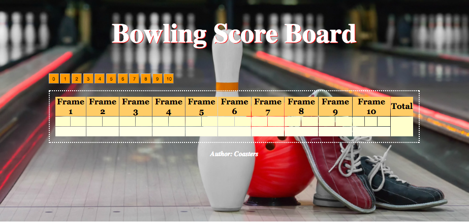

Bowling Challenge
=================

<p align="center">
  
</p>


### How to use

Heroku: https://bowling-score-board.herokuapp.com/

To run locally:
```
- clone the repo https://github.com/ckiteou/bowling-challenge
- cd bowling-challenge  
- rackup
- localhost 9292
- count & total scores for your bowling game!
```
### To run the tests
```
- open SpecRunner.html
```
### Technologies
- JavaScript (ES5)
- [Jasmine](https://jasmine.github.io/)
- [JQuery](https://jquery.com/)

### Authors ####
- Costas Kiteou, **Makers Academy Student** - _July, 2017 Cohort_

### Acknowledgements ####
- My beautiful wife who helped with styling...and made me coffee
