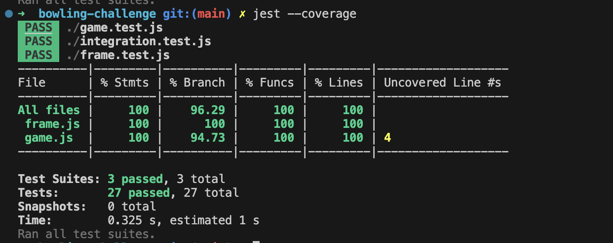
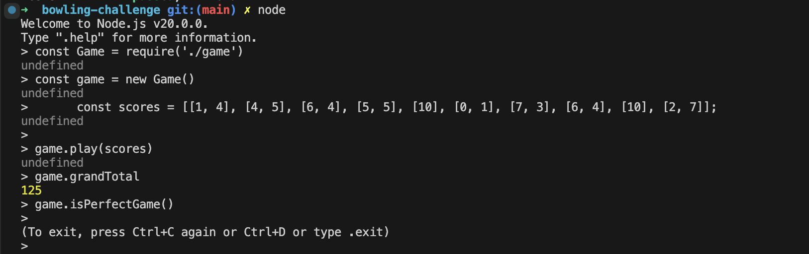

# Makers Academy Bowling Challenge (Javascript)

A weekend challenge as part of the Makers Academy bootcamp, undertaken in Javascript after [attempting the same problem in Ruby](https://github.com/tomcarmichael/bowling-challenge-ruby.git) first.

## The Task

The brief was defined in the README of the [Makers Academy repo](https://github.com/makersacademy/bowling-challenge) that I forked to begin this challenge. 

Key points:

>**THIS IS NOT A BOWLING GAME, IT IS A BOWLING SCORECARD. DO NOT GENERATE RANDOM ROLLS. AN ACTUAL USER INTERFACE IS OPTIONAL**

>Count and sum the scores of a bowling game for one player (in JavaScript). 

>More about ten pin bowling here: http://en.wikipedia.org/wiki/Ten-pin_bowling

## Getting started

`git clone https://github.com/tomcarmichael/bowling-challenge.git`

Install dependencies: `npm install`

## Usage

The program is designed to be used in the context of the Node REPL, having been created solely as a learning exercise.

In the terminal, run:

`node` 

`const Game = require('./game')`

`const game = new Game()`

Define a 2D array of valid scores for a bowling game (each frame is an array) e.g.

`const scores = [[1, 4], [4, 5], [6, 4], [5, 5], [10], [0, 1], [7, 3], [6, 4], [10], [2, 7]]`

`game.play(scores)`

See the total score for the game:

`game.grandTotal`

Check if the game is a perfect game or gutter game:

`game.isGutterGame()` , `game.isPerfectGame()`

## Running Tests

`jest`

## Reflections

This challenge was completed after one week of learning Javascript, following on from completing [the same challenge in Ruby](https://github.com/tomcarmichael/bowling-challenge-ruby). Although I did not implement a UI via the command line in this Javascript version, I tried to design and write the program in a way that would make it easily extendable for such a feature. A key goal for me was to write the program in such a way that scores were updated as soon as possible, during the game (as they would be in a bowling alley) something made more complex by the rules around bonus points for strikes and spares which are based on the scores in the subsequent frames. In the Ruby version of the challenge, scores were calculated at the end of the game only, and the user interface code was not sufficiently separated from the rest of the game logic. In this version of the program, I feel I was able to improve on both of those problems.
