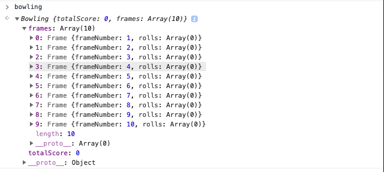
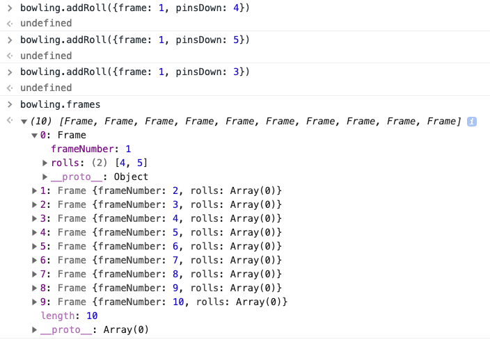
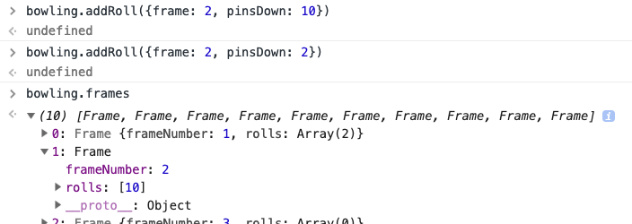

# Bowling Challenge

_My solution is the subdirectory /Bowling. Original challenge README [here](./challenge.md)._

## Getting started

Tests may be run as follows:

```sh
git clone git@github.com:dafuloth/bowling-challenge.git
cd bowling-challenge/Bowling
open SpecRunner.html
```

## Usage

### Creating a new Bowling Scorecard

```javascript
var bowling = new Bowling()
```



### Add roll to Bowling Scorecard

#### Adding a normal roll

```javascript
bowling.addRoll({frame: 1, pinsDown: 4})
bowling.addRoll({frame: 1, pinsDown: 5})
// frame complete, further rolls ignored:
bowling.addRoll({frame: 1, pinsDown: 3})  
```



#### Adding a Strike

```javascript
bowling.addRoll({frame: 1, pinsDown: 10}) // this is a Strike

// frame complete, further rolls ignored:
bowling.addRoll({frame: 1, pinsDown: 2})  
```


