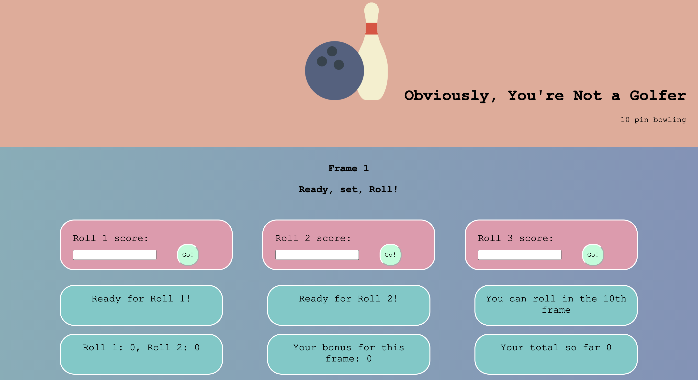

Bowling Challenge
=================
  

BOWLING SCORECARD PROGRAM

Count and sum the scores of a bowling game for one player.

A bowling game consists of 10 frames in which the player tries to knock down the 10 pins.
In every frame the player can roll one or two times. The actual number depends on strikes and spares. The score of a frame is the number of knocked down pins plus bonuses for strikes and spares. After every frame the 10 pins are reset.

---
## Bowling rules

### Strikes

The player has a strike if he knocks down all 10 pins with the first roll in a frame. The frame ends immediately (since there are no pins left for a second roll). The bonus for that frame is the number of pins knocked down by the next two rolls. That would be the next frame, unless the player rolls another strike.

### Spares

The player has a spare if the knocks down all 10 pins with the two rolls of a frame. The bonus for that frame is the number of pins knocked down by the next roll (first roll of next frame).

### 10th frame

If the player rolls a strike or spare in the 10th frame they can roll the additional balls for the bonus. But they can never roll more than 3 balls in the 10th frame. The additional rolls only count for the bonus not for the regular frame count.

    10, 10, 10 in the 10th frame gives 30 points (10 points for the regular first strike and 20 points for the bonus).
    1, 9, 10 in the 10th frame gives 20 points (10 points for the regular spare and 10 points for the bonus).

### Gutter Game

A Gutter Game is when the player never hits a pin (20 zero scores).

### Perfect Game

A Perfect Game is when the player rolls 12 strikes (10 regular strikes and 2 strikes for the bonus in the 10th frame). The Perfect Game scores 300 points.

---

### modelling

|     class      |   constructor                          |   function                                   |
|----------------|----------------------------------------|----------------------------------------------|
|  BowlingGame   |  this.current_frame = 1                | roll1(playersScore)                          |
|                |  this.strike = false                   | roll2(playersScore)                          |
|                |  this.spare = false                    | roll3(playersScore)                          |
|                |  this.newScorecard = new Scorecard()   | roll2(players_score)                         |
|                |                                        | nextFrame                                    |
|                |                                        | updateRoll1Score(playersScore)               |
|                |                                        | updateRoll2Score(playersScore)               |
|                |                                        | updateRoll3Score(playersScore)               |
|                |                                        | updateBonus(playersScore)                    |
|                |                                        | updateScorecard                              |
|                |                                        | viewScorecard                                |
|                |                                        | endOfGame                                    |
|  Scorecard     |   this.scorecard = []                  | updateBonus(playersScore)                    |
|                |   this.roll1Score = 0                  | updateScorecard(currentFrame, strike, spare) |
|                |   this.roll2Score = 0                  | runningTotal(currentFrame)                   |
|                |   this.roll3Score = nil                |                                              |
|                |   this.bonusScore = 0                  |                                              |
|                |   this.totalGameScore = 0              |                                              |

----
### To-do:
[ ] total score is printing weird stuff??  
[ ] bonus score not updating  
[ ] spare message not printing  
[ ] print scores for previous frames  
[ ] roll 2 cannot be played if roll 1 is a strike  
[ ] logic of more than one strike in a row  
[ ] roll 2 can be any number between 0-10, needs logic for the sum of roll1 and 2 to equal 10  
[ ] reset functionality to start a new game and reset scorecard  
[ ] rolls cannot be minus  

### Optional Extras

In any order you like:  
  
[x] Create a nice interactive animated interface with jQuery.  
[?] Set up [Travis CI](https://travis-ci.org) to run your tests.    
[?] Add [ESLint](http://eslint.org/) to your codebase and make your code conform.    
(Used Stu's guides for Travis and ESlint: https://github.com/StuBehan/npm-eslint-jasmine-guide)  

### UI
[x] add roll1 score (a number between 0-10)  
[x] add roll2 score (a number between 0-10)  
[x] add roll3 score (a number between 0-10)  
[x] display frame number  
[ ] displays for roll scores  
[x] display for score totals  
[x] display for bonus totals  
[ ] full scorecard  

---
#### console.log testing

let newGame = new BowlingGame();  
// game 1
console.log(newGame.roll1(3));
console.log(newGame.roll2(4));  
// game 2
console.log(newGame.roll1(10));  
// game 3
console.log(newGame.roll1(2));
console.log(newGame.roll2(5));  
// game 4
console.log(newGame.roll1(3));
console.log(newGame.roll2(4));
console.log(newGame.roll3(4));  
// game 5
console.log(newGame.roll1(10));  
// game 6
console.log(newGame.roll1(7));
console.log(newGame.roll2(1));  
// game 7
console.log(newGame.roll1(3));
console.log(newGame.roll2(7));  
// game 8
console.log(newGame.roll1(1));
console.log(newGame.roll2(8));  
// game 9
console.log(newGame.roll1(5));
console.log(newGame.roll2(2));
console.log(newGame.newScorecard.roll3Score); // game 10
console.log(newGame.roll1(10));
console.log(newGame.roll2(3));
console.log(newGame.roll3(4));  

console.log(newGame.newScorecard.roll3Score);
console.log(newGame.view_scorecard());
