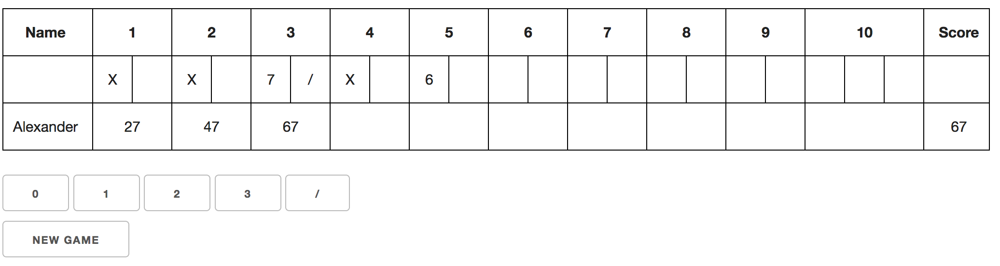

Bowling Challenge
=================

```

```

An interactive bowling scorecard written in Javascript.

## Installation:

`git clone git@github.com:adc17/bowling-challenge.git`

## Usage:

Option 1: Visit the app [here](https://adc17.github.io/bowling-challenge/).

Option 2: Open `index.html` in your preferred web browser.

## Challenges:

1. Simplicity: I overcomplicated my code by looking too far ahead regarding functionality. I plan to address this next week by taking the simplest steps possible at any given time, erring on the side of being deliberately obstructive, and trusting that good design principles are enough to keep my code extensible.

2. Tests: I wasn't always clear on the right things to test for, or how to test for them, and I found that my tests didn't always keep me safe from bugs. This was perhaps due to a need for a mishmash of feature and unit testing in my unit tests, (I don't know enough about Karma to write proper feature tests). It is definitely an area where I can improve.

3. Updating scorecard using jQuery. There is a point in my code where this happens:

   ```javascript
     var updateScorecard = function() {
       $('#box1').text(game.frame1.box1());
       $('#box2').text(game.frame1.box2());
       $('#box3').text(game.frame2.box1());
       etc.
   ```

   There must be a better way.

4. No separate constructor for 10th frames. I couldn't figure out inheritance in ES5, which meant I couldn't create custom 10th frame objects. Instead I wrote two hacky frame methods to handle frame 10 box rendering and some hacky jQuery to handle frame 10 button behaviour. They ended up constituting almost all of my code smells, so I want to learn more about handling this type of scenario in Javascript. 

## Strengths:

1. Functionality: I'm pleased with how much my project does. The buttons change to reflect the possible outcomes for any given roll, and the table displays all information as it becomes available. The information displayed is complete—individual rolls are shown as well as scores.
2. Domain model: I've handled bonus rolls by building three rolls into each frame, which adds the complexity of processing a single roll in multiple frames, but means that frames do not need to know about each other. I'm very happy with this trade-off.
3. Refactoring: The advantage of overcomplicating at first was that I got to practice refactoring, and excepting the problems mentioned above, I'm pleased with how much I managed to improve my code.

## Technologies:

* ES5
* JQuery
* Skeleton.css

## Tests:

Open `SpecRunner.html` in your preferred web browser.

## Help Received:

I got the idea of building the scorecard with a `<table>` and `colspan` attributes from a fellow student. But the jQuery I used to render the table was my own work.

## Other Notes:

A four day solo challenge during the [Makers Academy](http://www.makersacademy.com) Bootcamp.
