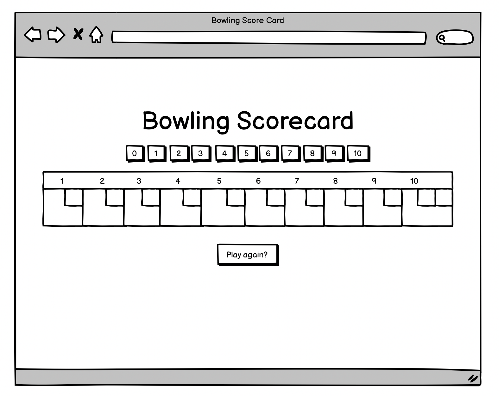

Bowling Scorecard in Javascript
================================

**THIS IS NOT A BOWLING GAME, IT IS A BOWLING SCORECARD. THE USER INPUTS THE ROLLS.**

Count and sum the scores of a bowling game for one player (in JavaScript).

A bowling game consists of 10 frames in which the player tries to knock down the 10 pins. In every frame the player can roll one or two times. The actual number depends on strikes and spares. The score of a frame is the number of knocked down pins plus bonuses for strikes and spares. After every frame the 10 pins are reset.

## Implementation

- A class called BowlingGame
- A constructor array - `rolls`  
- Methods: `roll` & `totalScore`
- `roll` will be called at the correct number of times to complete a game.
- `totalScore` will be called at the end of the game and should return the correct score.

## Test examples

- Can return the score when 10 frames of gutter rolls are bowled:  
`[0,0] --> Bowling.totalScore --> 0`

- Can return the score when score 10 frames of 4s are bowled:  
`[4,4] --> Bowling.totalScore --> 80`

- Can return the score when a spare is bowled followed by 9 frames of 4s:  
`[5,5], 9 x [4,4] --> Bowling.totalScore --> 86`

- Can return the score when score 2 spares are bowled followed by 9 frames of 4s:  
`[5,5], [4,6], 8 x [4,4] --> Bowling.totalScore --> 92`

- Can return the score when a strike is bowled followed by 9 frames of 4s:  
`[10,-], 9 x [4,4] --> Bowling.totalScore --> 90`

- Can return the score when 2 strikes are bowled followed by 8 frames of 4s:  
`[10,-],[10,-], 8 x [4,4] --> Bowling.totalScore --> 106`

- Can return the score when a spare is bowled in the 10th frame:  
`9 x [7,7], [5,5,1] --> Bowling.totalScore --> 137`
 
- Can return the score when a strike is bowled in the 10th frame:  
`9 x [7,7], [10,1,1] --> Bowling.totalScore --> 138`

- Can return the score when 2 strikes are bowled in the 10th frame:  
`9 x [7,7], [10,10,1] --> Bowling.totalScore --> 147`

- Can score a perfect game:  
`10 x [10,-], 2 x [10,-] --> Bowling.totalScore --> 300`

## Planning the interface

## Bowling — The rules

### Strikes

The player has a strike if he knocks down all 10 pins with the first roll in a frame. The frame ends immediately (since there are no pins left for a second roll). The bonus for that frame is the number of pins knocked down by the next two rolls. That would be the next frame, unless the player rolls another strike.

### Spares

The player has a spare if the knocks down all 10 pins with the two rolls of a frame. The bonus for that frame is the number of pins knocked down by the next roll (first roll of next frame).

### 10th frame

If the player rolls a strike or spare in the 10th frame they can roll the additional balls for the bonus. But they can never roll more than 3 balls in the 10th frame. The additional rolls only count for the bonus not for the regular frame count.

    10, 10, 10 in the 10th frame gives 30 points (10 points for the regular first strike and 20 points for the bonus).
    1, 9, 10 in the 10th frame gives 20 points (10 points for the regular spare and 10 points for the bonus).

### Gutter Game

A Gutter Game is when the player never hits a pin (20 zero scores).

### Perfect Game

A Perfect Game is when the player rolls 12 strikes (10 regular strikes and 2 strikes for the bonus in the 10th frame). The Perfect Game scores 300 points.

In the image below you can find some score examples.

More about ten pin bowling here: http://en.wikipedia.org/wiki/Ten-pin_bowling

