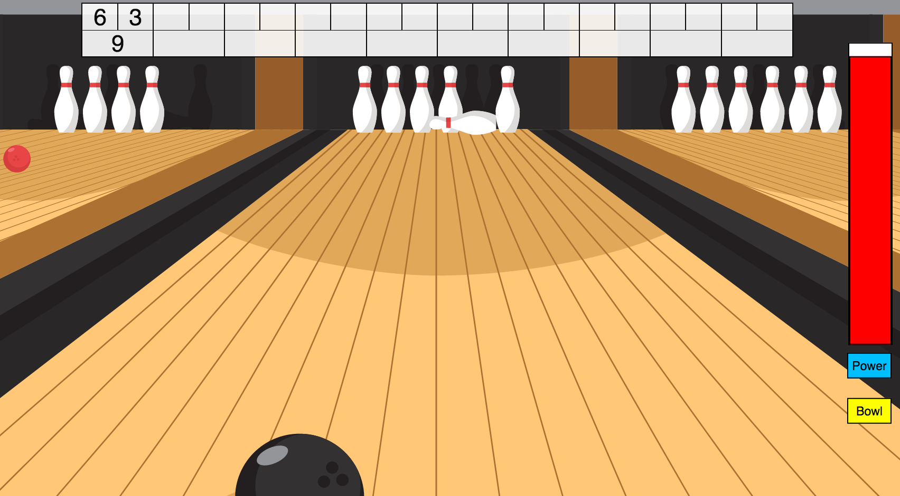

# Bowling Challenge

[](https://travis-ci.org/treborb/bowling-challenge)
[](https://codecov.io/gh/treborb/bowling-challenge)

## [Makers Academy](http://www.makersacademy.com) - Week 5/6 - Solo Weekend Challenge

## Technologies
* [Javascript ES5](https://www.javascript.com/)
* [jQuery v3.1.1](http://www.sinatrarb.com/)
* [Jasmine v2.5.3](https://jasmine.github.io/)
* [Node Static](https://www.npmjs.com/package/node-static)
* [Grunt](https://gruntjs.com/)
* [NPM](https://www.npmjs.com/)

## Jump To
* [User Stories](#user-stories)
* [Game Rules](#rules)
* [Installation](#install)
* [Usage](#usage)
* [Tests](#tests)
* [Heroku Demo](https://treborb-bowling.herokuapp.com/)
* [Screenshots](#screenshots)

## The Brief

Create a ten-pin bowling game in Javascript, with complete functionality and adherence to the rules and scoring of ten-pin bowling for one player.

A bowling game consists of 10 frames in which the player tries to knock down the 10 pins. In every frame the player can roll one or two times. The actual number depends on strikes and spares. The score of a frame is the number of knocked down pins plus bonuses for strikes and spares. After every frame the 10 pins are reset.

## <a name="rules">Game Rules</a>

#### Strikes

The player has a strike if he knocks down all 10 pins with the first roll in a frame. The frame ends immediately (since there are no pins left for a second roll). The bonus for that frame is the number of pins knocked down by the next two rolls. That would be the next frame, unless the player rolls another strike.

#### Spares

The player has a spare if the knocks down all 10 pins with the two rolls of a frame. The bonus for that frame is the number of pins knocked down by the next roll (first roll of next frame).

#### 10th frame

If the player rolls a strike or spare in the 10th frame they can roll the additional balls for the bonus. But they can never roll more than 3 balls in the 10th frame. The additional rolls only count for the bonus not for the regular frame count.

    10, 10, 10 in the 10th frame gives 30 points (10 points for the regular first strike and 20 points for the bonus).
    1, 9, 10 in the 10th frame gives 20 points (10 points for the regular spare and 10 points for the bonus).

#### Gutter Game

A Gutter Game is when the player never hits a pin (20 zero scores).

#### Perfect Game

A Perfect Game is when the player rolls 12 strikes (10 regular strikes and 2 strikes for the bonus in the 10th frame). The Perfect Game scores 300 points.

#### Optional Extra

Create a nice interactive animated interface with jQuery.

More about ten pin bowling here: [Wikipedia](http://en.wikipedia.org/wiki/Ten-pin_bowling)

___

## <a name="install">Installation</a>

```
$ git clone https://github.com/treborb/bowling-challenge.git
$ cd bowling-challenge
```

## <a name="usage">Usage</a>

```
$ open SpecRunner.html
```

From there, you can open the Chrome developer tools console and run the following example commands to play:

```javascript
game = new Game;
game.start;
game.bowl(n);   // where n is the number of pins to be knocked down
```

### For a more realistic experience, play the game in the browser using jQuery:

```
$ open index.html
```

OR

```
$ npm start
$ open http://localhost:3000
```

Click the "Start" button to start the power bar.

Try to let the power bar get as close to the top as you can and then click the "Bowl" button.

On the first roll of a frame, if you stop the power bar at the top, you'll knock ten pins down. The bottom of the power bar is zero pins.

On the second roll of a frame, if you stop the power bar at the top, you'll knock down all of the remaining pins. The bottom of the power bar is zero pins.

The scoreboard updates as you go along.

See if you can get score perfect game!

## <a name="tests">Running the tests</a>

There are two ways to run the tests, the first relies on having [NPM (Node Package Manager)](https://www.npmjs.com/) and [Grunt](https://gruntjs.com/) installed:

```sh
$ npm update
$ grunt jasmine
```

Or to run the tests in the web browser:

```sh
$ open SpecRunner.html
```

## <a name="screenshots">Screenshots</a>


