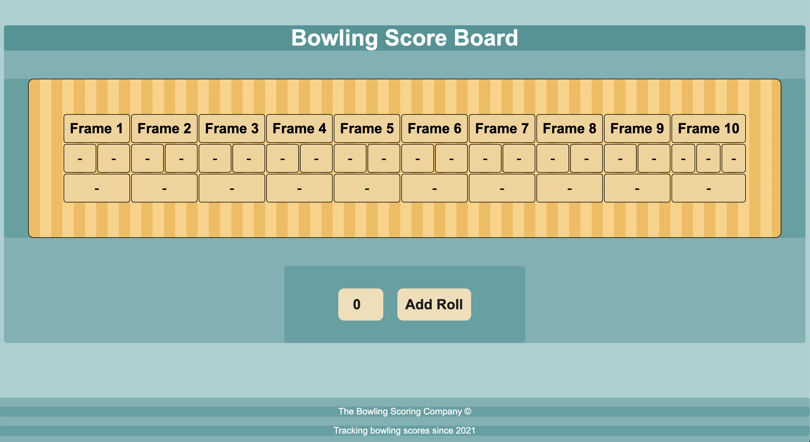

Bowling Challenge 🎳
====================

[](https://travis-ci.com/AJ8GH/bowling-challenge) [](https://coveralls.io/github/AJ8GH/bowling-challenge?branch=master) [](https://codeclimate.com/github/AJ8GH/bowling-challenge/maintainability) 

Bowling score tracker written in JavaScript



## Dependencies
- `"coveralls": "^3.1.0"`
- `"eslint": "^7.21.0"`
- `"eslint-config-airbnb-base": "^14.2.1"`
- `"eslint-plugin-import": "^2.22.1"`
- `"jasmine": "^3.6.4"`
- `"karma": "^6.2.0"`
- `"karma-chrome-launcher": "^3.1.0"`
- `"karma-cli": "^2.0.0"`
- `"karma-coverage": "^2.0.3"`
- `"karma-coveralls": "^2.1.0"`
- `"karma-jasmine": "^4.0.1"`
- `"nyc": "^15.1.0"`

## Getting Started

### Start by cloning this repository

```shell
git clone git@github.com:AJ8GH/bowling-challenge.git
```

### Install dependencies

```shell
npm install
```

### Runnning tests:

```shell
npm test
```

Or open `public/js/spec/SpecRunner.html` in your browser

## Usage

Open `public/index.html` in your browser

Input your rolls one at a time and let the logic take care of the rest!


***A perfect Game. Impressive stuff.***

## Approach and Design

The scoreboard is fully automated. All that is required from the user is to input their rolls one at a time and the program handles the, scoring, bonuses and final frame logic. User can see their running total displayed on the scoreboard and their final score is announced when the game is over.

### Classes

#### Game class:
- Knows how many frames it has
- Understands how to create and store frames
- Knows when it reaches the final frame
- Knows when it is over
- Knows its score

#### Frame class:
- Knows how many rolls it has
- Knows when it is over
- Knows how many bonuses it needs
- Knows its score
- Can be made final by Game

### Interface:
- Built using js and jQuery
- Responsible for updating the view after each roll input

### Guard Conditions:
- Input of invalid rolls is prevented:
  - non-numbers
  - null rolls
  - rolls > 10 or < 0
  - rolls > the remaining pins of the frame

## Skills applied

- Building a full stack web application using only javascript ✅
- Using jQuery to create a responsive interface ✅
- Using Karma and ChromeHeadless to implement CI with Travis - Build passing ✅
- Using Karma, nyc and Coveralls to automate test coverage reports - 96% < coverage ✅
- Translating specifications into user stories ✅
- Domain modelling and sequence diagrams ✅
- Styling with HTML and CSS ✅
- Linting - applying standard JS style with eslint ✅


***Gutter game. Ouch...***

## Planning

### Sequence Diagrams

#### Spare Bonus


#### Strike Bonus


### User Stories
```
As a bowler,
So that I can track my score while I play,
I want to be able to record a score from 1 roll.

As a bowler,
So that I can track my total score easily throughout a game,
I want my scores to automatically accumlate as I enter them.

As a bowler,
So that my score is accurate and my experience is enjoyable,
I want my bonuses to be added to frames automatically.

As a bowler,
So that I can get extra points,
I want the final frame to allow a bonus roll if I get a spare.

As a bowler,
So that I can bowl a perfect game,
I want the final frame to allow 2 bonus rolls if I get a strike.

As a bowler,
So that my game flows and I can focus on the bowling,
I want the game to automatically register when it is the final frame.
```
