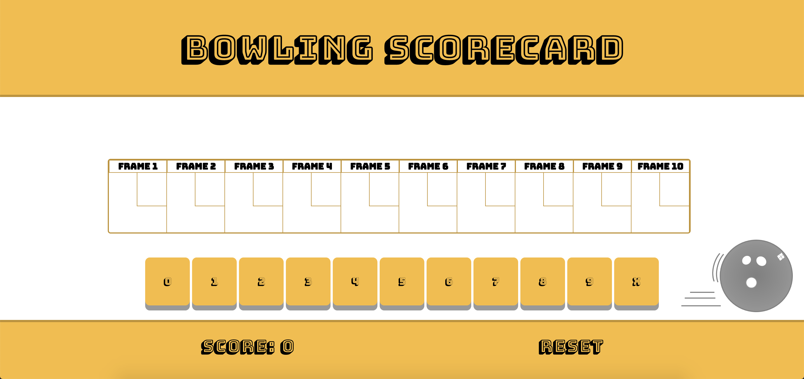
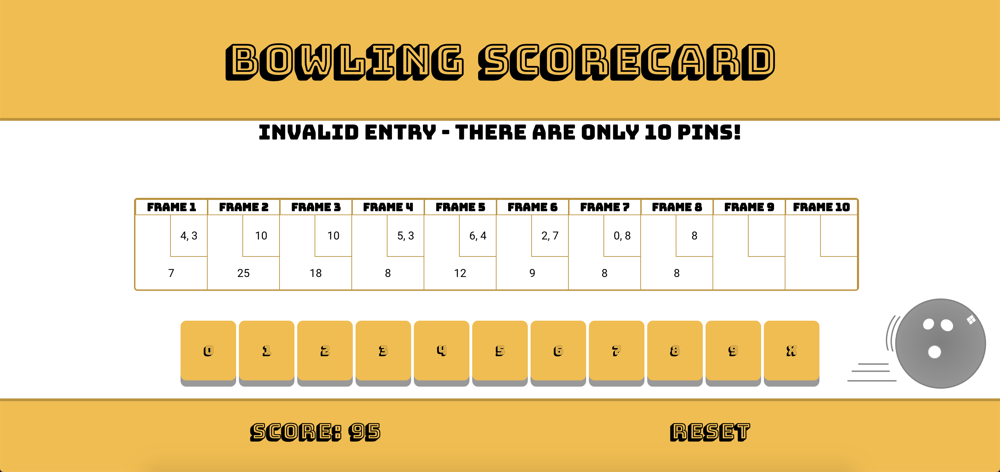
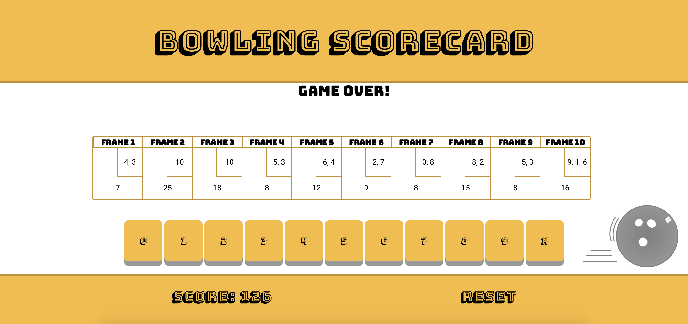

Bowling Challenge!
=================

This is a fully-functioning bowling scorecard, built using JavaScript, JQuery, HTML/CSS, and Jasmine. It is a single-page web app with a user-friendly interface. This challenge was completed during weekends 5 and 6 of Makers Academy.

### My approach
I created three types of objects for my app: `Game`, which keeps track of the total score and the current frame; `Frame`, which keeps an individual score and calculates its own bonuses for strikes and spares; and `FinalFrame`, which inherits from `Frame` and has different scoring rules. I used JQuery for the interface between UI and JavaScript, and Jasmine for testing.

### Screenshots

Here is the plain UI, pictured here as it is appears when loaded:

The user inputs their bowl scores using the 10 buttons towards the bottom of the app:

No more than 10 pins can be inputted for each frame (apart from the final frame):

The user cannot continue inputting scores after the game is finished:

The game can be reset by using the `RESET` button at the bottom of the app.

### Using the app
- Clone the repository
- `open SpecRunner.html` to run the tests
- `open scorecard.html` to open the app
- Input bowl scores using the 10 score buttons
- Click the `RESET` button to start a new game.
