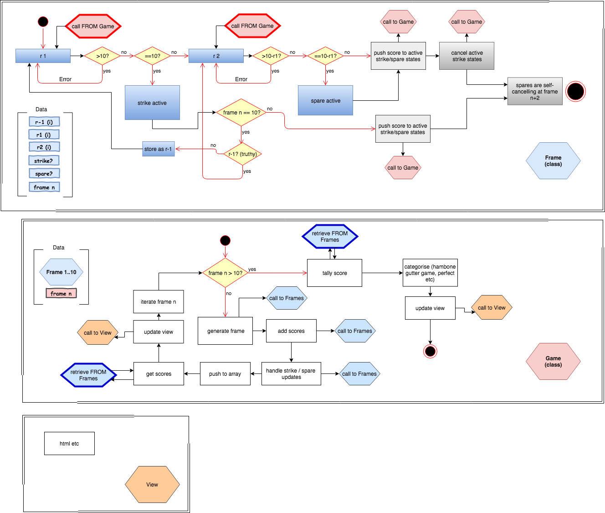

**INTRODUCTION**

This is a simple, single page app for calculating the scores of a game of
10 pin bowling.

**TECH**

This is a javascript app served using node.js, express and nodemon, with ejs used for rendering.
Unit testing was done with jasmine, and feature testing with zombie and mocha. NPM is used for bundling.
Web interface has been tested with the Chrome browser (Version 65.0.3325.181).

**CONTENTS**

| dir: public | logic |
|--|
| frame.js | logic for individual bowling frame |
| game.js | logic for bowling game |
| interface.js | logic for running web interface |

| dir: spec | jasmine test suites - unit & integration |
|--|
| frameSpec.js | jasmine unit test suite for frame.js |
| gameSpec.js | jasmine unit test suite for game.js |
| gameFrameIntegrationSpec.js | jasmine integration test for game.js and frame.js |

| dir: test | mocha / zombie test suites - feature |
|--|
| interfaceSpec.js | basic web interface feature tests |
| normalGameSpec.js | feature test for complete standard bowling game |
| perfectGameSpec.js | feature test for perfect bowling game |
| gutterGameSpec.js | feature test for gutter bowling game |

| dir: views | ejs pages |
|--|
| bowling.ejs | ejs page for web interface |

| dir: main | misc. |
|--|
| app.js | main app controller file |
| package.json | dependencies list for npm |
| README.md | You are reading it! |
| SpecRunner.html | display page for Jasmine tests |

**GETTING STARTED**

Clone or download the repository to a local directory, and then run **npm install** from a
console in the root folder to install all necessary dependencies.

**INSTRUCTIONS FOR USE**

To boot the app, run **npx nodemon app.js** from a console in the root folder.
Open a web browser and navitage to http://localhost:4567/bowling. You should see
a page with **Welcome to Bowling!** displayed. Click on the **Start new game**
button to score a new bowling game.

To add the score for each roll, simply select the value from the drop-down menu
(immediately below the **Start new game** button), then click on **Add roll**.
The score will be added to both the total score (shown as **Total Score:**
and to the appropriate frame. Frames are drawn below the total score display,
and are added and updated automatically.

Specials (strikes and spares) are handled automatically, simple add the scores
they represent (i.e 10 for a strike) using the drop-down menu and add roll button.
Bonus scores relating to strikes and spares are added to frames automatically,
as appropriate. After ten frames (plus one bonus roll if the first roll of the final
frame was a strike!), the game will be over.

To start a new game (at any point), click **Start new game**, and the game will
be reset.

**TESTING**

The core logic of the app is a game object that contains and interacts with frame
objects. Unit tests for the frame and game logic, and integration tests for the game and
frame together, we written using the Jasmine testing framework. To run the unit and
integration tests, open the **SpecRunner.html** in a web browser.

The feature tests for the web interface were written using Mocha (test framework)
and Zombie (headless browser plus test framework). To run these tests, enter
**npm test** from a console in the root folder of the app.

**// ==================== DEVELOPMENT ==================== //**

**MODELLING**

**CHALLENGE INSTRUCTIONS**

Bowling Challenge
=================

* Challenge time: rest of the day and weekend.
* Feel free to use google, your notes, books, etc. but work on your own
* If you refer to the solution of another coach or student, please put a link to that in your README
* If you have a partial solution, **still check in a partial solution**
* You must submit a pull request to this repo with your code by 9am Monday week

## The Task

Count and sum the scores of a bowling game for one player (in JavaScript).

A bowling game consists of 10 frames in which the player tries to knock down the 10 pins. In every frame the player can roll one or two times. The actual number depends on strikes and spares. The score of a frame is the number of knocked down pins plus bonuses for strikes and spares. After every frame the 10 pins are reset.

As usual please start by

* Forking this repo

* Finally submit a pull request before Monday week at 9am with your solution or partial solution.  However much or little amount of code you wrote please please please submit a pull request before Monday week at 9am.  And since next week is lab week you have a full extra week to work on this.

___STRONG HINT, IGNORE AT YOUR PERIL:___ Bowling is a deceptively complex game. Careful thought and thorough diagramming — both before and throughout — will save you literal hours of your life.

Also, don't generate random rolls. Trust us on this one.

### Optional Extras

In any order you like:

* Create a nice interactive animated interface with jQuery.
* Set up [Travis CI](https://travis-ci.org) to run your tests.
* Add [ESLint](http://eslint.org/) to your codebase and make your code conform.

You might even want to start with ESLint early on in your work — to help you
learn Javascript conventions as you go along.

## Bowling — how does it work?

### Strikes

The player has a strike if he knocks down all 10 pins with the first roll in a frame. The frame ends immediately (since there are no pins left for a second roll). The bonus for that frame is the number of pins knocked down by the next two rolls. That would be the next frame, unless the player rolls another strike.

### Spares

The player has a spare if the knocks down all 10 pins with the two rolls of a frame. The bonus for that frame is the number of pins knocked down by the next roll (first roll of next frame).

### 10th frame

If the player rolls a strike or spare in the 10th frame they can roll the additional balls for the bonus. But they can never roll more than 3 balls in the 10th frame. The additional rolls only count for the bonus not for the regular frame count.

    10, 10, 10 in the 10th frame gives 30 points (10 points for the regular first strike and 20 points for the bonus).
    1, 9, 10 in the 10th frame gives 20 points (10 points for the regular spare and 10 points for the bonus).

### Gutter Game

A Gutter Game is when the player never hits a pin (20 zero scores).

### Perfect Game

A Perfect Game is when the player rolls 12 strikes (10 regular strikes and 2 strikes for the bonus in the 10th frame). The Perfect Game scores 300 points.

In the image below you can find some score examples.

More about ten pin bowling here: http://en.wikipedia.org/wiki/Ten-pin_bowling

## Code Review

In code review we'll be hoping to see:

* All tests passing
* The code is elegant: every class has a clear responsibility, methods are short etc.

Reviewers will potentially be using this [code review rubric](docs/review.md).  Note that referring to this rubric in advance may make the challenge somewhat easier.  You should be the judge of how much challenge you want.
