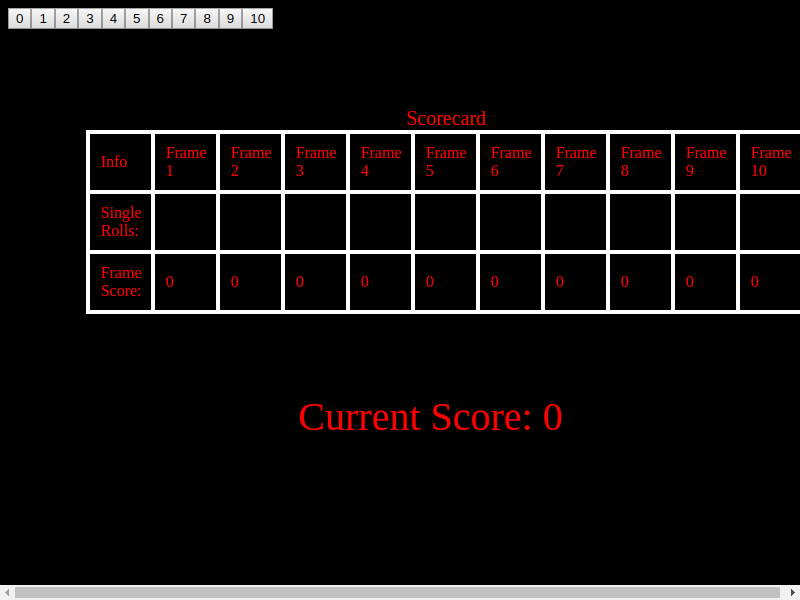

Bowling Challenge
=================


See the deployed project here:- http://phils-bowlingcard.surge.sh/
## The Task

Count and sum the scores of a bowling game for one player (in JavaScript).

A bowling game consists of 10 frames in which the player tries to knock down the 10 pins. In every frame the player can roll one or two times. The actual number depends on strikes and spares. The score of a frame is the number of knocked down pins plus bonuses for strikes and spares. After every frame the 10 pins are reset.

### Optional Extras

In any order you like:

* Create a nice interactive animated interface with jQuery.
* Set up [Travis CI](https://travis-ci.org) to run your tests.
* Add [ESLint](http://eslint.org/) to your codebase and make your code conform.

## Bowling — how does it work?

### Strikes

The player has a strike if he knocks down all 10 pins with the first roll in a frame. The frame ends immediately (since there are no pins left for a second roll). The bonus for that frame is the number of pins knocked down by the next two rolls. That would be the next frame, unless the player rolls another strike.

### Spares

The player has a spare if the knocks down all 10 pins with the two rolls of a frame. The bonus for that frame is the number of pins knocked down by the next roll (first roll of next frame).

### 10th frame

If the player rolls a strike or spare in the 10th frame they can roll the additional balls for the bonus. But they can never roll more than 3 balls in the 10th frame. The additional rolls only count for the bonus not for the regular frame count.

    10, 10, 10 in the 10th frame gives 30 points (10 points for the regular first strike and 20 points for the bonus).
    1, 9, 10 in the 10th frame gives 20 points (10 points for the regular spare and 10 points for the bonus).

### Gutter Game

A Gutter Game is when the player never hits a pin (20 zero scores).

### Perfect Game

A Perfect Game is when the player rolls 12 strikes (10 regular strikes and 2 strikes for the bonus in the 10th frame). The Perfect Game scores 300 points.

# My Approach

## Main technologies used

 * Project language - Javascript
 * Testing - Jasmine
 * CI - Travis
 
 | Purpose | Technology |
 | ----- | ----- |
 | Language | Javascript |
 | Testing | Jasmine |
 | CI | Travis [](https://travis-ci.com/PhilipVigus/bowling-challenge) |
 
## Getting started

```bash
# clone the repository to your local machine with either

# if you're using ssh
git clone git@github.com:PhilipVigus/bowling-challenge.git

# if you're using https
git clone https://github.com/PhilipVigus/bowling-challenge.git

# Dependencies
# The repository requires node, which can be installed with the following commands
brew update
brew install node

# then run npm install from the project root directory
npm install
```

## Using the scorecard

The scorecard can be used simply by opening the project's index.html page.

## Running tests

```bash
# Tests can be run in two ways
# 1. using npm - run the following command
npm run test

# 2. opening the SpecRunner.html file and refreshing the page
```

## Approach

Note - what follows is the approach I took on my second attempt through the challenge. As I will discuss in the challenges section, my first attempt was unsuccessful, partly because it didn't follow the consistent, logical approach set out below.

### User stories

My first task was to convert the brief into user stories

```
As a bowler
So that I can keep track of the game
I want to enter the scores I get as I'm playing

As a bowler
So that I can see how well I am playing
I want the scorecard to update whenever I enter a score

As a bowler
So that I don't make mistakes or have to worry
I want the scorecard to automatically keep the right score

As a bowler
So that I can be entertained while I"m playing
I want the scorecard to highlight special scores like strikes, spares, gutter games and perfect games

As a bowler
So that the scorecard is easy and interesting to read
I want it to be graphically well designed and interesting to look at
```

### Diagramming and score logic

The logic of bowling scoring is far more complex than it initially seems. I spent quite a time roughing out how the logic might work so I could get a sense of how I might start to implement it.

### General project set up

* ESLint - this was straightforward to set up
* Jasmine - I initially made the mistake of setting up the Node version of Jasmine, not realising that this would not work for client-side javascript. Once I realised my mistake it was straightforward to switch to the standalone version for client-side development
* Grunt - I set up Grunt so that I could run tests via the command line using an NPM script. This was partly to make things a little quicker, but also a necessary step for later integration with Travis

### Development

#### 1st and 2nd stories

```
As a bowler
So that I can keep track of the game
I want to enter the scores I get as I'm playing

As a bowler
So that I can see how well I am playing
I want the scorecard to update whenever I enter a score
```

At this stage I kept things as simple as possible, with a barebones interface for entering individual scores, and a string printed to the page to show the state of the game.

#### 3rd user story

```
As a bowler
So that I don't make mistakes or have to worry
I want the scorecard to automatically keep the right score
```

This was where the majority of the work was carried out. The logic and rules for scoring bowling are a lot more complex than they seem, and I spent a great deal of time working out how to break them down into small increments that I could implement with TDD.

As I progressed I realised that there were several issues with my approach to testing:

* The tests I was writing for the main Game function were not unit tests, instead effectively functioning as somewhere between feature and integration tests
* The tests made no attempt to isolate individual functions and instances so that true unit testing could be carried out

I found using spies in Jasmine extremely challenging, and it took me a long time to understand how to use the in conjunction with the dependency injection I had implemented to separate the Game and Frame functions.

Once I had eventually worked out a way of approaching the problem though, I was able to write actual unit tests for the Game function. This required a complete rewrite of the existing tests, and I took the opportunity to move many of them into a feature test folder and keep them.

#### 4th user story

```
As a bowler
So that the scorecard is easy and interesting to read
I want it to be graphically well designed and interesting to look at
```

I decided on a minimal, 'arcade' style interface, which I thought would be quick to implement. However, formatting the scorecard itself with the correct borders and spacing proved much more challenging than I anticipated. I ended up making extensive use of css flex-boxes to make it work, but I feel there is probably a more intuitive approach that I am missing.


#### Refactoring intermission

It was at this point I realised that outside of the main model functions, my code was poorly organised. I spent some time refactoring, following a rough parallel to the idea of MVC.

* I moved the Game and Frame functions into the model
* I split the large game-controller function into smaller controllers for the different buttons and parts of the display

This took a while, but was well worth it as the resulting code was far easier to follow and understand. It also made the last user story relatively trivial to implement.

#### 5th user story

```
As a bowler
So that I can be entertained while I"m playing
I want the scorecard to highlight special scores like strikes, spares, gutter games and perfect games
```

As already commented, this story was quite simple to implement following the refactoring of the controller code.

### Class diagram

[![](https://mermaid.ink/img/eyJjb2RlIjoiY2xhc3NEaWFncmFtXG5cbkZyYW1lU2NvcmVDb250cm9sbGVyIDwtLSBHYW1lY2FyZENvbnRyb2xsZXJcbk1lc3NhZ2VEaXNwbGF5Q29udHJvbGxlciA8LS0gR2FtZWNhcmRDb250cm9sbGVyXG5TY29yZUJ1dHRvbkNvbnRyb2xsZXIgPC0tIEdhbWVjYXJkQ29udHJvbGxlclxuUmVzZXRCdXR0b25Db250cm9sbGVyIDwtLSBHYW1lY2FyZENvbnRyb2xsZXJcbkdhbWUgPC0tIEdhbWVjYXJkQ29udHJvbGxlclxuRnJhbWUgPC0tIEdhbWVcbkZyYW1lMTAgPC0tIEdhbWVcblxuICBjbGFzcyBGcmFtZVNjb3JlQ29udHJvbGxlcntcbiAgLUZyYW1lIGZyYW1lXG4gIC1pbnQgZnJhbWVOdW1iZXJcbiAgLXVwZGF0ZVNwYXJlRnJhbWUoKVxuICAtdXBkYXRlU3RyaWtlRnJhbWUoKVxuICAtdXBkYXRlTm9ybWFsRnJhbWUoKVxuICAtdXBkYXRlVGVudGhGcmFtZSgpXG4gICtyZXNldFNjb3JlcygpXG4gICt1cGRhdGVTY29yZXMoKVxuICB9XG5cbiAgY2xhc3MgR2FtZWNhcmRDb250cm9sbGVye1xuICAtR2FtZSBnYW1lXG4gIC1GcmFtZVNjb3JlQ29udHJvbGxlcltdIGZyYW1lU2NvcmVDb250cm9sbGVyc1xuICAtU2NvcmVCdXR0b25Db250cm9sbGVyW10gc2NvcmVCdXR0b25Db250cm9sbGVyc1xuICAtUmVzZXRCdXR0b25Db250cm9sbGVyIHJlc2V0QnV0dG9uQ29udHJvbGxlclxuICAtTWVzc2FnZURpc3BsYXlDb250cm9sbGVyIG1lc3NhZ2VEaXNwbGF5Q29udHJvbGxlclxuICAtaW50IGZyYW1lRGlzcGxheVdhc0xhc3RDaGFuZ2VkXG4gIC1oYW5kbGVNZXNzYWdlRGlzcGxheSgpXG4gIC11cGRhdGVTY29yZWNhcmQoKVxuICAtZGlzYWJsZUludmFsaWRTY29yZUJ1dHRvbnMoKVxuICAtb25DbGlja1Njb3JlQnV0dG9uKHNjb3JlKVxuICAtcmVzZXRTY29yZUJ1dHRvbnMoKVxuICAtcmVzZXRTY29yZWNhcmQoKVxuICAtaW5pdGlhbGlzZUJ1dHRvbkNvbnRyb2xsZXJzKClcbiAgLWluaXRpYWxpc2VGcmFtZUNvbnRyb2xsZXJzKClcbiAgK2luaXRpYWxpc2UoKVxuICB9XG5cbiAgY2xhc3MgTWVzc2FnZURpc3BsYXlDb250cm9sbGVye1xuICAtbWVzc2FnZURpc3BsYXlcbiAgLXRpbWVvdXRcbiAgK2Rpc3BsYXlTdHJpa2UoKVxuICArZGlzcGxheVNwYXJlKClcbiAgK2Rpc3BsYXlQZXJmZWN0R2FtZSgpXG4gICtkaXNwbGF5R3V0dGVyR2FtZSgpXG4gICtyZXNldERpc3BsYXkoKVxuICB9XG5cbiAgY2xhc3MgUmVzZXRCdXR0b25Db250cm9sbGVye1xuICB9XG5cbiAgY2xhc3MgU2NvcmVCdXR0b25Db250cm9sbGVye1xuICAtZnVuY3Rpb24gY2FsbGJhY2tcbiAgLWludCBmcmFtZU51bWJlclxuICAtYnV0dG9uXG4gICtkaXNhYmxlQnV0dG9uKClcbiAgK2VuYWJsZUJ1dHRvbigpXG4gIH1cblxuICBjbGFzcyBHYW1le1xuICAtRnJhbWVbXSBmcmFtZXNcbiAgLXBvcHVsYXRlRnJhbWVzKClcbiAgLWludCBjdXJyZW50RnJhbWVOdW1iZXJcbiAgLUZyYW1lIGN1cnJlbnRGcmFtZVxuICAtRnJhbWVbXSBmcmFtZXNOZWVkaW5nQm9udXNlc1xuICArYWRkU2NvcmUoKVxuICArZnJhbWUobnVtYmVyKVxuICAraXNDb21wbGV0ZSgpXG4gICttYXhOZXh0U2NvcmUoKVxuICAtaGFuZGxlQ29tcGxldGVGcmFtZSgpXG4gIC1hZGRCb251c1RvUHJldmlvdXNGcmFtZXMoKVxuICAtdXBkYXRlVG90YWxzKClcbiAgLXJlbW92ZUZyYW1lc1dpdGhBbGxCb251c2VzKClcbiAgK2ludCBjdXJyZW50U2NvcmVcbiAgK2ludCBjdXJyZW50RnJhbWVOdW1iZXJcbiAgfVxuXG4gIGNsYXNzIEZyYW1le1xuICAraW50IHRvdGFsXG4gICtpbnQgc2NvcmUxXG4gICtpbnQgc2NvcmUyXG4gIC1pbnQgYm9udXNTY29yZVxuICAtaW50IGJvbnVzZXNSZXF1aXJlZFxuICArYWRkU2NvcmUoc2NvcmUpXG4gICthZGRCb251cyhib251cylcbiAgK2hhc0FsbEJvbnVzZXMoKVxuICAraXNDb21wbGV0ZSgpXG4gICtjYWxjVG90YWwoY3VycmVudFNjb3JlKVxuICAraXNTcGFyZSgpXG4gICtpc1N0cmlrZSgpXG4gICttYXhOZXh0U2NvcmUoKVxuICB9XG5cbiAgY2xhc3MgRnJhbWUxMHtcbiAgK2ludCBzY29yZTFcbiAgK2ludCBzY29yZTJcbiAgK2ludCBzY29yZTNcbiAgK2ludCB0b3RhbFxuICArYWRkU2NvcmUoKVxuICAraXNDb21wbGV0ZSgpXG4gICtoYXNBbGxCb251c2VzKClcbiAgK2NhbGNUb3RhbCgpXG4gICtpc1NwYXJlKClcbiAgK2lzU3RyaWtlKClcbiAgK21heE5leHRTY29yZSgpXG4gIH1cbiIsIm1lcm1haWQiOnsidGhlbWUiOiJkZWZhdWx0In0sInVwZGF0ZUVkaXRvciI6ZmFsc2V9)](https://mermaid-js.github.io/mermaid-live-editor/#/edit/eyJjb2RlIjoiY2xhc3NEaWFncmFtXG5cbkZyYW1lU2NvcmVDb250cm9sbGVyIDwtLSBHYW1lY2FyZENvbnRyb2xsZXJcbk1lc3NhZ2VEaXNwbGF5Q29udHJvbGxlciA8LS0gR2FtZWNhcmRDb250cm9sbGVyXG5TY29yZUJ1dHRvbkNvbnRyb2xsZXIgPC0tIEdhbWVjYXJkQ29udHJvbGxlclxuUmVzZXRCdXR0b25Db250cm9sbGVyIDwtLSBHYW1lY2FyZENvbnRyb2xsZXJcbkdhbWUgPC0tIEdhbWVjYXJkQ29udHJvbGxlclxuRnJhbWUgPC0tIEdhbWVcbkZyYW1lMTAgPC0tIEdhbWVcblxuICBjbGFzcyBGcmFtZVNjb3JlQ29udHJvbGxlcntcbiAgLUZyYW1lIGZyYW1lXG4gIC1pbnQgZnJhbWVOdW1iZXJcbiAgLXVwZGF0ZVNwYXJlRnJhbWUoKVxuICAtdXBkYXRlU3RyaWtlRnJhbWUoKVxuICAtdXBkYXRlTm9ybWFsRnJhbWUoKVxuICAtdXBkYXRlVGVudGhGcmFtZSgpXG4gICtyZXNldFNjb3JlcygpXG4gICt1cGRhdGVTY29yZXMoKVxuICB9XG5cbiAgY2xhc3MgR2FtZWNhcmRDb250cm9sbGVye1xuICAtR2FtZSBnYW1lXG4gIC1GcmFtZVNjb3JlQ29udHJvbGxlcltdIGZyYW1lU2NvcmVDb250cm9sbGVyc1xuICAtU2NvcmVCdXR0b25Db250cm9sbGVyW10gc2NvcmVCdXR0b25Db250cm9sbGVyc1xuICAtUmVzZXRCdXR0b25Db250cm9sbGVyIHJlc2V0QnV0dG9uQ29udHJvbGxlclxuICAtTWVzc2FnZURpc3BsYXlDb250cm9sbGVyIG1lc3NhZ2VEaXNwbGF5Q29udHJvbGxlclxuICAtaW50IGZyYW1lRGlzcGxheVdhc0xhc3RDaGFuZ2VkXG4gIC1oYW5kbGVNZXNzYWdlRGlzcGxheSgpXG4gIC11cGRhdGVTY29yZWNhcmQoKVxuICAtZGlzYWJsZUludmFsaWRTY29yZUJ1dHRvbnMoKVxuICAtb25DbGlja1Njb3JlQnV0dG9uKHNjb3JlKVxuICAtcmVzZXRTY29yZUJ1dHRvbnMoKVxuICAtcmVzZXRTY29yZWNhcmQoKVxuICAtaW5pdGlhbGlzZUJ1dHRvbkNvbnRyb2xsZXJzKClcbiAgLWluaXRpYWxpc2VGcmFtZUNvbnRyb2xsZXJzKClcbiAgK2luaXRpYWxpc2UoKVxuICB9XG5cbiAgY2xhc3MgTWVzc2FnZURpc3BsYXlDb250cm9sbGVye1xuICAtbWVzc2FnZURpc3BsYXlcbiAgLXRpbWVvdXRcbiAgK2Rpc3BsYXlTdHJpa2UoKVxuICArZGlzcGxheVNwYXJlKClcbiAgK2Rpc3BsYXlQZXJmZWN0R2FtZSgpXG4gICtkaXNwbGF5R3V0dGVyR2FtZSgpXG4gICtyZXNldERpc3BsYXkoKVxuICB9XG5cbiAgY2xhc3MgUmVzZXRCdXR0b25Db250cm9sbGVye1xuICB9XG5cbiAgY2xhc3MgU2NvcmVCdXR0b25Db250cm9sbGVye1xuICAtZnVuY3Rpb24gY2FsbGJhY2tcbiAgLWludCBmcmFtZU51bWJlclxuICAtYnV0dG9uXG4gICtkaXNhYmxlQnV0dG9uKClcbiAgK2VuYWJsZUJ1dHRvbigpXG4gIH1cblxuICBjbGFzcyBHYW1le1xuICAtRnJhbWVbXSBmcmFtZXNcbiAgLXBvcHVsYXRlRnJhbWVzKClcbiAgLWludCBjdXJyZW50RnJhbWVOdW1iZXJcbiAgLUZyYW1lIGN1cnJlbnRGcmFtZVxuICAtRnJhbWVbXSBmcmFtZXNOZWVkaW5nQm9udXNlc1xuICArYWRkU2NvcmUoKVxuICArZnJhbWUobnVtYmVyKVxuICAraXNDb21wbGV0ZSgpXG4gICttYXhOZXh0U2NvcmUoKVxuICAtaGFuZGxlQ29tcGxldGVGcmFtZSgpXG4gIC1hZGRCb251c1RvUHJldmlvdXNGcmFtZXMoKVxuICAtdXBkYXRlVG90YWxzKClcbiAgLXJlbW92ZUZyYW1lc1dpdGhBbGxCb251c2VzKClcbiAgK2ludCBjdXJyZW50U2NvcmVcbiAgK2ludCBjdXJyZW50RnJhbWVOdW1iZXJcbiAgfVxuXG4gIGNsYXNzIEZyYW1le1xuICAraW50IHRvdGFsXG4gICtpbnQgc2NvcmUxXG4gICtpbnQgc2NvcmUyXG4gIC1pbnQgYm9udXNTY29yZVxuICAtaW50IGJvbnVzZXNSZXF1aXJlZFxuICArYWRkU2NvcmUoc2NvcmUpXG4gICthZGRCb251cyhib251cylcbiAgK2hhc0FsbEJvbnVzZXMoKVxuICAraXNDb21wbGV0ZSgpXG4gICtjYWxjVG90YWwoY3VycmVudFNjb3JlKVxuICAraXNTcGFyZSgpXG4gICtpc1N0cmlrZSgpXG4gICttYXhOZXh0U2NvcmUoKVxuICB9XG5cbiAgY2xhc3MgRnJhbWUxMHtcbiAgK2ludCBzY29yZTFcbiAgK2ludCBzY29yZTJcbiAgK2ludCBzY29yZTNcbiAgK2ludCB0b3RhbFxuICArYWRkU2NvcmUoKVxuICAraXNDb21wbGV0ZSgpXG4gICtoYXNBbGxCb251c2VzKClcbiAgK2NhbGNUb3RhbCgpXG4gICtpc1NwYXJlKClcbiAgK2lzU3RyaWtlKClcbiAgK21heE5leHRTY29yZSgpXG4gIH1cbiIsIm1lcm1haWQiOnsidGhlbWUiOiJkZWZhdWx0In0sInVwZGF0ZUVkaXRvciI6ZmFsc2V9)

## Challenges

### My first attempt

My initial attempt at this challenge was unsuccessful. I did not plan sufficiently, and did not properly follow TDD. I also misread the specification and how the frame scores were supposed to be calculated.

About 6 hours into the implementation I realised there was a problem and attempted to fix it. However, due to the approach I had taken, this proved to be extremely difficult. I eventually decided to go back to a much earlier version of the code and start a new branch, appropriately titled, 'second-attempt'. This now contains the completed version of the challenge.

### My second attempt

As commented in the 'My approach' section, I found setting up tests for the model extremely challenging. This was largely due to unfamiliarity with the way Jasmine spys worked, but alo because I had failed to properly differentiate between unit and feature/integration tests.

Once these two problems were solved, my tests became much clearer and fit for their intended purpose.

I also left it quite late to refactor the game-controller code. By the time I realised something needed to be done, it was far too large and this made it much harder to refactor.

## Further work

The challenge is essentially feature complete. However, there are additional things I would do given more time:

* Code coverage - At present the project does not use a code coverage tool. This is an important metric, and I would add the Istanbul npm module as it works well with Jasmine.
* End-to-end testing - There are no tests covering the controller code. I realise this is far from ideal, and that I could have implemented something that tested their interaction with the model. However, I chose not to for the following reason. I believe an end-to-end testing module, eg Cypress, that exercises the code by directly controlling the browser would be the most effective way of testing this code. Anything I had done without a library such as this would have been very awkward and incomplete because of the interactions between the controller code and web-page DOM model. The challenge did not involve setting one of these up, but if I were to continue working on this, I would do so as a priority.

