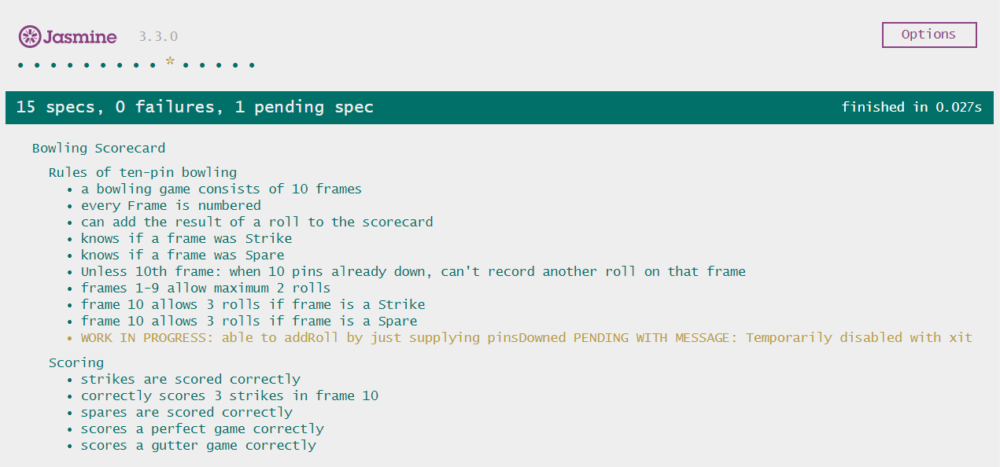
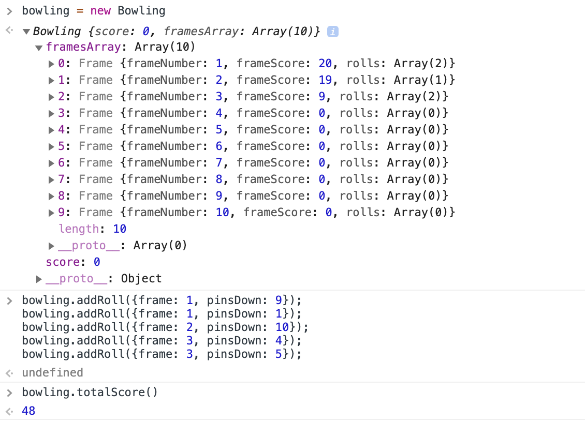
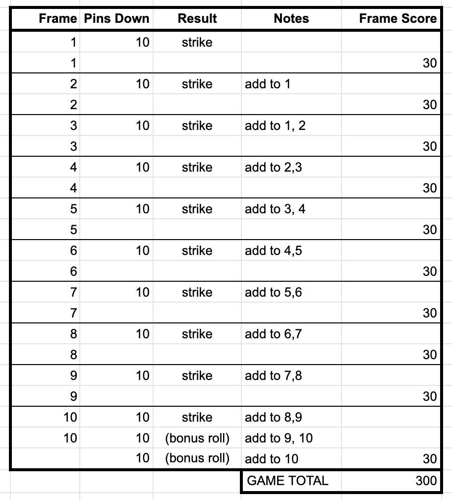

[](https://travis-ci.org/dafuloth/bowling-challenge)

# Bowling Challenge

_My solution is the subdirectory /Bowling. Original challenge README [here](./challenge.md)._

## Contents
<details><summary><i>expand Table of Contents</i></summary>

  - [Getting started](#getting-started)
  - [Overview of Features](#overview-of-features)
    - [Creating a new Bowling Scorecard](#creating-a-new-bowling-scorecard)
    - [Add roll to Bowling Scorecard](#add-roll-to-bowling-scorecard)
      - [Adding a normal roll](#adding-a-normal-roll)
      - [Adding a Strike](#adding-a-strike)
      - [Adding a Spare](#adding-a-spare)
    - [Strike on last frame awards 2 bonus rolls](#strike-on-last-frame-awards-2-bonus-rolls)
    - [Spare on last frame awards 1 bonus roll](#spare-on-last-frame-awards-1-bonus-roll)
    - [Can get the total score at any point](#can-get-the-total-score-at-any-point)
  - [Development Approach](#development-approach)
  - [Further work](#further-work)
  - [Addendum](#addendum)

</details>

## Getting started

Tests may be run as follows:

```sh
git clone git@github.com:dafuloth/bowling-challenge.git
cd bowling-challenge/Bowling
open SpecRunner.html
```

The results are currently as follows, all tests passing (except for pending test that was deemed not MVP):



## Overview of Features

- Create a new Bowling object: `var bowling = new Bowling()`
- Add a roll: `bowling.addRoll({frame: 1, pinsDown: 4})`
- Get the score at any point: `bowling.totalScore();`

Further details on the methods follows.

---

### Creating a new Bowling Scorecard

```javascript
var bowling = new Bowling()
```


### Add roll to Bowling Scorecard

The solution endeavours to ignore illogical or physically impossible inputs:

- Knocking down more than 10 pins in a normal frame: e.g. 7, 5
- Adding a third roll to a frame - unless it's the last frame and bonus roll(s) are in play
  - _Illegal:_ **2, 3, 4**
  - _Allowed in last frame:_
    - 2 bonus rolls with a strike: **10, 2, 3**
    - 1 bonus roll with a spare  **4, 6, 10**

#### Adding a normal roll

```javascript
bowling.addRoll({frame: 1, pinsDown: 4})
bowling.addRoll({frame: 1, pinsDown: 5})
// frame complete, further rolls ignored:
bowling.addRoll({frame: 1, pinsDown: 3})  
```


#### Adding a Strike

```javascript
bowling.addRoll({frame: 2, pinsDown: 10}) // this is a Strike

// frame complete, further rolls ignored:
bowling.addRoll({frame: 2, pinsDown: 2})  
```


#### Adding a Spare

```javascript
bowling.addRoll({frame: 3, pinsDown: 8})
bowling.addRoll({frame: 3, pinsDown: 2}) // a Spare is recorded
// frame complete, further rolls ignored:
bowling.addRoll({frame: 3, pinsDown: 1})
```


### Strike on last frame awards 2 bonus rolls

```javascript
bowling.addRoll({frame: 10, pinsDown: 10}) // a Strike is recorded
bowling.addRoll({frame: 10, pinsDown: 10}) // First bonus roll
bowling.addRoll({frame: 10, pinsDown: 10}) // Second bonus roll
// frame complete, further rolls ignored
```


### Spare on last frame awards 1 bonus roll

```javascript
bowling.addRoll({frame: 10, pinsDown: 9})
bowling.addRoll({frame: 10, pinsDown: 1}) // a Spare is recorded
bowling.addRoll({frame: 10, pinsDown: 10}) // Bonus roll
// frame complete, further rolls ignored
```


### Can get the total score at any point

```javascript
bowling.addRoll({frame: 1, pinsDown: 9})
bowling.addRoll({frame: 1, pinsDown: 1}) // a Spare is recorded
bowling.addRoll({frame: 2, pinsDown: 10})
bowling.addRoll({frame: 3, pinsDown: 4})
bowling.addRoll({frame: 3, pinsDown: 5})
bowling.totalScore();
```



## Development Approach

I wrote out a "perfect game" scorecard so that I could understand how bonuses were applied:

<div  align="center">

</div>

## Further work

- _Work in progress:_ Refactor `addRoll()` for more intelligent data entry, allowing it to work just by passing the number of pins knocked down
  - .addRoll(5)
  - it should be able to progress through the scorecard on its own without being told which frame the roll belongs to
  - the solution should then assign it appropriately, taking into account all the rules
  - this approach might be more reliant on a "virtuous consumer"

## Addendum

Travis CI can be used to automate testing for JavaScript, as with Ruby. A good reference: https://medium.com/@koalamango/javascript-automated-testing-with-jasmine-karma-and-travis-c118a98223d9