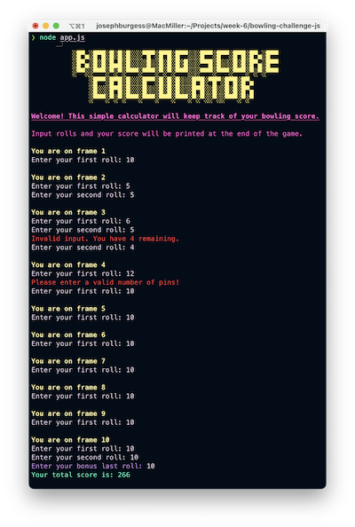

Bowling Challenge
=================

Bowling score calculator written in Node.js for the end of week 6 challenge at Makers Academy. This was a fun challenge building on a previous exercise to put together the logic for a bowling scorecard using Ruby in the previous week.

Once the logic was in place and fully functional I took the challenge a step further in creating a terminal UI for users to input their scores. I used [readline-sync](https://github.com/anseki/readline-sync) for this and tested the terminal input/output using Jest mocks. I also used [colors](https://github.com/marak/colors.js/) to add some colour to the terminal output.

Additional logic was included to ensure that users could only input a valid number of pins for each roll, and takes into account how many had been knocked down in their first roll. It also takes into account the rolls thrown in the final frame and will allow the user to input their bonus third roll if a strike or spare is achieved.

## How to use

1. Clone the repository to your machine
2. Ensure you have [Node.js](https://nodejs.org/en/download/) installed
3. Navigate to the directory in your terminal and run:

   - `npm install`
   - `node app.js`

4. You will be greeted with the title screen and asked to input your rolls.

## The Task

**THIS IS NOT A BOWLING GAME, IT IS A BOWLING SCORECARD. DO NOT GENERATE RANDOM ROLLS. THE USER INPUTS THE ROLLS.**

Count and sum the scores of a bowling game for one player (in JavaScript).

A bowling game consists of 10 frames in which the player tries to knock down the 10 pins. In every frame the player can roll one or two times. The actual number depends on strikes and spares. The score of a frame is the number of knocked down pins plus bonuses for strikes and spares. After every frame the 10 pins are reset.

As usual please start by

* Forking this repo

* Finally submit a pull request before Monday week at 9am with your solution or partial solution.  However much or little amount of code you wrote please please please submit a pull request before Monday week at 9am. 

___STRONG HINT, IGNORE AT YOUR PERIL:___ Bowling is a deceptively complex game. Careful thought and thorough diagramming — both before and throughout — will save you literal hours of your life.

### Optional Extras

In any order you like:

* Set up [Travis CI](https://travis-ci.org) to run your tests.
* Add [ESLint](http://eslint.org/) to your codebase and make your code conform.
* Create a UserInterface class, allowing you to run a game from the command line.

You might even want to start with ESLint early on in your work — to help you
learn Javascript conventions as you go along.

## Bowling — how does it work?

### Strikes

The player has a strike if he knocks down all 10 pins with the first roll in a frame. The frame ends immediately (since there are no pins left for a second roll). The bonus for that frame is the number of pins knocked down by the next two rolls. That would be the next frame, unless the player rolls another strike.

### Spares

The player has a spare if the knocks down all 10 pins with the two rolls of a frame. The bonus for that frame is the number of pins knocked down by the next roll (first roll of next frame).

### 10th frame

If the player rolls a strike or spare in the 10th frame they can roll the additional balls for the bonus. But they can never roll more than 3 balls in the 10th frame. The additional rolls only count for the bonus not for the regular frame count.

    10, 10, 10 in the 10th frame gives 30 points (10 points for the regular first strike and 20 points for the bonus).
    1, 9, 10 in the 10th frame gives 20 points (10 points for the regular spare and 10 points for the bonus).

### Gutter Game

A Gutter Game is when the player never hits a pin (20 zero scores).

### Perfect Game

A Perfect Game is when the player rolls 12 strikes (10 regular strikes and 2 strikes for the bonus in the 10th frame). The Perfect Game scores 300 points.

## Code Review

In code review we'll be hoping to see:

* All tests passing
* The code is elegant: every class has a clear responsibility, methods are short etc.

Reviewers will potentially be using this [code review rubric](docs/review.md).  Note that referring to this rubric in advance may make the challenge somewhat easier.  You should be the judge of how much challenge you want.
