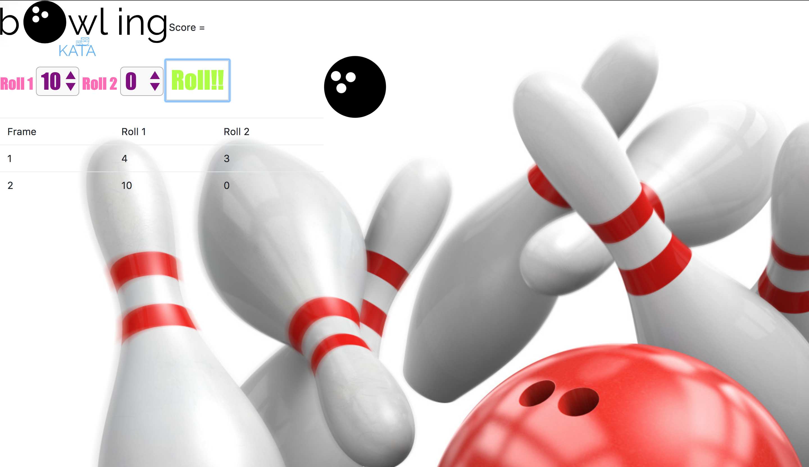

# Bowling Challenge Kata 
### Makers Academy week 5 & 6 Weekend Challenge

This weekend's challenge was spread over two weekends. After only learning JavaScript for one week we were given the task to design the infamous bowling kata using jQuery, HTML and styling with CSS.

I learned a lot from this challenge and finally jQuery is making sense! 

### Functionality

After rolling ten frames the game ends **unless** a strike or spare is rolled in the tenth frame. If this is the case the user is prompted with a bonus roll button and will either have one or two bonus rolls depending on what they rolled in the tenth frame.

### jQuery fun

I experimented with animating in jQuery for the first time, a simple binding to make the image of the bowling ball move right with each successive click of the 'roll' button.

### If given more time...

... I would: 
* refactor
* complete the jQuery logic which is at this point incomplete
*  explore deeper into CSS and create a simple, clean but dynamic UI

