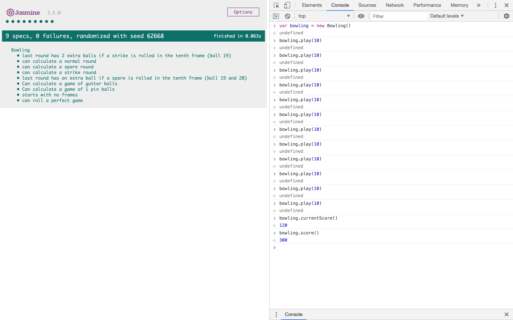

# Bowling Challenge

This was the fifth weekend challenge at Makers. It reinforced what I had learnt in the weeks work - test driving a simple web app in a new language - JavaScript.

I followed the brief when making this 10 Pin Bowling Scorecard that is used with the console in the browser:

I decided to view the game as 20 rolls instead of 10 frames of 2 rolls. This made it far easier to access the individual rolls, as they were at the index of the game array (where each 'roll' was pushed into), and therefore made it easier to add the bonus (strike/spare bonus). This accumulative bonus is applied at the end of the game, and relies on the user calling the score function after the final frame.

Currently, the 'bowling' game has the following functionality, it calculates:

- Gutter games/frames
- Single frame
- Multiple frames
- Spares
- Strikes
- Final Frame (up to 3 x balls depending on previous ball(s) scores)
- Perfect game

## How to Run

Clone this repo, in the command line navigate to the [_Jasmine_](Jasmine) directory and right click on the [_SpecRunner_](SpecRunner.html) file, click `copy path` and paste this into the Google Chrome browser.

This will display the `Jasmine Test Suite` showing 9 passing tests.

Right click, and click on `Inspect` to open up the Chrom Developer Tools. Click on the console tab at the top. This will act like a terminal.

To start a new game, create a new instance of Bowling by typing into the console:

```
var bowling = new Bowling()
```

You then enter the score of each induvidual ball rolled by the play function:

```
bowling.play(10)
```

The argument of the .play function would be hw many pins were knocked down on that ball. During the game, you can see the score without the accumulative bonus by typing:

```
bowling.currentScore()
```

After the user has rolled 10 frames of balls, with the 10th frames bonus balls (if applied), you can see the final total score with bonus by typing:

```
bowling.score()
```

### An Example showing a Perfect Game



---

## Brief

Count and sum the scores of a bowling game for one player (in JavaScript).

A bowling game consists of 10 frames in which the player tries to knock down the 10 pins. In every frame the player can roll one or two times. The actual number depends on strikes and spares. The score of a frame is the number of knocked down pins plus bonuses for strikes and spares. After every frame the 10 pins are reset.

### Bowling — Requirements and Rules

**Strikes**
The player has a strike if he knocks down all 10 pins with the first roll in a frame. The frame ends immediately (since there are no pins left for a second roll). The bonus for that frame is the number of pins knocked down by the next two rolls. That would be the next frame, unless the player rolls another strike.

**Spares**
The player has a spare if the knocks down all 10 pins with the two rolls of a frame. The bonus for that frame is the number of pins knocked down by the next roll (first roll of next frame).

**10th Frame**
If the player rolls a strike or spare in the 10th frame they can roll the additional balls for the bonus. But they can never roll more than 3 balls in the 10th frame. The additional rolls only count for the bonus not for the regular frame count.

    10, 10, 10 in the 10th frame gives 30 points (10 points for the regular first strike and 20 points for the bonus).
    1, 9, 10 in the 10th frame gives 20 points (10 points for the regular spare and 10 points for the bonus).

**Gutter Game**
A Gutter Game is when the player never hits a pin (20 zero scores).

**Perfect Game**
A Perfect Game is when the player rolls 12 strikes (10 regular strikes and 2 strikes for the bonus in the 10th frame). The Perfect Game scores 300 points.
