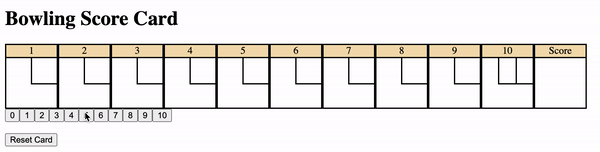

# Bowling Score Card #

To use the bowling score card first clone this repo. 
navigate to the correct directory and then open the bowling.html using the console.
```
cd bowling-challenge
open bowling.html
```



The card is designed to be as user friendly as possible, removing any unnecessary buttons after each roll and automatically changed frames when needed. 
I have also added a reset button so that you can easily play another round without having to refresh the page. 