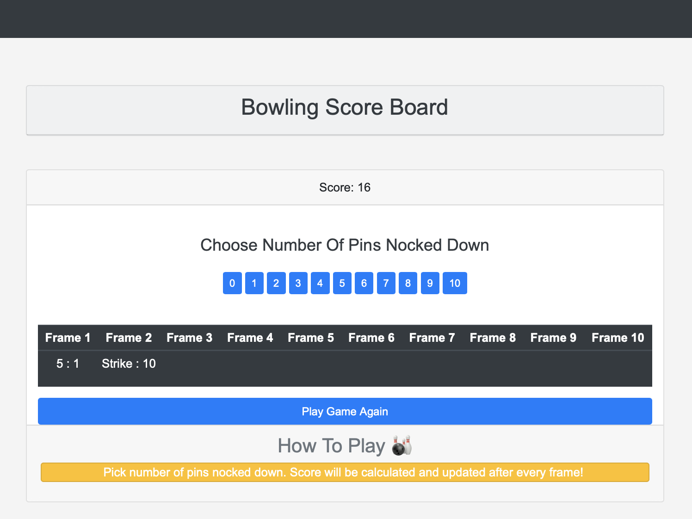

## **Bowling Challenge**

## The Task

**THIS IS NOT A BOWLING GAME, IT IS A BOWLING SCORECARD. DO NOT GENERATE RANDOM ROLLS. THE USER INPUTS THE ROLLS.**

Count and sum the scores of a bowling game for one player (in JavaScript).

A bowling game consists of 10 frames in which the player tries to knock down the 10 pins. In every frame the player can roll one or two times. The actual number depends on strikes and spares. The score of a frame is the number of knocked down pins plus bonuses for strikes and spares. After every frame the 10 pins are reset.

___STRONG HINT, IGNORE AT YOUR PERIL:___ Bowling is a deceptively complex game. Careful thought and thorough diagramming — both before and throughout — will save you literal hours of your life.

### Optional Extras

In any order you like:

* Create a nice interactive animated interface with jQuery.
* Set up [Travis CI](https://travis-ci.org) to run your tests.
* Add [ESLint](http://eslint.org/) to your codebase and make your code conform.

You might even want to start with ESLint early on in your work — to help you
learn Javascript conventions as you go along.

## UI preview 

      
    *Bowling Score Board Preview*

## Bowling — how does it work?

### Strikes

The player has a strike if he knocks down all 10 pins with the first roll in a frame. The frame ends immediately (since there are no pins left for a second roll). The bonus for that frame is the number of pins knocked down by the next two rolls. That would be the next frame, unless the player rolls another strike.

### Spares

The player has a spare if the knocks down all 10 pins with the two rolls of a frame. The bonus for that frame is the number of pins knocked down by the next roll (first roll of next frame).

### 10th frame

If the player rolls a strike or spare in the 10th frame they can roll the additional balls for the bonus. But they can never roll more than 3 balls in the 10th frame. The additional rolls only count for the bonus not for the regular frame count.

    10, 10, 10 in the 10th frame gives 30 points (10 points for the regular first strike and 20 points for the bonus).
    1, 9, 10 in the 10th frame gives 20 points (10 points for the regular spare and 10 points for the bonus).

### Gutter Game

A Gutter Game is when the player never hits a pin (20 zero scores).

### Perfect Game

A Perfect Game is when the player rolls 12 strikes (10 regular strikes and 2 strikes for the bonus in the 10th frame). The Perfect Game scores 300 points.

## Code Review

In code review we'll be hoping to see:

* All tests passing
* The code is elegant: every class has a clear responsibility, methods are short etc.

#### Bowling Rules
- The goal is to knock down all ten pins
- Each frame consists of throwing the ball twice to knock down all the pins
- If you knock down all the pins with the first ball, it is called a "strike"
- If you knock down all the pins with the second ball, it is called a "spare"
- Each games consists of ten frames. If you bowl a strike in the tenth frame, you get
two more balls. If you throw a spare, you get one more ball.
- Open frames are frames without a strike or spare
- Scoring is based on the number of pins you knock down. However, if you bowl a
spare, you get to add the pins in your next ball to that frame. For strikes, you get
the next two balls.
- An average of three games is played. You determine a 3 game average by adding
all 3 scores and then dividing that number by 3.
- Accurate preliminary scores are essential for fair divisioning.
- Foul line is in effect. If you step over the foul line, any pins knocked down will not
count towards your score.
- Ramp Bowling is allowed for those athletes that are not physically capable of
rolling a bowling ball. The ramp is for physical disabilities and not to be used to
just increase a score.
- Bumpers are not allowed.
