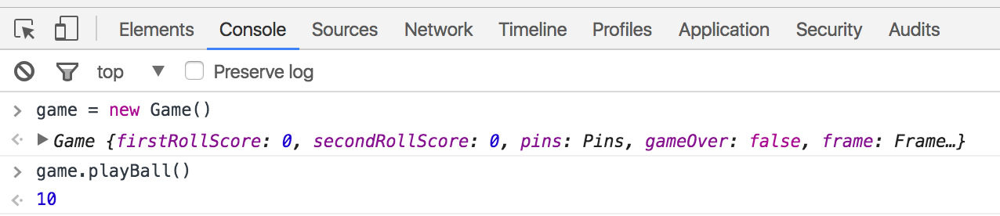
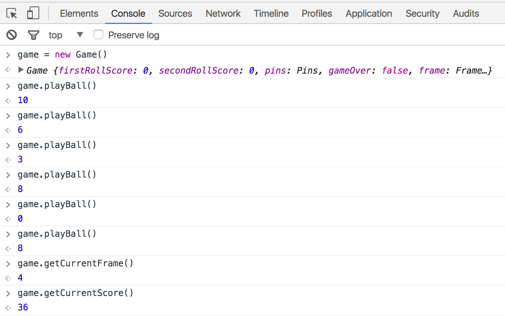
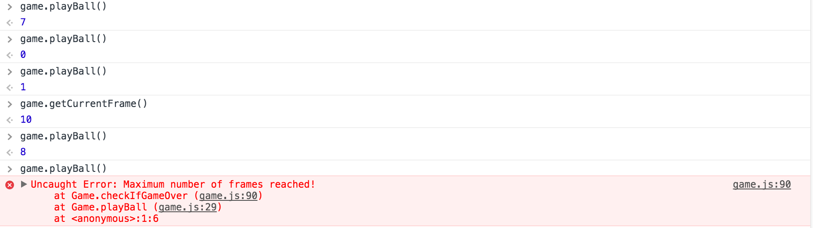

#Bowling Challenge

[](https://travis-ci.org/aabolade/bowling-challenge)
[](https://coveralls.io/github/aabolade/bowling-challenge?branch=master)

Task
====


Program in javascript to count and sum the scores of a bowling game for one player.

A bowling game consists of 10 frames in which the player tries to knock down the 10 pins. In every frame the player can roll one or two times. The actual number depends on strikes and spares. The score of a frame is the number of knocked down pins plus bonuses for strikes and spares. After every frame the 10 pins are reset. More about ten pin bowling here: http://en.wikipedia.org/wiki/Ten-pin_bowling

User Stories
============
```
As a player
So I can begin my game of 10-pin bowling
I would like to start on the first frame

As a player
So I can have a target for the ball
I would like to play against 10-pins

As a player
So I can compete properly
I would like to have two attempts to knock down the ten pins

As a player
So I can play again in the next frame
I would like the pins to be refreshed back to 10pins.

As a player
So I am rewarded for hitting 10 pins at once
I would like to have a bonus for a strike

As a player
So I am rewarded for hitting 10 pins in two attempts
I would like to have a bonus for a spare.

As a player
So I can have a Challenge
I would like there to be a maximum of 10 frames.

As a player
So I can know how well I am doing
I would like to see my score.

As a player
So I can make the final frame more interesting
I would like to have three chances to knock down the pins.

```
Approach and Technologies
=========================

* Jasmine: For unit testing.

The project uses three main classes:

**Game** responsible for the controlling the game and contains methods related to rolling the ball

**Pins** responsible for randomly selecting between 0 and 10 pins on the first roll, and from 0 to up to the remaining pins left on the second roll.

**Score** responsible for calculating the score, and awarding bonuses for strikes and spares.

**Frame** responsible for moving to the next frame at the end of the play.

The main challenges faced were deciding the exact responsibilities of each class in order to keep to Single Responsibility Principle (SRP).

Setup
=====

Fork and clone this repo, then copy the path of the SpecRunner.html file into any browser. It should be ./yourPath/SpecRunner.html

You will then need to open the developer tools which can be done by pressing ```F12``` or ```cmd+alt+i``` on a Mac.

start a new game by entering ```game = new Game() ``` where ```game``` is a parameter variable. Then use the following commands:

* To roll the ball: ```game.playBall()``` This returns a random number between 0 and 10.
* To get the current score: ```game.getCurrentScore()```
* To get the current Frame. ```game.getCurrentFrame()```
* To start again. ```game.startAgain()```

The game will throw an error when the game is over.

Example
=======

Starting up the game, and getting a strike on the first roll!



Checking the score or frame during the game.



'Game Over' message when end of last frame is reached.




Further Features
================

* Use jQuery to connect models to a user interface.
