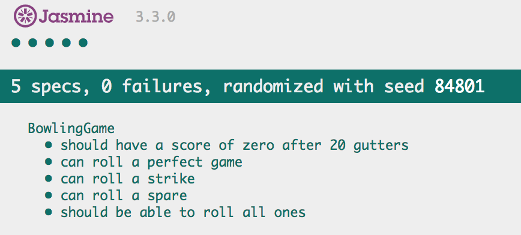

Bowling Challenge
=================

## Description
A bowling game consists of 10 frames in which the player tries to knock down the 10 pins. In every frame the player can roll one or two times. The actual number depends on strikes and spares. The score of a frame is the number of knocked down pins plus bonuses for strikes and spares. After every frame the 10 pins are reset.

## User Stories
The program was created to satisfy the below user stories 
```
As a user 
So that I can calculate my score
I want to have scorecard 

As a user 
So that I can calculate my score
I want see 10 frames

As a user 
So that I can calculate my score
I want to be able to record how many pins I knock down after each roll 

As a user 
So that I can calculate my score
I want to be able to calculate my final score 
```
## Installation
* $ `git clone git@github.com:CazaBelle/bowling-challenge.git`
* $ `cd bowling-challenge`
* $ `open index.html` 
* Navigate to the console to calculate a game of bowling 

## Testing 
* BDD completed with [Jasmine](https://jasmine.github.io/)
* `open SpecRunner.html`



## Bowling Rules

### Strikes

The player has a strike if he knocks down all 10 pins with the first roll in a frame. The frame ends immediately (since there are no pins left for a second roll). The bonus for that frame is the number of pins knocked down by the next two rolls. That would be the next frame, unless the player rolls another strike.

### Spares

The player has a spare if the knocks down all 10 pins with the two rolls of a frame. The bonus for that frame is the number of pins knocked down by the next roll (first roll of next frame).

### 10th frame

If the player rolls a strike or spare in the 10th frame they can roll the additional balls for the bonus. But they can never roll more than 3 balls in the 10th frame. The additional rolls only count for the bonus not for the regular frame count.

    10, 10, 10 in the 10th frame gives 30 points (10 points for the regular first strike and 20 points for the bonus).
    1, 9, 10 in the 10th frame gives 20 points (10 points for the regular spare and 10 points for the bonus).

### Gutter Game

A Gutter Game is when the player never hits a pin (20 zero scores).

### Perfect Game

A Perfect Game is when the player rolls 12 strikes (10 regular strikes and 2 strikes for the bonus in the 10th frame). The Perfect Game scores 300 points.

In the image below you can find some score examples.

More about ten pin bowling here: http://en.wikipedia.org/wiki/Ten-pin_bowling


### Extension

* A nice interactive animated interface with jQuery.
* Set up [Travis CI](https://travis-ci.org) to run the tests.
* Add [ESLint](http://eslint.org/) to the codebase 

### Contributions

* [David Donahue](https://www.youtube.com/watch?v=-qA_MjNmpVU)


