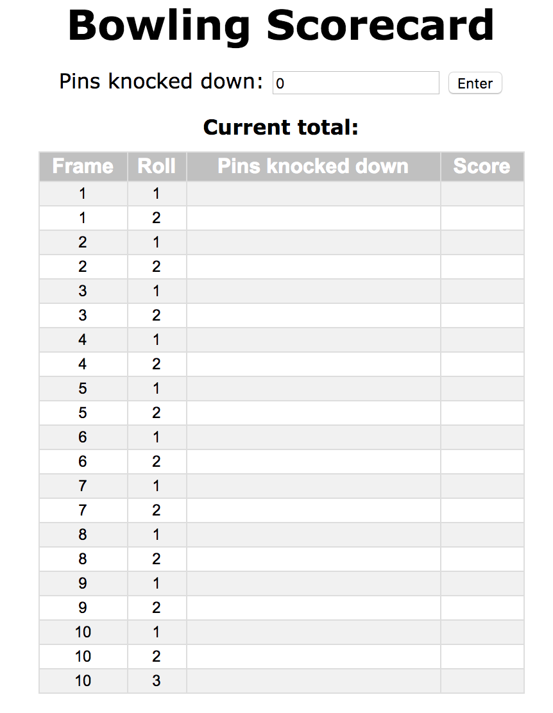
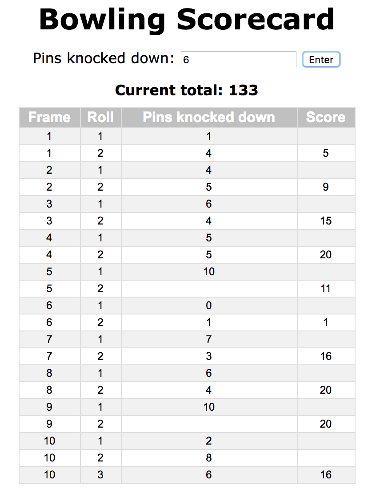
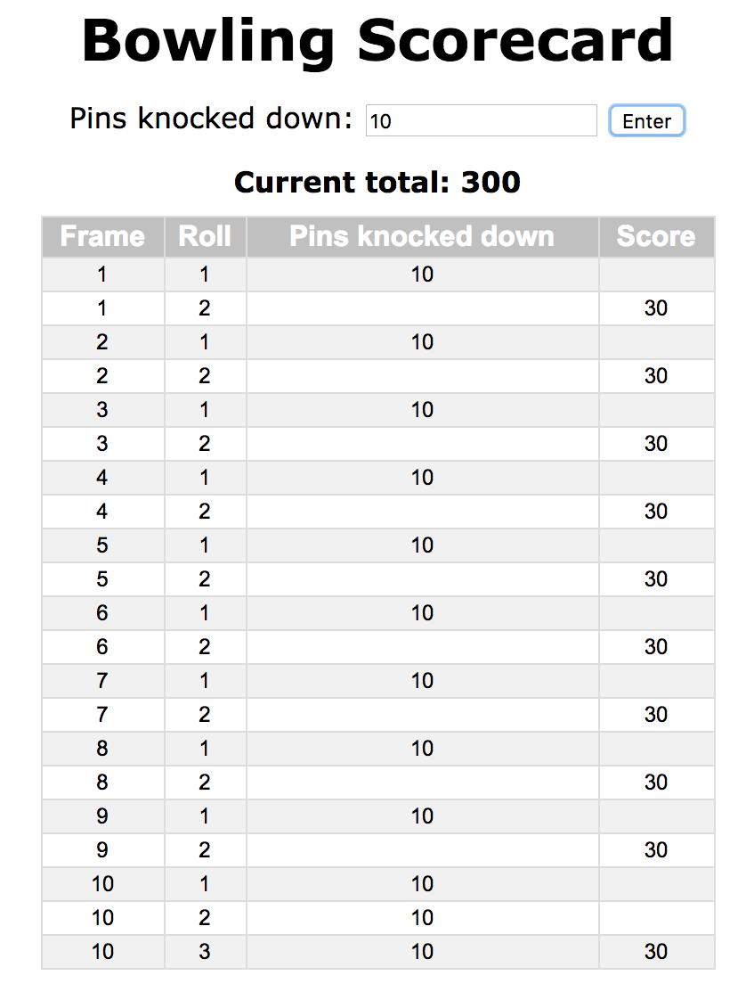
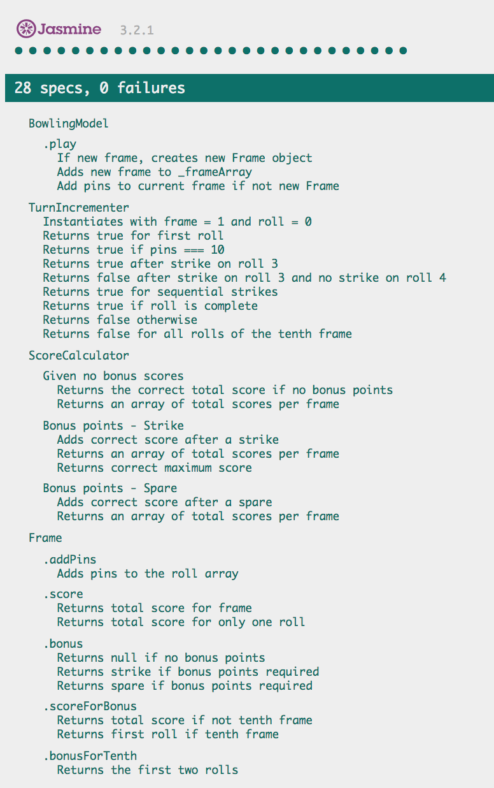

Bowling Challenge
=================

Simple bowling scorecard: enter the number of pins you knock down for each roll and this app will keep track of your total score!

Tags: JavaScript, Jasmine, jQuery, Recursive Functions, OOP


## Domain Model

OOP principles were used when designing the app. The result is the following domain model (considering the front-end JavaScript functions only:

```
   Client
╔════════════╗  
║            ║ 
║  Browser   ║ User enters score and clicks button     
║            ║
╚════════════╝
      |
      | 
      |
╔════════════╗
║            ║ jQuery event listeners waiting for user input
║    View    ║ Invokes model functions based on input
║ Controller ║ Updates display
╚════════════╝
      |
      |
      |                
╔════════════╗             ╔════════════╗       
║            ║             ║            ║       
║ Front-end  ║-------------║    Turn    ║ Returns true if new frame required 
║   Model    ║             ║ Incrementer║       
╚════════════╝             ╚════════════╝ 
      |
      |
      |
      |                    ╔════════════╗
      |                    ║            ║ Keeps track of the rolls           
      |--------------------║    Frame   ║ Returns the score
      |                    ║            ║ Knows if its the tenth frame
      |                    ╚════════════╝
      | 
      |                    ╔════════════╗
      |                    ║            ║ Calculates score per frame
      |--------------------║   Score    ║ Calculates overall total
                           ║ Calculator ║
                           ╚════════════╝
                                              
```

The front-end model contains an array of Frame objects - and inputs the pins knocked down into the appropriate Frame object.


### Score Calculation

Effort was directed to implementing succient logic for the score calculation. Recursive functions were used to iterate over the scores and bonus points. An example snippet of code:

```
ScoreCalculator.prototype._calculateScores = function(frameArray, index) {
  if (index >= 10) return; // exit condition from recursive function
  var frameScore = 0;
  if (frameArray[index] !== undefined) { // for when we calculate score before game is complete
    frameScore = frameArray[index].score() + addBonus(frameArray[index], frameArray[index+1], frameArray[index+2], index);
  };
  this._frameScores[index] += frameScore;
  this._calculateScores(frameArray, index+1);
};
```

The function above invoked itself to loop over all the frame scores, exiting when the condition (index >= 10) was satisfied.


## How to Use

### Install

Clone this repo to your local machine then run `bundle install`. This will ensure all Ruby gems are loaded on your machine.

The web app is hosted on a Sinatra server using Rack. So to start the server enter `rackup` into the CLI. 

Go to the `localhost:[PORTNUMBER]` to view the scorecard, you'll see the following screen:

<p align="center"></p>

Enter the number of pins you knock down and then click the `Enter` button. The total score will update with every roll you enter. You can also see your score per frame (when you roll a strike or a spare the bonus points will be added when the following frames are completed).

An example game:
<p align="center"></p>

The maximum score you can achieve is also calculated correctly:
<p align="center"></p>


## Tests

Tests have been created in Jasmine for the JavaScript front-end. Tests can be run by running the Jasmine SpecRunner file:
`open SpecRunner.html`.

All tests are passing:
<p align="center"></p>


## User Stories

User stories were created to document the features the app should deliver.

```
As an avid bowler
So I can keep track of my rolls
I'd like to be able to enter my roll on a web interface

As an avid bowler
So I can keep track of my score
I'd like my web interface to update my current score as I input my rolls

As an avid bowler
So that I follow the game correctly
I'd like my web interface to my score per frame

As an avid bowler
So I can be sure my score is correct
I'd like my web interface to follow standard bowling rules when generating the score

As an avid bowler
So I can be sure my score is correct
I'd like my app to include logic for the tenth frame

As an avid bowler
So I can be sure my score is correct
I want my maximum calculated total score to be 300

-- IF I HAVE TIME --

As an avid bowler
So that I can keep track of my progress
I'd like my game to be saved in a database

As an avid bowler
So that I can keep track of my progress
I'd like my past games to be viewable through the web interface
```

The intention was to link the front-end to a database, allowing the scorecards to be saved after completion (and then viewed later if required). However, these final user stories have not been completed.


## Bowling — how does it work?

### Strikes

The player has a strike if he knocks down all 10 pins with the first roll in a frame. The frame ends immediately (since there are no pins left for a second roll). The bonus for that frame is the number of pins knocked down by the next two rolls. That would be the next frame, unless the player rolls another strike.

### Spares

The player has a spare if the knocks down all 10 pins with the two rolls of a frame. The bonus for that frame is the number of pins knocked down by the next roll (first roll of next frame).

### 10th frame

If the player rolls a strike or spare in the 10th frame they can roll the additional balls for the bonus. But they can never roll more than 3 balls in the 10th frame. The additional rolls only count for the bonus not for the regular frame count.

    10, 10, 10 in the 10th frame gives 30 points (10 points for the regular first strike and 20 points for the bonus).
    1, 9, 10 in the 10th frame gives 20 points (10 points for the regular spare and 10 points for the bonus).

### Gutter Game

A Gutter Game is when the player never hits a pin (20 zero scores).

### Perfect Game

A Perfect Game is when the player rolls 12 strikes (10 regular strikes and 2 strikes for the bonus in the 10th frame). The Perfect Game scores 300 points.

In the image below you can find some score examples.

More about ten pin bowling here: http://en.wikipedia.org/wiki/Ten-pin_bowling

