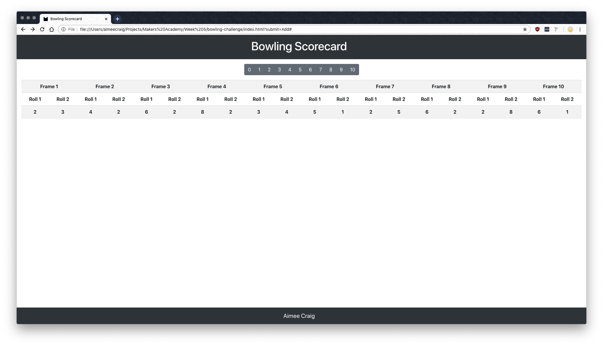
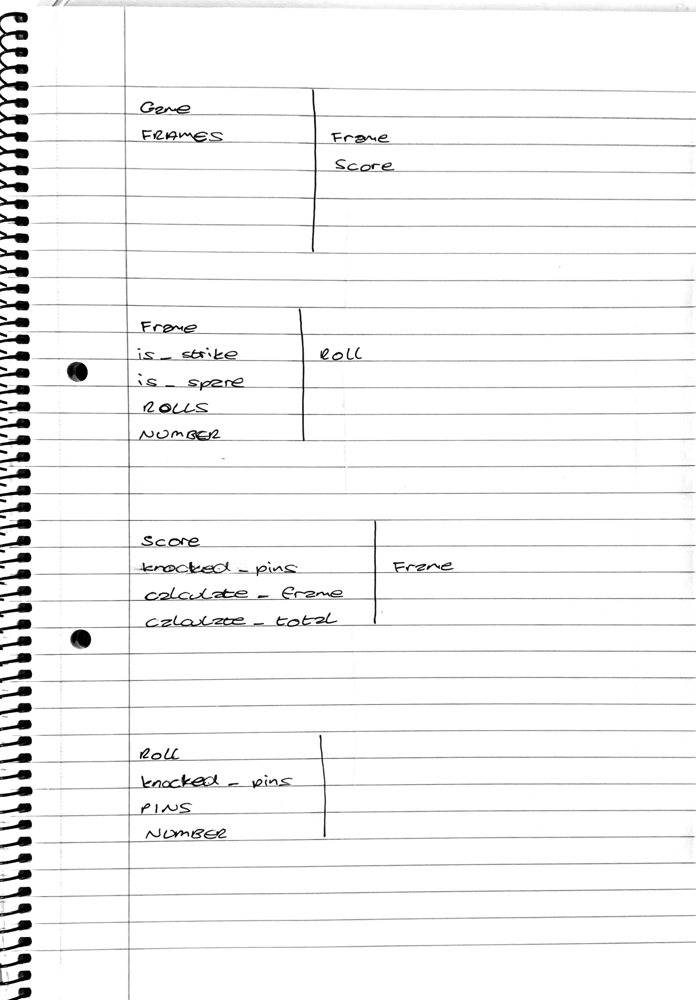

# Bowling Challenge #

<<<<<<< HEAD
This is a bowling scorecard in JavaScript that integrates with a web application.
=======
This is a bowling scorecard application in JavaScript that integrates with a web application.
>>>>>>> 088c24f67dc30cff800958d8970c6ee9c17125a3



## How to Use ##
1. Open Terminal and clone the repository:
```bash
git clone https://github.com/aimeecraig/bowling-challenge.git
```
2. Change into the project directory:
```bash
cd bowling-challenge
```
3. Install the dependancies:
```bash
bundle install
```
4. Run the Jasmine tests to ensure code is functioning:
```bash
open SpecRunner.html
```
5. Open the web app:
```bash
open index.html
```

## Technologies ##
* JavaScript
* jQuery
* Jasmine
* CSS
* HTML

## Specification ##
#### Bowling Rules ####

* A game is a total of 10 frames.
* There are 2 rolls in each frame.
  * The player can roll 2 more times in the last frame if they get a strike in the first roll.
  * The player can roll 1 more time in the last frame if they get a spare in the first 2 rolls.
* A spare occurs if the player knocks down all 10 pins within a frame.
  * A spare is worth 10 points, plus the value of the player's next roll.
* A strike occurs if the player knocks down all 10 pins within the first roll of a frame.
  * A strike is worth 20 points, plus the value of the player's next 2 rolls.
* A gutter game occurs if the player never hits a pin (20 zero scores).
* A perfect game occurs if the player rolls 12 strikes (10 regular strikes and 2 strikes for the bonus in the 10th frame).

## User Stories ##
```
As a player
So I can play a full game of bowling
I'd like the game to consist of 10 frames

As a player
So I can play a full game of bowling
I'd like a frame to consist of 2 rolls

As a player
So I don't record my score incorrectly
I'd like for the number of knocked down pins to be limited to 10

As a player
So I can keep track of my score
I'd like to record the number of knocked down pins for each roll

As a player
So I can see my score
I'd like to see the number of knocked down pins for each frame

As a player
So I can continue playing
I'd like for the number of pins to be reset at the end of each frame

As a player
So I can earn extra points
I'd like a strike to occur if all 10 pins are knocked down in the first roll

As a player
So I can earn extra points
I'd like bonus points to be awarded for a strike

As a player
So I can earn extra points
I'd like a spare to occur if all 10 pins are knocked down within the two rolls of a frame

As a player
So I can earn extra points
I'd like bonus points to be awarded for a spare

As a player
So I can see how well I've done
I'd like to receive a gutter game if I never knock down a pin

As a player
So I can see how well I've done
I'd like to receive a perfect game if I roll 12 strikes
```

#### CRC Cards ####


In the end I decided against having the Roll class as it would only be responsible for holding a single number which could be easily transferred to an attribute of the Frame class.
