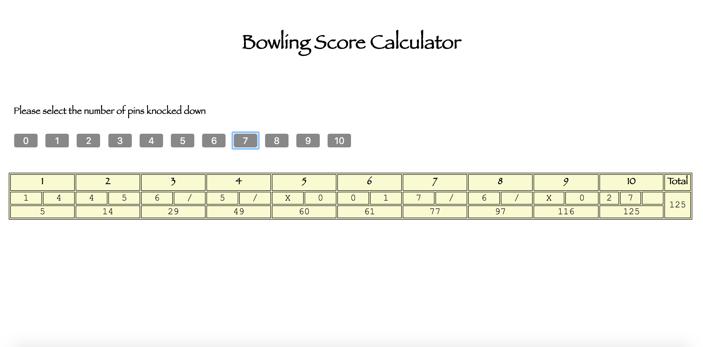

Bowling Challenge
=================

Instructions
---

```
$ git clone https://github.com/aballal/bowling-challenge.git
$ cd bowling-challenge
$ open SpecRunner.html
$ open index.html
```

Algorithm for calculating score
---

[Algorithm](docs/algorithm.md)

Screenshot
---

  

Testing
---
[Testing](docs/testing.pdf)

Self Review
---

[Self Review](docs/self_review.md)
