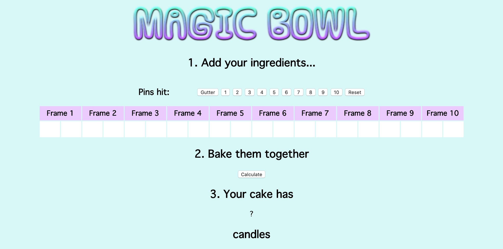

Bowling Scorecard
=================

This is an implementation of a bowling scorecard with a user interface. For rules of ten-pin bowling [click here](https://en.wikipedia.org/wiki/Ten-pin_bowling#Play).

To see a short video demonstrating the bowling scorecard in use, [click here](https://www.youtube.com/watch?v=suvjufqDdmk&feature=youtu.be&hd=1).



## Technologies Used

* JavaScript - implementation of the scorecard
* jQuery, HTML, CSS - user interface
* Jasmine - testing

## Instructions

This app is not currently hosted anywhere. To use it, you will need to clone this GitHub repo and open the `index.html` in a web browser.

### Using the Scorecard

```
$ git clone git@github.com:jonsanders101/bowling-challenge.git
$ cd bowling-challenge
$ open index.html
```

### Running the Test Suite

```
$ git clone git@github.com:jonsanders101/bowling-challenge.git
$ cd bowling-challenge
$ open SpecRunner.html
```

### Project Review

This is a non-exhaustive list of weaknesses I have identified in this project and actions to improve these.

## Implementation
* The scorecard is currently implemented through one monolithic `Game` object. To improve on this design, I would extract implementation into `Scorecard` and `Frame` classes which would remove the need for the large object currently held in the `Game` object.
* I would also add a `Match` object which could handle multiple `Game` objects, allowing the user to see total points scored over multiple games.
* A big weakness of implementing the scorecard through this scorecard object is the long, repetitive statements used to access particular values within the object (e.g. `this.scorecard[this.currentFrame][this.currentRoll]['hitPins'] = hitPins`).
* The use of numbers as keys within the scorecard object representing frames and rolls provided a convenient way to access particular values. This is at the expense of readability. I initially used strings as keys such as `frame7` and `roll2` and used methods to concatenate numbers, which made their meaning clearer to the user but add superfluous steps.

## User Interface
* There is nothing to indicate which numbers of pins can't be chosen by the user because they exceed the number of pins remaining for that frame. Currently, when those buttons are pressed, nothing changes on the screen. I would use jQuery to change the appearance of the buttons reflection those options and make them unclickable.
* There is no interaction with particular features of the bowling game such as a gutter game, a perfect game, a strike or a spare. I would add features which indicated these scenarios.
* The table displaying the scorecard is difficult to read and requires further design work. I would make the table static when new values appear on it.

## Testing
* Further attention is needed on the test suite to ensure all outcomes of the game are covered.
* The behaviour of the random bowl is currently stubbed with a long list of return values. Many of these tests were written before the option for the user to select a certain number of pins was added, so many of these tests can be refactored using explicit values. The use of helper methods would slim the test suite further.

## Delivery
* This solution is not currently implemented through a web interface. I would create one using a Sinatra framework to allow the app to be hosted.
* There is no persistence so the user cannot access information from previous games after they have closed the browser. With a web interface, I would use HTML web storage to allow the user to store game data in localStorage for use between games.
