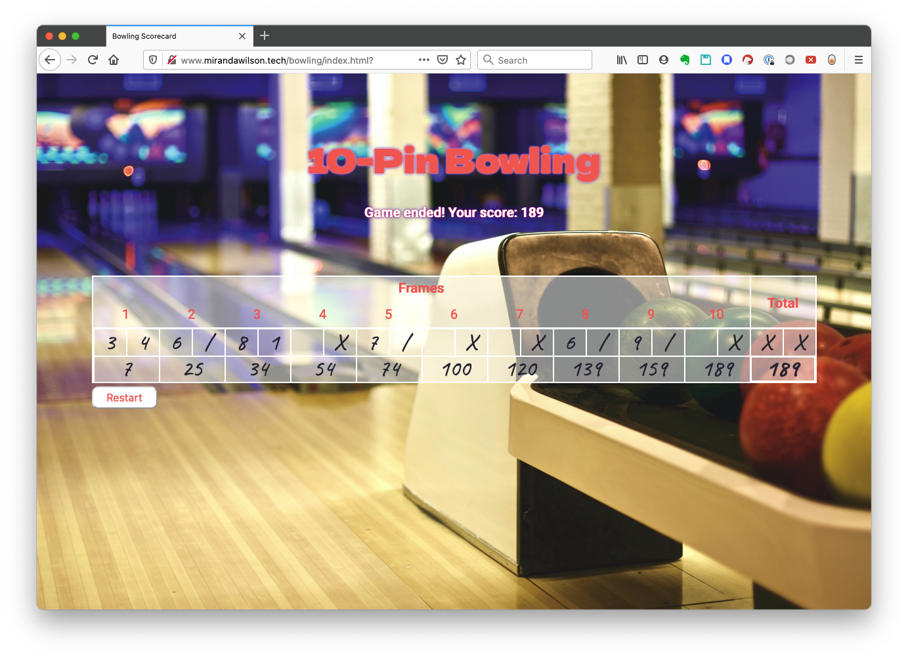

## Bowling Scorecard Challenge in JavaScript

A ten-pin bowling score calculator. It's a translation of [this](https://github.com/mscwilson/bowling-challenge-ruby) Ruby project, with a jQuery UI. It's hosted [here](https://mscwilson.github.io/bowling).

### The Task
Ten-pin bowling has surprisingly [complex rules](https://en.wikipedia.org/wiki/Ten-pin_bowling#Scoring). Essentially the score is the number of pins knocked over per round (frame), but there are bonus points if all ten pins fall after only one or two consecutive rolls.

This was the 6th weekend challenge for [Makers Academy](https://makers.tech). The goal was to practise JavaScript, with a stretch goal of adding a jQuery interface.

Try it out [on my GitHub Pages site](https://mscwilson.github.io/bowling).

It looks like this:

### Technical Approach
The logic is a straight translation of my [original](https://github.com/mscwilson/bowling-challenge-ruby) Ruby project. That wasn't written with an interface in mind, so it was challenging to then display what I wanted. I looked at more examples of real scorecards and saw that results are usually shown differently from how I expected. I ended up writing several new functions, for example to calculate cumulative scores for each frame.

During a Frame, the user is only given appropriate choices in the Select dropdown list. For example, if they already knocked down 8 pins, the dropdown list will have only 0, 1, and 2 as options.

I chose a handwriting-style font for the scores to reference real, old-fashioned scorecards. The background image is a free picture from [Pexels](https://www.pexels.com/).

### Installation and Usage
* Clone this repo and navigate into it
* Open `index.html` in your browser
* Enter number of pins knocked down to see a cumulative score
* To run the unit tests, open `SpecRunner.html` in your browser

### Known Issues
* The scorecard grid has absolute sizes, it's not responsive. It doesn't fit the screen on mobile. To fix this ideally I would create a new layout for mobile, with a vertically aligned scorecard.
* There's a bug around displaying the score in the 10th frame under certain conditions.
* The code isn't the cleanest. The Frame logic around what to display in the scorecard is particularly in need of refactoring.
* The scorecard borders aren't perfect; there are some unwanted double thickness sections down the left-hand side.
* I'd like it to congratulate the user if they get a "perfect game".
