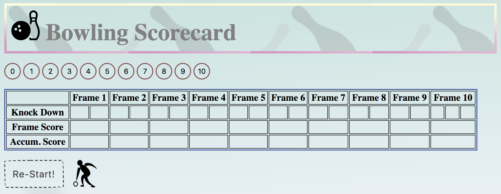
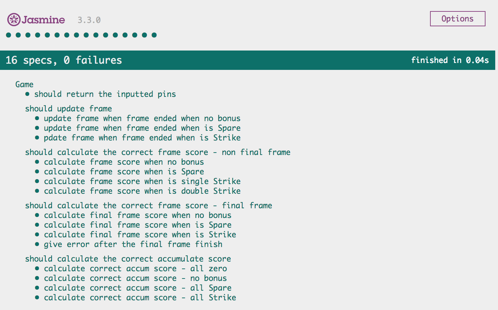

# Bowling Challenge

This repository is a Javascript implementation of a bowling scorecard. The rules for bowling can be found [here](https://github.com/EllyChanx/bowling-challenge/blob/elly/Instruction%20and%20Rules.md).

The app delivers the following user story:

```
As an bowling player
So that I can keep track of my score
I want to be able to record my performance and see the sum of my score according to the standard 10 pins bowling rules
```  

## Usage

### Installation  

This app runs on Javascript, and uses Node.js to manage dependencies. To install Node.js follow the instructions [here](https://nodejs.org/en/). Then install this app by cloning this repository using git and installing the dependencies. To run the app just open the `index.html` page:



### Linting Utility

Linting is performed with [ESLint](https://eslint.org/) to analyse potential errors and to maintain code conform. All codes in `src` folder and `spec` folder are linted and have 0 error.

### Tests  

Tests are performed with Jasmine. To run the test just open the `SpecRunner.html` page. All 16 tests are passing to cover the basic function of the bowling rules:  



## Approach  

### Game record

Each frame is stored as an array and the game record is an array of 10 frames. A specific frame can be search by using the index number of the frame `index = frameNo - 1` in the game record. Not the best approch to complete the task:  
- Many (too many?) validations to ensure the reqired frame exist to avoid `undefine` error  
- `frameNo - 1`, `index + 1`, `index + 2` are all over the code logic:

```javascript

Game.prototype.noBonus = function (index) {
  this.cur_score += (this.gameRecord[(index)].reduce((a, b) => a + b))
}

Game.prototype.spareBonus = function (index) {
  if (!this.gameRecord[index + 1]) { return }
  this.cur_score += 10 + this.gameRecord[index + 1][0]
}

``` 

### Score control

In the game instance, no logic is applied to control the number of pins therefore score to be inputted and processed. For normal frames and final (10th) frame, this behaviour is only controlled in the `disableButtons` method in the `interface` file:

```javascript
function disableButtons (num) {
  if (game.cur_roll === 2 && num !== 10) {
    var to_disable = 11 - num
    for (let i = to_disable; i <= 11; i++) {
      $('#score' + i).hide()
    }
  } else {
    for (var i = 0; i < 11; i++) {
      $('#score' + i).show()
    }
  }
}
```
This is the interface when the buttons are hidden according to the method:


## Improvement

There are several areas where this project could be improved. These are not limited to:
- Test coverage: monitor test coverage to this repository
- End game status: recognize a perfect game and gutter game at the end
- Styling: can always do better

