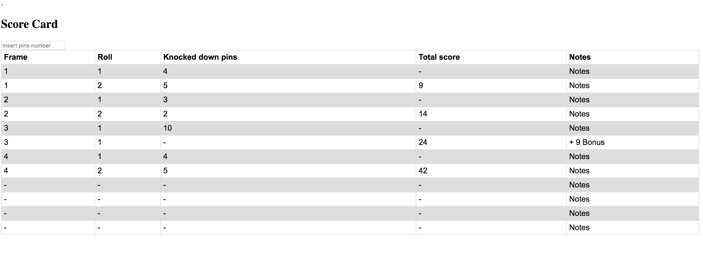

# Bowling Challenge

* The Game stores the Frames. The new instance of the game is initialized once the app boot.
* The frame gets automatically instantiated once the game start. The maximum number of frames is 10.
* Frame is composed of two rolls, every time the second roll is completed then a new frame is instantiated by the game and added to the table.
* The frame keeps track of the knocked down pins in per roll. The user has to insert the number of knocked pins per roll.
* The frame has a function that calculates the score of the single instance.
* The game manages the overall score and the bonuses.
* The card is fully automatic. The user needs to insert the number of pins only.

## User stories

```
As a user
So I can take note of my scores
I want to add a new frame line
```
```
As a user
So I can calculate the score
I want to add the knocked down pins
```
```
As a user
So I can easily fill up a new frame
I want a new frame to be created once I fill in the last roll
```
```
As a user
So I do not have to use calculation skills
I want the score card to calculate the score
```
```
As a user
So I do not have to think of the game rules
I want the score card to calculate the strike bonus
``` 

## Example

