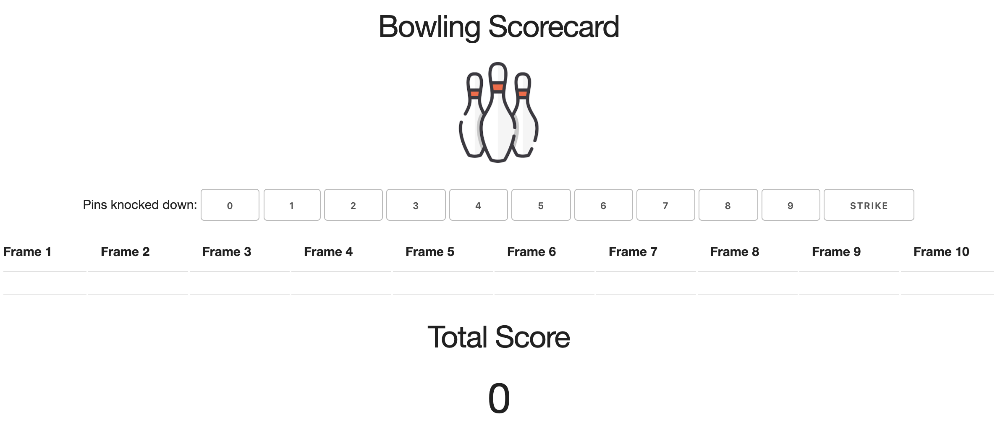

Bowling Challenge
=================

Week 5 Makers Academy weekend challenge - build an app that counts the scores of a game of 10 pin bowling, in Javascript.

## To run this program
1. Clone this repo
2. Type `open index.html` from the command line and click on the button that corresponds to the number of pins you knocked down. You will see a running total being displayed, as well as a record of your scores printed to the screen. This is a work in progress, so if you prefer you can run the program using the console in your Chrome Dev Tools. To do so, follow the steps below:
3. Copy and paste the code from the 'game.js' file into the console.
3. Type `game = new Game();`
4. Input rolls using the following function: `game.inputRolls(x)`, replacing `x` for the number of pins you knocked down.
5. Type `game` and hit enter in order to see the current status of the game (e.g. the number of frames you have played, or the total score).

## To test this program
1. Clone this repo
2. Type `open SpecRunner.html` from the command line.

## Rules of Bowling

### Strikes

The player has a strike if he knocks down all 10 pins with the first roll in a frame. The frame ends immediately (since there are no pins left for a second roll). The bonus for that frame is the number of pins knocked down by the next two rolls. That would be the next frame, unless the player rolls another strike.

### Spares

The player has a spare if the knocks down all 10 pins with the two rolls of a frame. The bonus for that frame is the number of pins knocked down by the next roll (first roll of next frame).

### 10th frame

If the player rolls a strike or spare in the 10th frame they can roll the additional balls for the bonus. But they can never roll more than 3 balls in the 10th frame. The additional rolls only count for the bonus not for the regular frame count.

    10, 10, 10 in the 10th frame gives 30 points (10 points for the regular first strike and 20 points for the bonus).
    1, 9, 10 in the 10th frame gives 20 points (10 points for the regular spare and 10 points for the bonus).

### Gutter Game

A Gutter Game is when the player never hits a pin (20 zero scores).

### Perfect Game

A Perfect Game is when the player rolls 12 strikes (10 regular strikes and 2 strikes for the bonus in the 10th frame). The Perfect Game scores 300 points.

## My approach

My first step was to break down this task into the following user stories:

```
As a competitive bowler
So that I can keep track of my score as I play
I would like a scorecard that calculates a running total.

As a competitive bowler
So that I can record when I score a strike
I would like a scorecard to recognise a strike.

As a competitive bowler
So that I can record when I score a spare
I would like a scorecard to recognise a spare.

As a competitive bowler
So that I can work out my spare scores correctly
I would like a scorecard to calculate the special scoring for spares.

As a competitive bowler
So that I can work out my strike scores correctly
I would like a scorecard to calculate the special scoring for strikes.

As a competitive bowler
So that I can calculate a gutter game
I would like a scorecard to calculate when I score 0 for every roll.

As a competitive bowler
So that I can calculate a perfect game
I would like a scorecard to calculate when I score 10 for every roll.

As a competitive bowler
So that I can take advantage of the tenth frame bonus
I would like an additional roll if I score a spare or strike in the tenth frame.

```

At first I considered having a Scorecard constructor function and a Frame constructor function. However, when planning this project I realised that it is simply designed to be a scorecard, not a bowling game. As the scorecard has one responsibility - to keep track of scores - I made the decision to just have a Game constructor function that would take care of the logic.

I have managed to implement most of these user stories successfully and have also created a user interface which records the running total as the user clicks on the button corresponding with the number of pins they have knocked down.

I have not yet managed to implement the logic of consecutive strike scores (and accordingly a perfect game). I have also not managed to implement the 10th frame bonus feature yet, which are both features I would like to fix.

## User Interface

Here is a screenshot of the user interface as it currently is:

<div align="center">
    
</div>

## What I learned from this project
* The importance of planning carefully when there is a lot of complex logic involved!
* Practice using Javascript to create an app
* Practice TDD in Javascript
* Practice debugging in Javascript
* Practice using Jquery and HTML

## To fix
* A perfect game (score 300)
* A game with consecutive strikes
* The tenth frame feature
* Improve the user interface

## Acknowledgements
Jordan Roberts - a Makers Academy Challenge
