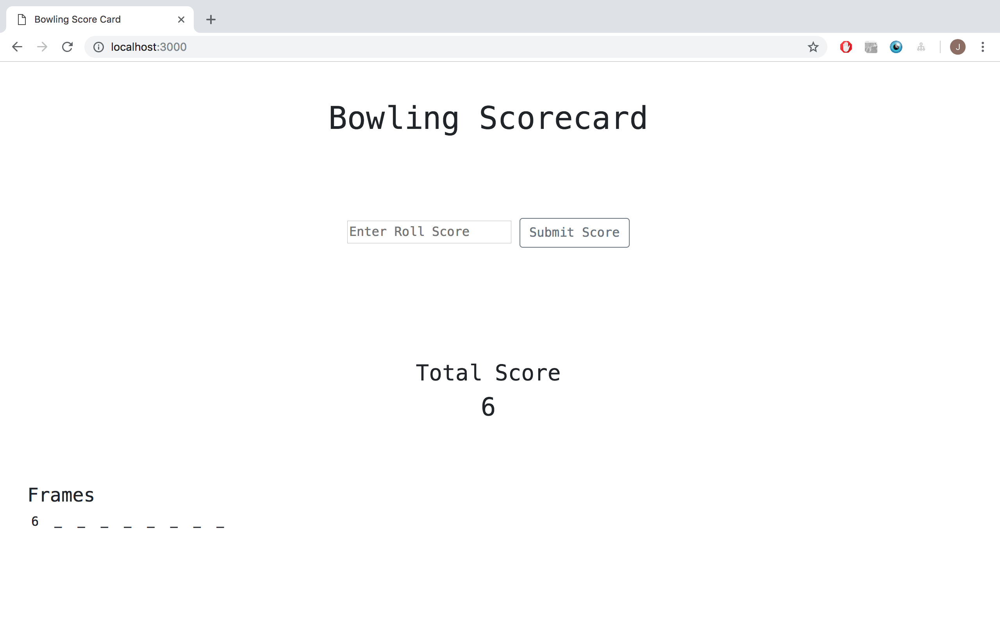
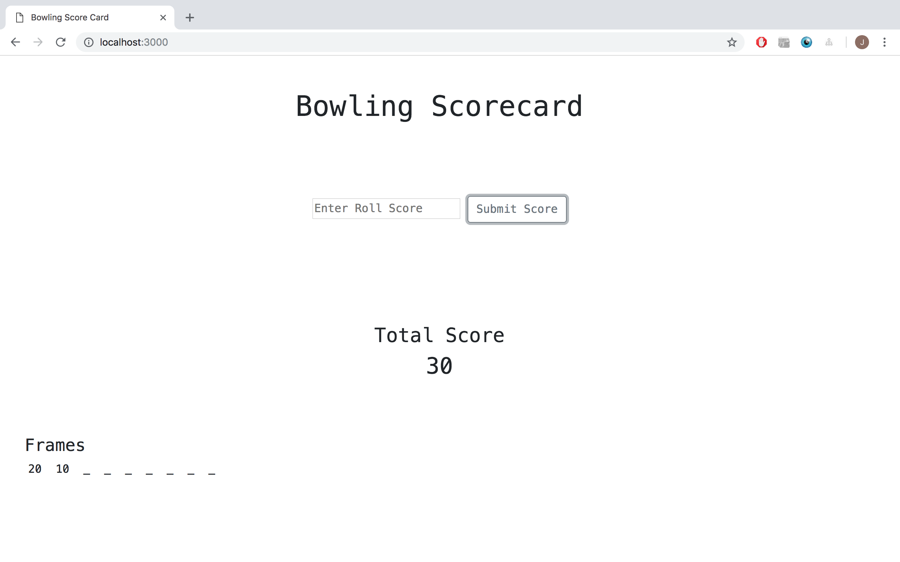
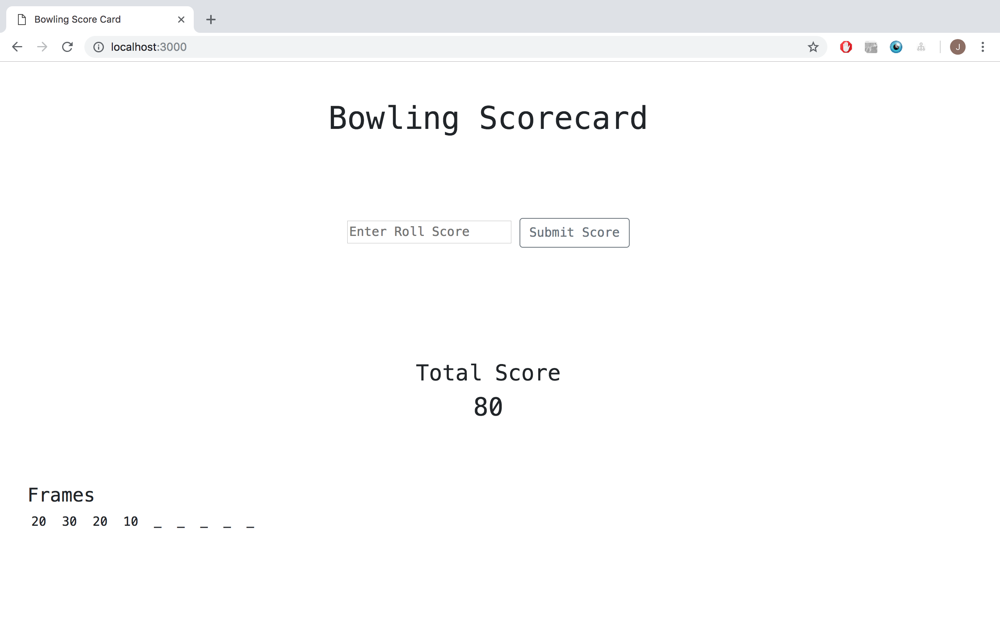
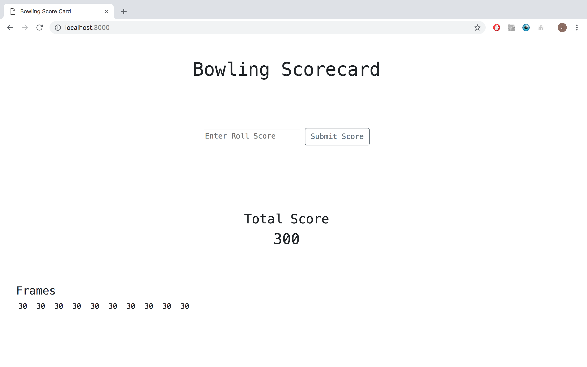
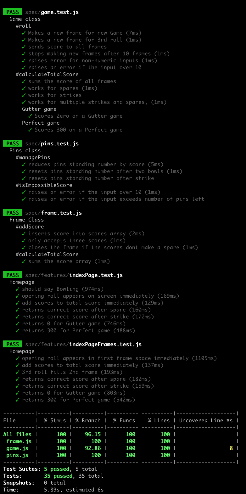

Bowling Challenge
=================

## User Story

`As an player` 
`So that I can measure my performance` 
`I want to track of my score according to the official rules.`

## Usage

Clone down the repo.

`git clone https://github.com/JonathanAndrews/bowling-challenge.git`

Install all dependencies.

`npm install`

Start up the app.

`node app.js`

Run the tests.

`npm test`

Hopefully all are green, then go to `http://localhost:3000/` in your browser.

## Screenshots

At `http://localhost:3000/` you will see a screen like this.

You enter a score into the central input field and it will appear in the central Total Score field and in the 1st frame field in the bottom left hand corner.

Scores are summed, and the Total Score field and the 1st frame field immediately update. Here the score is a spare.

The Spare receives bonus points from the next frame.

The Strike receives bonus points from the next two frames.

12 Strikes is a perfect game totalling 300 points.

## Strategy

I built this web app back to front.
I designed and coded the model and then connected it to a webapp.

I did this because the primary problem of the challenge is how to implement the bonus points scored after a Strike or Spare.

I have attempted in this challenge to engineer away most of the headaches associated with this.

I feel I have been relatively successful.  I do not have chains of nested if/else statements and I think the my solution is easy to understand.

The first thing I did was to write down the extreme cases:
- a strike
- a spare
- a strike in the last frame
- a perfect game

I concluded two things:
1. All frames store either three scores or two scores, even for edge cases.
2. A new frame is made every two bowls unless there is a strike, in which case a new frame is made immediately.

## The Design

1. So, I designed my frames to limited their own size to 3 scores.
2. If the first two scores were less than 10 the frame put 0 into the final available slot.
3. This meant that I could send the scores to all frames and only those with space would store the Roll score.

4. With the frames controlling their own bonuses, the game code only focuses on when to make more frames.
5. It makes a new frame if there is a strike.
6. It makes a new frame if there have been two bowls since the last new frame.
7. It stops making frames when there are ten frames.

8. The last thing to do was to guard against user error.

## The Stack

Views: Embedded JavaScript 
Controller: Express 
Models: Node 

Unit Testing: Jest 
Feature Testing: Jest with Puppeteer 

Linting: ESLint

## The Testing

