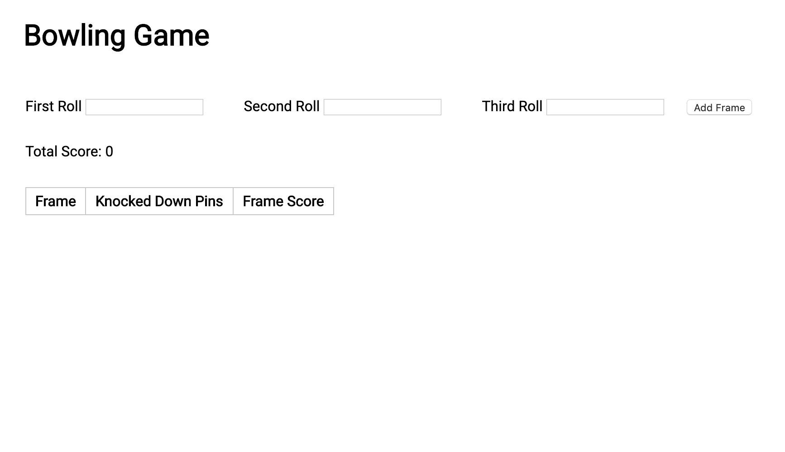
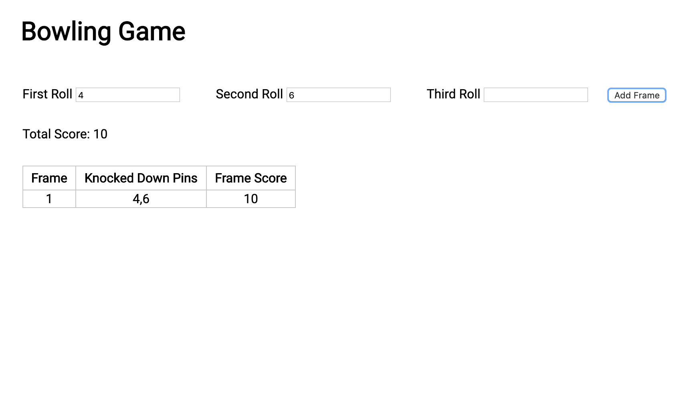
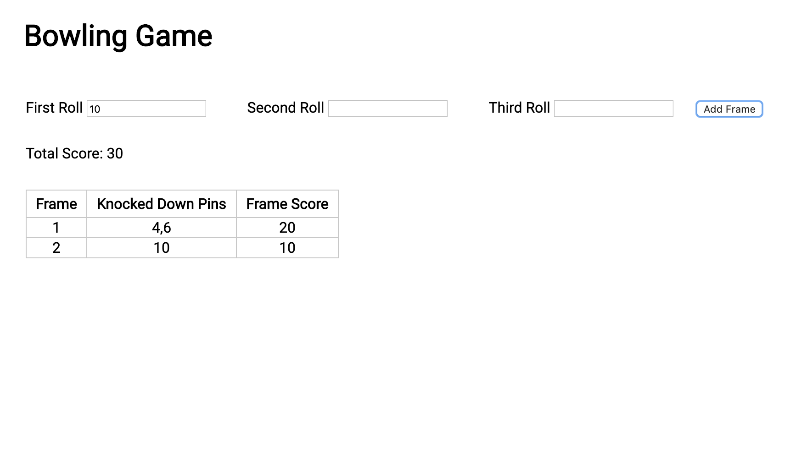
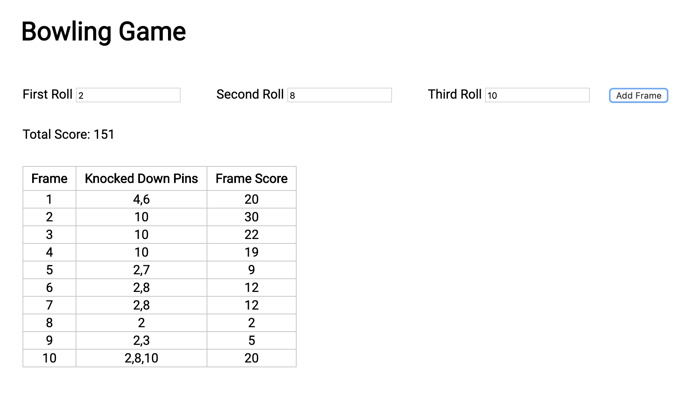

# Bowling Challenge

Description
-------

This is the weekend challenge at the end of my fifth week at Makers Academy, a 16-week software developer bootcamp. For all the instructions, please refer [here](https://github.com/makersacademy/rps-challenge/blob/master/INSTRUCTIONS.md).

Prerequisites
-------

* Fork this repository
* Clone the new repository into your machine with ```git clone```

How to run tests
-------

* Open the file ```SpecRunner.html``` in the browser to run the tests

Class Diagrams
-------

| Game                |
| ---                 |
| currentFrame        |
| frameSheet          |
| scoreSheet          |
|-------------------- |
| addFrame            |
| calculateTotalScore |       
|-------------------- | 
| calculateScoreSheet |  
| calculateFrameScore |

Feature Test / Screenshots
-------

* Open the file ```index.html``` in the browser to play the game



* Input the first frame and press "Add frame" (spare)



* Input the second frame and press "Add frame" (strike)



* See the partial and total scores

