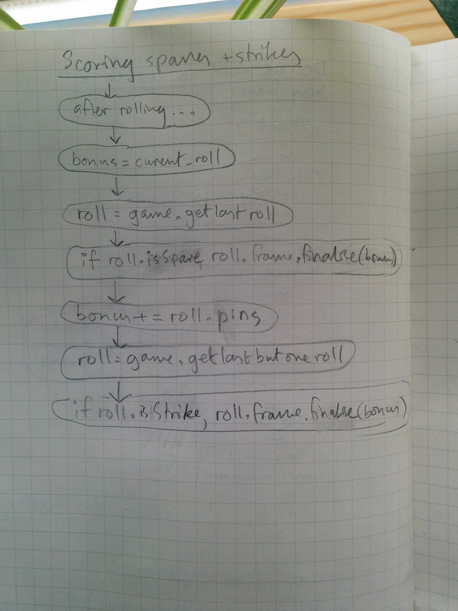

# Bowling challenge

*[Instructions](instructions.md)*  
*[Notes](notes.md)*

## Stuff used

- JavaScript
- Jasmine
- npm:
    - `eslint` with [standard style guide](https://standardjs.com/)
    - `eslint-plugin-jasmine`
    - `jasmine` - command line jasmine
    - `jasmine-terminal-reporter` - enhanced jasmine test output in the terminal
    - `nyc` - test coverage. run with `node_modules/.bin/nyc jasmine`
- Travis CI

## Planning

I did more planning this time. It was easier since I had a better idea of the logic starting out, this being my second attempt.

