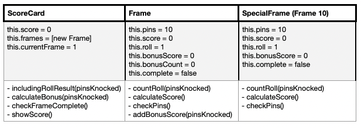

Bowling Challenge in JavaScript
=================

The purpose of the challenge was to create a program to count the score of a bowling game, using JavaScript as language.

The user inputs the rolls (amount of pins that went down) and the program shows the score after each frame. Spares and Strikes are not counted into the score until the final points for those are determined (Spare is 10 points plus the value of next roll. Strike is 10 points plus the value of next 2 rolls). Frames consists in 2 rolls, except 2 exemptions: when the 10 pins go down after first roll (Strike) or in last frame, when, if the user gets to hit all 10 pins in first 2 rolls, a third one is needed to determine the bonus points for Strike/Spare.

Maximum of pins that can be knocked down on a same frame is 10 (expect from last frame), so the program will not count an entry when it is more than 10, or when adding the first roll of the frame the result is bigger than 10.

CRC cards:
-----




Getting started:
-----

Install Node Version Manager (nvm).

Install node:
```
nvm install node
nvm use node
```

Install jest to run the tests:
```
npm init -y
npm add jest
npm install -g jest
```

Usage:
-----

On node, require ScoreCard class (`const ScoreCard = require('./scoreCard.js'`).

Create a new scorecard with `new ScoreCard` and call `includingRollReuslt(pinsKnocked)` class method with the number of pins knocked down for each roll. Score is printed on the screen after each frame.


Running tests:
-----

Run `jest` on main folder