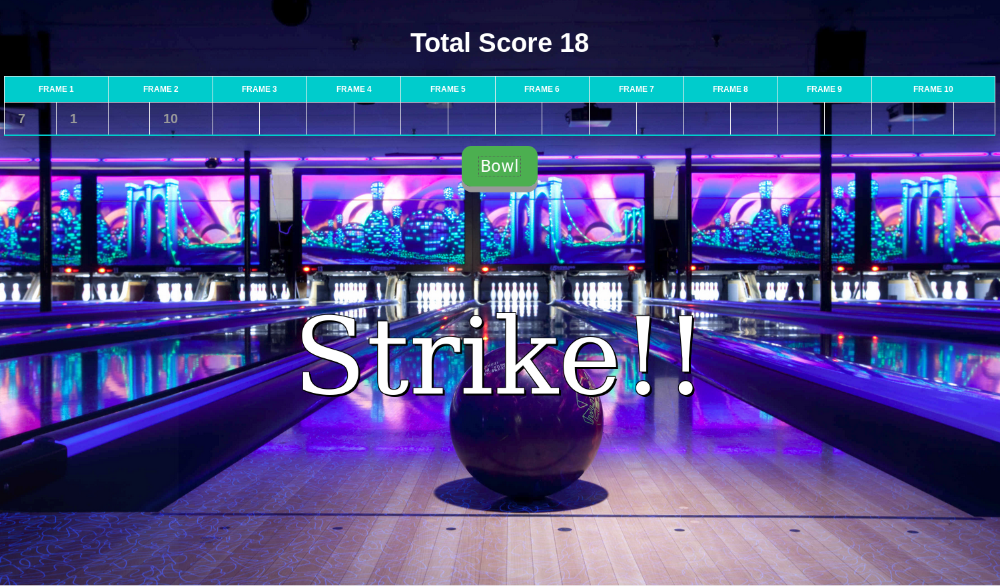
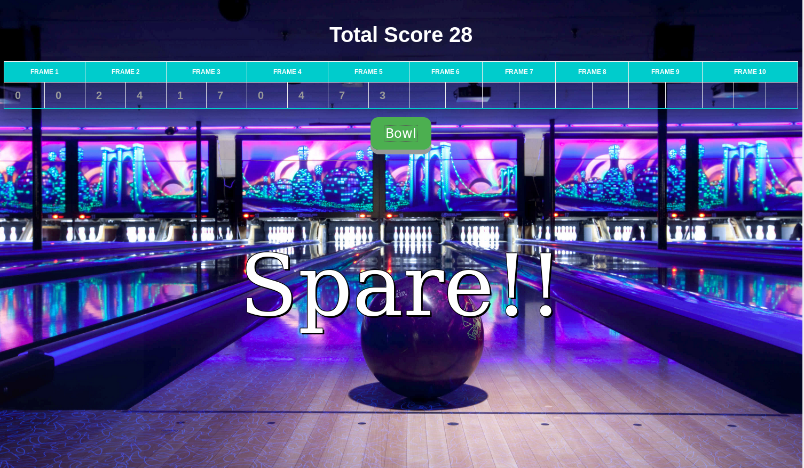

Bowling Challenge
=================

What is it:
-----

A 10 pin bowling game made in Javascript / jQuery.

How to use it:
----
* git clone https://github.com/AlexAvlonitis/bowling-challenge.git
* cd bowling-challenge
* open index.html

Build Process:
----
I've used Jasmine to TDD this JS project, Javascript OOP for the business logic, HTML/CSS for the layout design and jQuery to connect these two.
Rules of the game: http://en.wikipedia.org/wiki/Ten-pin_bowling

ScreenShots:
----

To Do:
----

* Need to complete the logic for the 10th frame.
* Improve the business logic design!.
