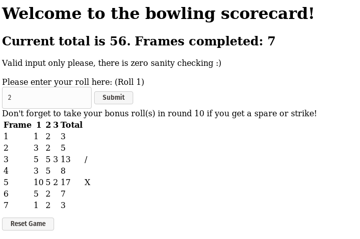

Colin's Bowling Challenge
=============

Welcome to my rather scrappy bowling challenge. This proved much more complicated than expected and while I did try and
stick to TDD, the code ended up pretty messy. I've refactored the worst of it away, but it's not pretty. 
 
I also encountered a world of technical issues, largely due to my unfamiliarity with javascript (new to it this week). More on that below. 

Features
=====

- Functioning bowling game.
- All bowling edge cases are working (gutter games, all-strike games, all-spare games, combinations etc.).
- Round 10 is also implemented in the UI - bonus balls for strikes and spares are counted.
- `JQuery` basic user interface, showing a table of results, scores and strike/spare symbols.
- `ESLint` used with `javascript standard` profile - all passing.
- `Jasmine` used for unit and feature tests. 

User experience
=====

The user interface is basic but functional:

Missing features / bugs etc.
=====

- The game does not announce victory, although the score stops tallying correctly.
- There is zero validation on user input at present (so e.g. the user can input >10 pins).
- The event loop behind the scenes is still slightly creaky, hence there is a 'frame 11' created behind the scenes. Needs some more thought and refactoring.
- There is no rules prompting for users - e.g. they must know to press the submit button again for bonus shots.
 
Technical issues I was not able to solve in the time we had:
====

- Jasmine helper methods in a separate file (I had to duplicate `enterScores` in both spec files...)
- Travis tests triggering when I create a PR on github
- Make ESLint aware of files that only become available in the browser (re. `interface.js`'s use of `Bowling`) - I had to mute it on lines 3 and 14 instead.
- Deal with dependencies arising from `node` more elegantly - currently using `browserify` but having to manage a `bundle.js` file is a pain.
- Event looping is currently bundled up in other methods (e.g. `enterScore()` can trigger `endFrame()`). I was unable to work out how to orchestrate things and have jasmine input when required.

Project structure
============

- `spec/features/BowlingFeatureSpec.js` and `spec/units/BowlingSpec.js` contain the two jasmine test files.
- `src/Bowling.js` coordinates events and creates new frames when needed.
- `src/Frame.js` contains all the information about an individual frame and makes decisions about the status of frames.
- `src/interface.js` connects the game to the UI and populates the dynamic sections of the page.
- `src/bowling.hmtl` is the front-end to the game. 
- `bundle.js` is the javascript produced by `Browserify`; necessary to make the node app run in the browser.

Technical feedback welcomed...
====

This week has felt a bit like I was stabbing in the dark with a bunch of technologies I was new to, so any feedback would be very welcome. In particular...

- Would it be better practice to have another class orchestrating the overall program logic?
    - If so, how can jasmine coordinate with this, when it needs to enter numbers?
    - Currently, this difficulty has led to events being triggered by existing methods within `Bowling.js` as a side-effect - e.g. `enterScore` triggers `endFrame`.
- Some of the missing orchestration has been placed within `interface.js` because it's triggered by user interaction. Is this appropriate?
 
Instructions for use
===

**As an end user: **

- No setup is required
- Clone the directory
- Open `src/bowling.html` and play. (`browserify` has been used in standalone moded to bundle the required javascript) 
 
**As a developer: **

- Install `npm` using your usual package manager
- Execute `npm install` in the project root to download the dependencies in `package.json`
- Execute `npm run lint` to run the `ESLint` package (`javascript-standard` profile)
- Execute `npm test` to run the `Jasmine` tests
- NB: If you make any changes to the source files, you need to run `browserify src/Bowling.js --s Bowling >  src/bundle.js` from the project root to generate an updated javascript bundle for the browser.
- NB2: If this is done, in order to pass the lint tests, add a `/*eslint-disable*/` to line 1 of `bundle.js` as the generated javascript is not compliant.

Bowling Challenge
=================

* Challenge time: rest of the day and weekend.
* Feel free to use google, your notes, books, etc. but work on your own
* If you refer to the solution of another coach or student, please put a link to that in your README
* If you have a partial solution, **still check in a partial solution**
* You must submit a pull request to this repo with your code by 9am Monday week

## The Task

**THIS IS NOT A BOWLING GAME, IT IS A BOWLING SCORECARD. DO NOT GENERATE RANDOM ROLLS. THE USER INPUTS THE ROLLS.**

Count and sum the scores of a bowling game for one player (in JavaScript).

A bowling game consists of 10 frames in which the player tries to knock down the 10 pins. In every frame the player can roll one or two times. The actual number depends on strikes and spares. The score of a frame is the number of knocked down pins plus bonuses for strikes and spares. After every frame the 10 pins are reset.

As usual please start by

* Forking this repo

* Finally submit a pull request before Monday week at 9am with your solution or partial solution.  However much or little amount of code you wrote please please please submit a pull request before Monday week at 9am.  And since next week is lab week you have a full extra week to work on this.

___STRONG HINT, IGNORE AT YOUR PERIL:___ Bowling is a deceptively complex game. Careful thought and thorough diagramming — both before and throughout — will save you literal hours of your life.

### Optional Extras

In any order you like:

* Create a nice interactive animated interface with jQuery.
* Set up [Travis CI](https://travis-ci.org) to run your tests.
* Add [ESLint](http://eslint.org/) to your codebase and make your code conform.

You might even want to start with ESLint early on in your work — to help you
learn Javascript conventions as you go along.

## Bowling — how does it work?

### Strikes

The player has a strike if he knocks down all 10 pins with the first roll in a frame. The frame ends immediately (since there are no pins left for a second roll). The bonus for that frame is the number of pins knocked down by the next two rolls. That would be the next frame, unless the player rolls another strike.

### Spares

The player has a spare if the knocks down all 10 pins with the two rolls of a frame. The bonus for that frame is the number of pins knocked down by the next roll (first roll of next frame).

### 10th frame

If the player rolls a strike or spare in the 10th frame they can roll the additional balls for the bonus. But they can never roll more than 3 balls in the 10th frame. The additional rolls only count for the bonus not for the regular frame count.

    10, 10, 10 in the 10th frame gives 30 points (10 points for the regular first strike and 20 points for the bonus).
    1, 9, 10 in the 10th frame gives 20 points (10 points for the regular spare and 10 points for the bonus).

### Gutter Game

A Gutter Game is when the player never hits a pin (20 zero scores).

### Perfect Game

A Perfect Game is when the player rolls 12 strikes (10 regular strikes and 2 strikes for the bonus in the 10th frame). The Perfect Game scores 300 points.

In the image below you can find some score examples.

More about ten pin bowling here: http://en.wikipedia.org/wiki/Ten-pin_bowling

## Code Review

In code review we'll be hoping to see:

* All tests passing
* The code is elegant: every class has a clear responsibility, methods are short etc.

Reviewers will potentially be using this [code review rubric](docs/review.md).  Note that referring to this rubric in advance may make the challenge somewhat easier.  You should be the judge of how much challenge you want.
