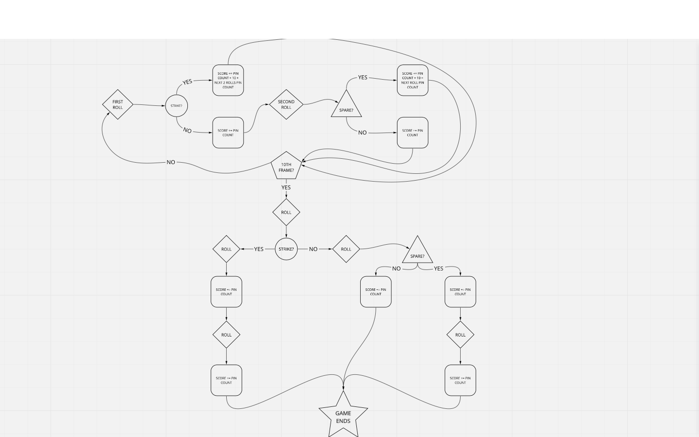

Bowling Challenge
=================

## The Task

**THIS IS NOT A BOWLING GAME, IT IS A BOWLING SCORECARD PROGRAM. THE USER INPUTS THE ROLLS.**

Count and sum the scores of a bowling game for one player. For this challenge, just focus on the logic for bowling.

A bowling game consists of 10 frames in which the player tries to knock down the 10 pins. In every frame the player can roll one or two times. The actual number depends on strikes and spares. The score of a frame is the number of knocked down pins plus bonuses for strikes and spares. After every frame the 10 pins are reset.

## GAME FLOW DIAGRAM

## USER STORIES

As a Player

So that I can play a bowling game

I want to roll a ball

---

As a Player

So that I know my score

I want to count the pins I throw

---

As a Player

So that I know if I have to throw once or twice in a frame

I want to know if I have knock down all 10 pins on current frame

---

As a Player 

So I that I can update my score throughout the game

I want to sum the score of each frame

---

As a player

So that I can keep my score thru the game

I want to know what's the current frame

---

As a player

So that I know if the game ended

I want to know if I reached the 10th frame

----
## IMPLEMENTATION 
Create a Bowlings class
In the class, create at least two methods: 
* 'roll', to emulate a player rolling a ball.
* 'score', to be called once the game ends. Should return the score for the current game.
---
## TESTS TO PASS
#### GUTTER GAME
-/- -/- -/- -/- -/- -/- -/- -/- -/- -/-  = 0 POINTS

#### ALL ONES
1/1 1/1 1/1 1/1 1/1 1/1 1/1 1/1 1/1 1/1  = 20 POINTS

#### GAME WITH A SPARE
4/6 4/- -/- -/- -/- -/- -/- -/- -/- -/-  = 18 POINTS

#### GAME WITH A STRIKES
10  2/5 -/- -/- -/- -/- -/- -/- -/- -/-  = 24 POINTS

---
---
### EXTRA INFO

## Focus for this challenge
The focus for this challenge is to write high-quality code.

In order to do this, I will pay particular attention to the following:
* Using diagramming to plan your approach to the challenge
* TDD your code
* Focus on testing behaviour rather than state
* Commit often, with good commit messages
* Single Responsibility Principle and encapsulation
* Clear and readable code

## Bowling — how does it work?

### Strikes

The player has a strike if he knocks down all 10 pins with the first roll in a frame. The frame ends immediately (since there are no pins left for a second roll). The bonus for that frame is the number of pins knocked down by the next two rolls. That would be the next frame, unless the player rolls another strike.

### Spares

The player has a spare if the knocks down all 10 pins with the two rolls of a frame. The bonus for that frame is the number of pins knocked down by the next roll (first roll of next frame).

### 10th frame

If the player rolls a strike or spare in the 10th frame they can roll the additional balls for the bonus. But they can never roll more than 3 balls in the 10th frame. The additional rolls only count for the bonus not for the regular frame count.

    10, 10, 10 in the 10th frame gives 30 points (10 points for the regular first strike and 20 points for the bonus).
    1, 9, 10 in the 10th frame gives 20 points (10 points for the regular spare and 10 points for the bonus).

### Gutter Game

A Gutter Game is when the player never hits a pin (20 zero scores).

### Perfect Game

A Perfect Game is when the player rolls 12 strikes (10 regular strikes and 2 strikes for the bonus in the 10th frame). The Perfect Game scores 300 points.

In the image below you can find some score examples.

More about ten pin bowling here: http://en.wikipedia.org/wiki/Ten-pin_bowling

