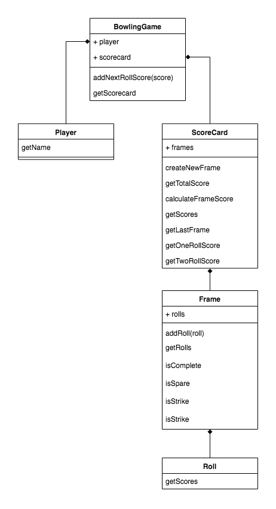

# Bowling Scorecard


## Model




## USER STORIES

```txt
As a user,
So I can see my score,
I want to enter my name.
```

```
As a user,
To save the game information,
I want to enter the number of pins I've knocked down in a roll, the score.
```

```txt
As a user,
So I can keep track of the progress of the game,
I want to see the accumulated score up to a frame.
```

```txt
As a user,
So I can keep track of the progress of the game,
I want to see the number of pins I knocked down on each roll.
```

```txt
As a user,
So I can keep track of the progress of the game,
I want to see the rolls organized by frames.
```

```txt
As a user,
So I can see the history of the game,
I want to see the values for the previous rolls.
```

```txt
As a user,
So that I know how well I did,
I want to see the total score.
```

```txt
As the Scoreboard,
So that the information of the game is valid,
I want to verify the values the User inputs.
```

```txt
As the Scoreboard,
So that the game information is correct,
I want to add the roll data to the correct frame.
```

```txt
As the Scoreboard,
To follow the game rules,
If the user hits 10 pins on the first roll of a frame, it's considered a Strike and the second roll of this frame is skipped, except if it's the 10th frame.
```

```txt
As the Scoreboard,
To follow the game rules,
If the user does *NOT* hit 10 pins on the first roll of a frame, he can do a second roll.
```

```txt
As the Scoreboard,
To follow the game rules,
If the user hits all the remaining pins on the second roll of a frame, it's considered a Spare.
```

```txt
As the Scoreboard,
To follow the game rules,
If the user hits a Strike on the first roll of the 10th frame, he gets two extra rolls.
```

```txt
As the Scoreboard,
To follow the game rules,
If the user hits a Spare on the second roll of the 10th frame, he gets one extra roll.
```

```txt
As the Scoreboard,
To provide the correct score,
If a frame is considered a Strike, the score from the next two rolls are added to that frame. 
```

```txt
As the Scoreboard,
To provide the correct score,
If a frame is considered a Spare, the score from the next roll is added to that frame.
```

