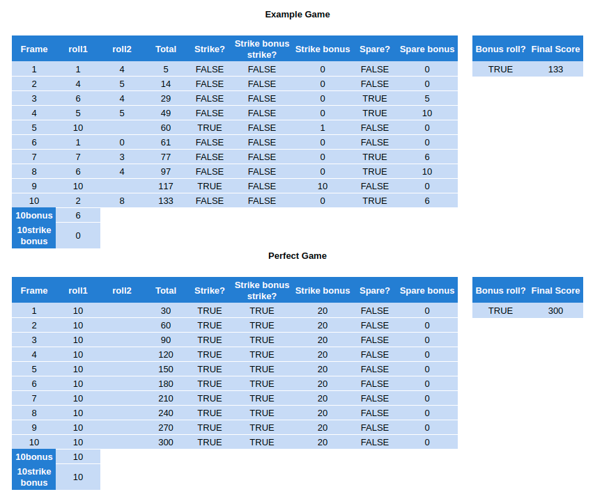

# Bowling Challenge

Create a bowling scorecard to count and sum the scores of a bowling game for one player (in JavaScript).

## Bowling Rules

A bowling game consists of 10 frames in which the player tries to knock down the 10 pins. In every frame the player can roll one or two times. The actual number depends on strikes and spares. The score of a frame is the number of knocked down pins plus bonuses for strikes and spares. After every frame the 10 pins are reset.

### Strikes

The player has a strike if he knocks down all 10 pins with the first roll in a frame. The frame ends immediately (since there are no pins left for a second roll). The bonus for that frame is the number of pins knocked down by the next two rolls. That would be the next frame, unless the player rolls another strike (in which case it will be the strike and the bonus is refreshed because of that strike).

### Spares

The player has a spare if the knocks down all 10 pins with the two rolls of a frame. The bonus for that frame is the number of pins knocked down by the next roll (first roll of next frame).

### 10th frame

If the player rolls a strike or spare in the 10th frame they can roll the additional balls for the bonus. But they can never roll more than 3 balls in the 10th frame. The additional rolls only count for the bonus not for the regular frame count.

- 10, 10, 10 in the 10th frame gives 30 points (10 points for the regular first strike and 20 points for the bonus).
- 1, 9, 10 in the 10th frame gives 20 points (10 points for the regular spare and 10 points for the bonus).

### Gutter Game

A Gutter Game is when the player never hits a pin (20 zero scores).

### Perfect Game

A Perfect Game is when the player rolls 12 strikes (10 regular strikes and 2 strikes for the bonus in the 10th frame). The Perfect Game scores 300 points.

## Development Journal

### Development approach

I approached this project using Test Driven Development strategies:

- Only write the most basic test you need to fail.
- Only write production code to pass a failing test.
- Only write the most basic production code to pass the test.

I approached this project with object oriented programming in mind:

- Objects should encapsulate methods that are related to one another in purpose.
- Methods should have a single responsibility, so they do not do too much, and are concise.

### Domain Modelling

I created a calculator in google sheets. It handles all aspects of the rules including the more complex logic of the 10th frame. It also calculates the perfect game properly.

This serves as a good guide for me to understand the logic I need to implement, and with JavaScript it is possible to hide away all the logic and simply show the frames, the rolls, and the running total.

### Project Setup

Installed Jasmine as my testing framework.

### Inputting some rolls

Created a spec file ScorecardSpec.js

Wrote a test that after calling record with 1 on scorecard, the scorecard's frame1 roll1 should be 1. Red.

- Created a file Scorecard.js, and sourced in SpecRunner.html.
- Created a scorecard constructor with a property frame1 object literal with a property roll1 assigned with 1.
- Added a record method.

Green.

Wrote a test that after calling record with 2 on scorecard, the scorecard's frame1 roll1 should be 2. Red.

- Adjusted record method to assign frame1.roll1 with the passed score.

Green.

- Refactored for record to create roll1 in an empty frame1 object literal.

Wrote a test that after calling record 1 twice, frame1 roll2 and roll1 should be 1. Red.

- Added a property to the scorecard, currentRoll set to 1.
- Added an if statement to record to assign roll1 with score passed if currentRoll is 1, then set currentRoll to 2.
- Added an else to assign roll2 with score passed.

Green.

### Summing Rolls in a Frame

Wrote a test that after calling record 1 twice, frame1 runningTotal should be 2. Red.

- added a runningTotal method to the frame1 object literal that returns 2.

Green.

Wrote a test that after calling record 2 twice, frame1 runningTotal should be 4. Red.

- rewrote runningTotal to return the sum of roll2 and roll2.

Green.

Refactored to use ES6 class syntax, as I find it easier to read.

### Moving On To The Next Frame

Wrote test that after calling record 1 three times, frame2 roll1 should be 1. Red.

- Added a currentFrame property to the scorecard, set to frame1.
- Added a new object literal for frame2, empty for now.
- Added to the record else statement to reset the currentRoll to 1 and set the currentFrame to frame2.

Green.

Wrote test that after calling record 1 four times, frame2 runningTotal is 4. Red.

- Hard coded frame2,runningTotal() to return 4.

Green.

Wrote a test that after calling record 2 four times, frame2 runningTotal is 8. Red.

At this point i need to be able to return the sum of frame2's rolls and the runningTotal of frame1. In its current form, the program has no way to reference the previous frame's total, so a different solution is needed.

- Created Frame object constructor, and the scorecard frames is now an array of new Frames.
- Reworked the runningTotal method not to belong to the frame, but to belong to scorecard. It takes an argument of which frame to calculate for, then loops up through the frames until that frame, collecting their individual totals (roll1 + roll2).

Green.

- Refactored frame into its own file, Frame.js.
- Sourced that in SpecRunner.html.

_Frames will now be referred to by their index in the frames array._

### Adding Spares

Now for spares. Wrote a test that recording 5 three times should result with runningTotal(0) returning 15 (5 + 5 + 5 on the first roll of the next frame as bonus). Red.

In order to help pass this test the frame should know if its score is a spare.

Created FrameSpec.js and wrote a test for frame.isSpare to return true if the rolls are five and five. Red.

- Wrote the isSpare method returning true hardcoded.

Green.

Wrote a test for isSpare to return false if the rolls are 1 and 1. Red.

- Updated isSpare to return a boolean based on if the total is equal to 10.

Green.

Now back to the runningTotal for spares. The running total needs to account for the first roll in the next frame and include that in the total of the frame as a bonus.

The scoreboard needs to be able to calculate that for the frame and give it as a property.

- Added to record method a variable for the frame, and previousFrame if it exists (i.e. frames[this.currentFrame - 1]), otherwise set to false.
- In the if statement for the currentRoll is 1, if the previousFrame is not false and if previousFrame was a spare then assign the roll1 score as the previousFrame spareBonus.
- Finally, add spareBonus as part of Frame.total (which is defaulted to 0 in the Frame's constructor)

Green.

- Refactored with a variable for frame similar to previousFrame to make the record method more readable.

## Adding Strikes

Now on to strikes. Wrote a test that recording 10 on the first roll then recording 1 on the second roll should result in frames[0].roll1 being 10, frames[0].roll2 being 0 and frames[1].roll1 being 1 (as the strike moves on to the next frame immediately). Red.

- Added to the record if statement for currentRoll is 1 a if statement for if the score is 10 to increment the currentFrame, else to switch the currentRoll to 2.
- Added to the Frame constructor defaults for rolls of 0.

Green.

Now the strike bonus points need to be applied. The strike applies bonus points for its frame based on the result of the next two rolls. This will either be rolls 1 and 2 of the next frame, or if the next frame is a strike, it will include that and the first roll of the frame after that.

Wrote a test for recording 10, then recording 4 twice. The total for frames[0] should be 18 (10 + 4 + 4), and the runningTotal for frames[1] should be 26 (18 + 4 + 4). Red.

The frame should also know if it is a strike. Wrote a test for isStrike to return with a frame with a roll1 of 10. Red.

- Hard coded isStrike to return true.

Green.

Wrote a test for isSpare to check that it returns false if the frame is a strike. Red.

- Converted isSpare to return a ternary operator, if the frame is a strike then it returns false, otherwise it returns if this total is 10.

Green.

Now strikes and spares are correctly identified, back to assigning a frame with bonus points for a strike.

- In the record method, in each of the paths for currentRoll 1 and 2, added an if statement that checks if there is a previousFrame and if it was a strike, and if so then ads the score to the previousFrames strikeBonus.
- Adjusted the Frame total method to also add strikeBonus.
- in the Frame constructor, set strikeBonus to 0.

Green.

Refactoring to extract out some methods from a now quite busy record method.

- Extracted the logic to assign spareBonus to its own method.
- Extracted the logic to assign strikeBonus to its own method.

Also refactored for the default values in the Frames constructor to be null, to distinguish them from a recorded value of 0.

Tests still green.

Wrote a test for two strikes in a row, then a frame of 1 and 1.

- runningTotal(0) should be 24 (10 + 10 from the next frame strike, + 4 from the roll1 of following frame).
- runningTotal(1) should be 42 (24 from previous frame + 10 + 4 from next frame roll1 + 4 from next frame roll2).
- runningTotal(2) should be 50 (42 from previous frame + 4 + 4).

Red.

In order to pass this test, for subsequent strikes, additional strike bonus needs to be allocated for the first strike as well.

- Added a new variable in the record method, secondPreviousFrame, assigned in a similar way to the previousFrame but for the one before previous.
- Added a new if statement in the currentRoll is 1 path that checks for if the previous frame is a strike and the second previous frame is a strike, and then adds the score to the secondPreviousFrames strikeBonus.

Green.

- Refactored the if statement into its own method, assignConsecutiveStrikeBonus.

- Also refactored out a method to advance to the next roll or to the next frame based on the current scenario, called advance.
- Also refactored the variable names to reduce line length, previousFrame and secondPreviousFrame now prev1 and prev2

At this point I manually tested a few different game scenarios, which also worked as expected.

### Frame 10

In the tenth frame if the result is a strike or a spare an additional roll can be made. If the additional roll is also a strike, a third roll can be made.

Wrote a test for a game in which all rolls are missed up until the tenth frame. In the tenth frame two fives are recorded, a spare. A third roll of 5 is made. runningTotal(9) should be 15. red.

- The test is failing because at the moment because after the second record the scoreboard advances, and the third record attempts to set roll1 of the 11th item in frames, which does not exist.
- Added a new special Frame10 object, which has a roll3.
- Added logic to advance. If it is the 10th frame, then after each roll just increment the currentRoll. Otherwise go down the usual route of going from 1 to 2, or moving the the next frame if its a strike.
- Added logic to record to handle currentRoll of 3, score should be set to roll3.

Green.

### The Perfect Game

Wrote a test that 12 consecutive strikes should result in a runningTotal(9) of 300. It is green, but I had to be sure.

- Linted.
- Refactored currentFrame variable name to just frame.

### HTML

For this to be a web app, an html page needs to interface with the scorecard.

- Created index.html.
- Added a background video for ambience.
- Created the scoring table using css grid.
- Added styling and fonts.
- Added some buttons to input scores.
- Added a button to toggle the video sound.
- Sourced js files.

### Clicking Buttons

Now the buttons need to be hooked up to the model with an interface.

- Created Interface.js.
- Sourced this in index.html.
- Sourced jquery.
- For the ambience button added jquery to toggle the video sound with the ambience button (fun).
- For each of the scoring buttons (that have a class 'record') added jquery for clicking element with that class, the click event currentTarget's value is parsed to an integer, then passed in to the record method.

### Displaying Scores

The table needs to be filled in with the submitted scores.

- Wrote a function updateScores which loops through each of the frames calling an updateFrame function.
- updateFrame dynamically grabs the correct id for the frame and fills roll1 and roll2 with the frame object's values.
- updateFrame also has some logic to enter an X or / for strike or spare.
- The last frame has a special function, updateFrame9 (counting from 0).
- updateFrame9 has more complex logic to allow for each of its rolls to be a strike and/or roll2 to be a spare (/).

Now the table is filled with the correct score as they are recorded

### Displaying Frame Running Totals

The table needs to be filled in with running totals that update based on the submitted scores.

The frames running total should only be updated if it is complete.

Wrote a test for a frame to know if it is complete, which should default to false. Red.

- Wrote Frame isComplete to return false.

Green.

Wrote a test for a frame to be complete if both its rolls are filled. Red.

- Returned the boolean of if both roll1 and roll2 are not null (i.e. filled).

Green.

Wrote a test for a frame to complete if it is a strike. Red.

- Added an or statement if the frame is a strike.

Green.

Now this method can be used to decide if the running total for the frame should be rendered in index.html.

- Added a new interface method updateRunningTotal, which updates the relevant frame's total element with its total if that frame is complete.

### Displaying Final Frame Total

Now for the final frame. The final frame can have a bonus roll if the first roll is a strike or a spare so its isComplete method is slightly different.

Wrote a test for Frame10 isComplete to be false by default. Red.

- Wrote Frame10 isComplete to return false.

Green.

Wrote a test for Frame10 isComplete to be true if roll1 and roll2 are filled but not by a spare of a strike. Red.

- Returned the boolean of if both roll1 and roll2 are not null (i.e. filled).

Green.

Wrote a test for Frame10 isComplete to return false if the first two rolls are a spare (as there is still a bonus roll to go). Red.

- Modified to return true if roll1 has been made and the sum of roll 1 and 2  is less than 10 (not a spare), otherwise return false (spare, so still can make a bonus roll).

Green.

Wrote a test for isComplete to return true once the third roll after a spare has been made. Red.

- Added a condition to return true if roll three is not null (i.e. filled).

Green.

Wrote a test for isComplete to return true after a strike and then a non strike roll. Red.

- Added a condition to return true if roll1 is 10 and roll2 is not null (i.e. filled).

Green.

Wrote a test for isComplete to return false after two strikes (third roll still available).

- Added condition for roll 1 and roll2 both 10 to return false.

Green.

Wrote a test for isComplete to return true two strikes and then a third roll. Red.

- Moved the check for roll3 being filled up to the top of the order.

Green.

_While working on Frame10 I realised that it does not need the isStrike or isSpare methods, or the strikeBonus or spareBonus properties, as it is the last frame these are never called or assigned. I removed these and their tests._

