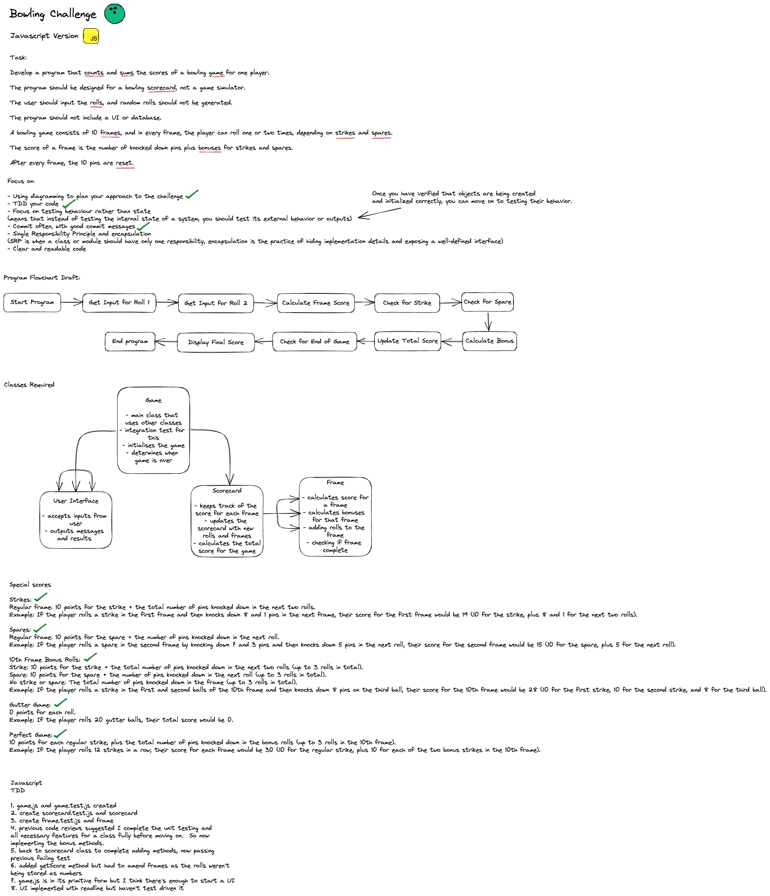

# Bowling Challenge

## How to use

1. Clone this repo
2. Run `npm install`
3. Run `BowlingScoreApp.js` in the terminal with `node BowlingScoreApp.js`

## How to run tests

1. Run 'jest' in the terminal

## How it works

The user is asked for the score for the first frame and so on until the game ends when the user has entered the scores for 10 frames. Throughout the game is notified for any bonus scores and bonus games such as Strike, Spare, Perfect Game and Gutter Game.

## Notes

To check the scores are following the rules of bowling I use this tool: https://www.bowlinggenius.com/

The rules of bowling can become complex when you start adding the bonuses and the 10th frame.

For the folder structure I asked ChatGPT and searched on google which led me to this: https://stackoverflow.com/questions/5178334/folder-structure-for-a-node-js-project

## Diagram

## Readline feature

Used ChatGPT to find out how to use the readline feature and this is also a good resource: https://nodejs.org/api/readline.html

## Classes
frame.js: Single frame of the bowling game.
Methods: isStrike, isSpare, isFinalFrame

scorecard.js: Handles the calculation of the scores.
Methods: addFrame, getScore, calculateStrikeBonus, calculateSpareBonus, isPerfectGame, isGutterGame

game.js: Represents a bowling game with 10 frames.
Methods: roll, startGame, endGame

userInterface.js: Provides the user interface for the terminal.
Methods: playGame()

## Unimplemented features and TODOs

- [ ] Add a feature to allow the user to enter the number of players.
- [ ] Add a feature to allow the user to enter the names of the players.
- [X] Score entry need to be limited to 10.
- [ ] Complete tests for the UserInterface.
- [ ] Add a feature to show current score after each frame.
- [ ] Add feature to allow the user to end the game prematurely.
- [ ] Add more error handling to all classes.