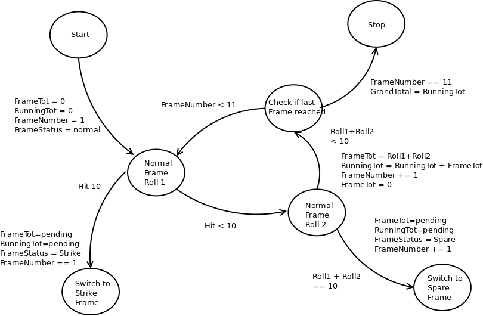
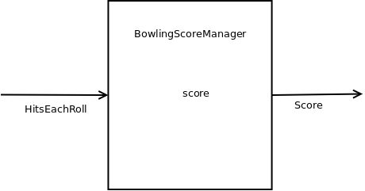
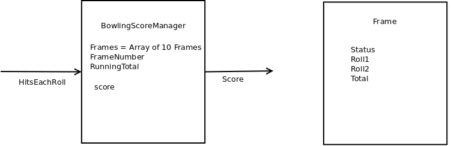
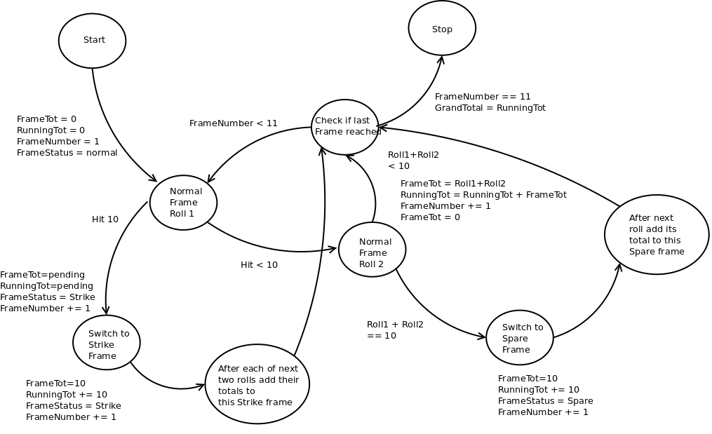

Bowling Challenge in JavaScript, ported from Ruby
=================================================

* Feel free to use google, your notes, books, etc. but work on your own
* If you refer to the solution of another coach or student, please put a link to that in your README
* If you have a partial solution, **still check in a partial solution**
* You must submit a pull request to this repo with your code by 9am Monday week

## The Task

**THIS IS NOT A BOWLING GAME, IT IS A BOWLING SCORECARD PROGRAM. DO NOT GENERATE RANDOM ROLLS. THE USER INPUTS THE ROLLS.**

Count and sum the scores of a bowling game for one player. For this challenge, you do _not_ need to build a web app with a UI, instead, just focus on the logic for bowling (you also don't need a database). Next end-of-unit challenge, you will have the chance to translate the logic to Javascript and build a user interface.

A bowling game consists of 10 frames in which the player tries to knock down the 10 pins. In every frame the player can roll one or two times. The actual number depends on strikes and spares. The score of a frame is the number of knocked down pins plus bonuses for strikes and spares. After every frame the 10 pins are reset.

As usual please start by

* Forking this repo

* Finally submit a pull request before Monday week at 9am with your solution or partial solution.  However much or little amount of code you wrote please please please submit a pull request before Monday week at 9am. 

___STRONG HINT, IGNORE AT YOUR PERIL:___ Bowling is a deceptively complex game. Careful thought and thorough diagramming — both before and throughout — will save you literal hours of your life.

## Focus for this challenge
The focus for this challenge is to write high-quality code.

In order to do this, you may pay particular attention to the following:
* Using diagramming to plan your approach to the challenge
* TDD your code
* Focus on testing behaviour rather than state
* Commit often, with good commit messages
* Single Responsibility Principle and encapsulation
* Clear and readable code

## Bowling — how does it work?

### Strikes

The player has a strike if he knocks down all 10 pins with the first roll in a frame. The frame ends immediately (since there are no pins left for a second roll). The bonus for that frame is the number of pins knocked down by the next two rolls. That would be the next frame, unless the player rolls another strike.

### Spares

The player has a spare if the knocks down all 10 pins with the two rolls of a frame. The bonus for that frame is the number of pins knocked down by the next roll (first roll of next frame).

### 10th frame

If the player rolls a strike or spare in the 10th frame they can roll the additional balls for the bonus. But they can never roll more than 3 balls in the 10th frame. The additional rolls only count for the bonus not for the regular frame count.

    10, 10, 10 in the 10th frame gives 30 points (10 points for the regular first strike and 20 points for the bonus).
    1, 9, 10 in the 10th frame gives 20 points (10 points for the regular spare and 10 points for the bonus).

### Gutter Game

A Gutter Game is when the player never hits a pin (20 zero scores).

### Perfect Game

A Perfect Game is when the player rolls 12 strikes (10 regular strikes and 2 strikes for the bonus in the 10th frame). The Perfect Game scores 300 points.

In the image below you can find some score examples.

More about ten pin bowling here: http://en.wikipedia.org/wiki/Ten-pin_bowling

## Design Diagrams

### State Diagram 1

### Class Diagrams 1

## Tests iteration 1

* Test ten frames each scoring zero with total score of zero.
* BowlingScoreManager.score( [...20 zeros...] ) => 0
* Test ten frames each scoring less than ten in total.
* [0,0, 1,1, 2,2, 3,3, 4,4, 4,5, 4,3, 3,2, 2,1, 0,0] => sum of these values

## Refactor

* Internally process the rolls / hits into frames
* Test drove the above

### State Diagram 2

## Tests iteration 2

* Successfully scores a game including a spare
* [5,5, 3,1, 2,2, 3,3, 4,4, 4,5, 4,3, 3,2, 2,1, 0,0]
* Successfully scores a game including two spares
* [5,5, 3,1, 2,2, 3,3, 6,4, 4,5, 4,3, 3,2, 2,1, 0,0]
* Successfully scores a game including multiple successive spares
* [5,2, 3,7, 2,8, 5,5, 6,4, 4,5, 4,3, 3,2, 2,1, 0,0]
* Successfully scores a game including a strike do
* [0,0, 1,1, 10, 3,5, 4,4, 4,5, 4,3, 3,2, 2,1, 0,0]
* Successfully scores a game including a strike followed immediately by a spare
* [0,0, 1,1, 10, 7,3, 4,4, 4,5, 4,3, 3,2, 2,1, 0,0] 
* Successfully scores a game including a spare followed immediately by a strike
* [0,0, 1,1, 4,6, 10, 4,4, 4,5, 4,3, 3,2, 2,1, 0,0]
* Successfully scores a game including a strike followed immediately by another strike
* [0,0, 1,1, 5,3, 10, 10, 4,5, 4,3, 3,2, 2,1, 0,0]
* Successfully scores a game including a strike followed immediately by another two strikes
* [0,0, 1,1, 5,3, 10, 10, 10, 4,3, 3,2, 2,1, 0,0]
* Successfully scores final frame in case of maximum possible score
* [10, 10, 10, 10, 10, 10, 10, 10, 10, 10,10,10] as 300
* Successfully scores final frame in case of spare in final frame
* [1,1, 1,1, 1,1, 1,1, 1,1, 1,1, 1,1, 1,1, 1,1, 3,7,2]
* Successfully scores final frame when no third roll needed
* [1,1, 1,1, 1,1, 1,1, 1,1, 1,1, 1,1, 1,1, 1,1, 1,2]
* Successfully scores final frame when no third roll needed but preceded by a spare
* [1,1, 1,1, 1,1, 1,1, 1,1, 1,1, 1,1, 1,1, 5,5, 1,2]
* Successfully scores final frame when no third roll needed but preceded by a strike 
* [1,1, 1,1, 1,1, 1,1, 1,1, 1,1, 1,1, 1,1, 10, 1,2]

## Refactor

* Internally process the rolls / hits into frames which account for spares
* Internally process the rolls / hits into frames which account for strikes
* Internally process the rolls / hits into frames which account for combinations and sequences of above
* Internally process all of the above including frame 10 and possible third roll therein
* Test-drove above

