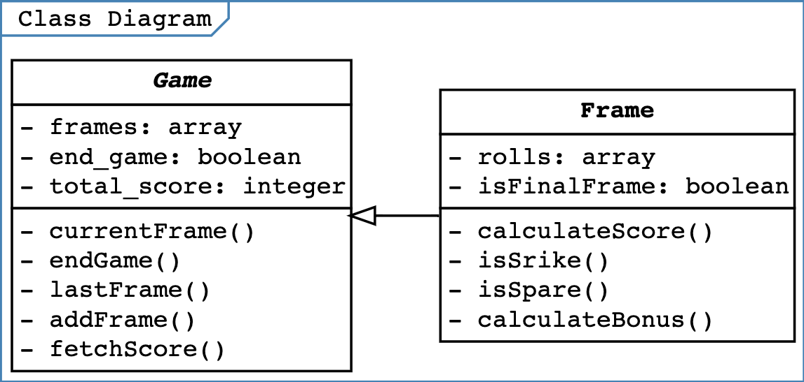

Bowling Challenge
=================

## The task

Create a virtual scoring card to calculate the score in a game of 10 pin bowling.

## Running tests

```
npm test
```

### User stories

To help structure my approach I created several user stories from the challenge specifications. This was mainly to help with directing my feature and unit tests. I also followed advice from Uncle Bob on his implementation of the Bowling Kata.

#### Story 1

```
As a bowler,
so I can play an accurate game of bowling,
I would like to calculate my score for a gutter game
```

#### Story 2
```
As a bowler,
so I can play an accurate game of bowling,
I would like to be able to calculate my score when I knock down only 1 pin
```

#### Story 3

```
As a bowler,
so I can play an accurate game of bowling,
I would like to be able to calculate my score when I get a spare
```

#### Story 4
```
As a bowler,
so I can play an accurate game of bowling,
I would like to be able to calculate my score when I get a strike
```

#### Story 5
```
As a bowler,
so I can play an accurate game of bowling,
I would like to be able to calculate my score for a perfect game
```

### Future additions

At the point where I began to add the calculations for the spare, I considered extracting frame into a separate class to deal with the calculations independently from game. Separating out frame into a separate class would have resulted in cleaner code which would be much easier to refactor down the line. It would also avoid the overuse of nesting functions.

In the future, when attempting this challenge again I would create 2 separate classes for:

Game - responsible for keeping track of the frames.

Frame  - responsible for working out its score, including deciding if it had achieved a spare or a strike bonus.



### Next steps

* Adding a user interface
* Implementing Express to handle get and post requests
* Extract functional code into multiple classes
* Adding additional tests for edge cases

## Bowling — how does it work?

### Strikes

The player has a strike if he knocks down all 10 pins with the first roll in a frame. The frame ends immediately (since there are no pins left for a second roll). The bonus for that frame is the number of pins knocked down by the next two rolls. That would be the next frame, unless the player rolls another strike.

### Spares

The player has a spare if the knocks down all 10 pins with the two rolls of a frame. The bonus for that frame is the number of pins knocked down by the next roll (first roll of next frame).

### 10th frame

If the player rolls a strike or spare in the 10th frame they can roll the additional balls for the bonus. But they can never roll more than 3 balls in the 10th frame. The additional rolls only count for the bonus not for the regular frame count.

    10, 10, 10 in the 10th frame gives 30 points (10 points for the regular first strike and 20 points for the bonus).
    1, 9, 10 in the 10th frame gives 20 points (10 points for the regular spare and 10 points for the bonus).

### Gutter game

A Gutter Game is when the player never hits a pin (20 zero scores).

### Perfect game

A Perfect Game is when the player rolls 12 strikes (10 regular strikes and 2 strikes for the bonus in the 10th frame). The Perfect Game scores 300 points.
