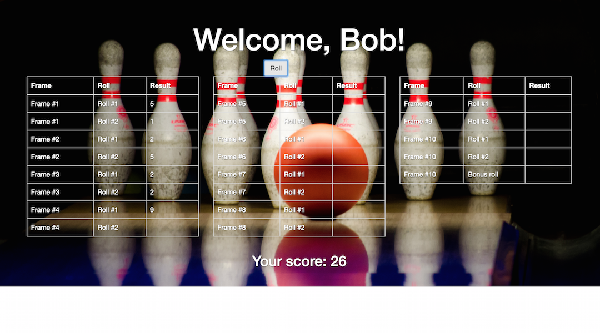
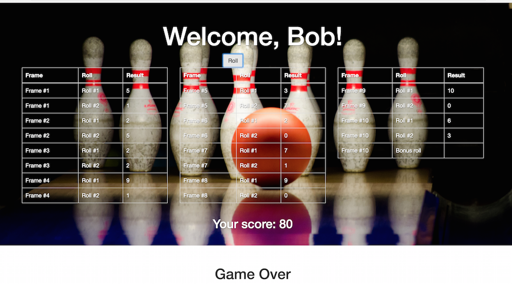

Bowling Challenge
=================

Description:
-----

The program counts and sums the scores of a bowling game for one player (in JavaScript).

A bowling game consists of 10 frames in which the player attempts to knock down the 10 pins. In every frame the player can roll one or two times. The actual number depends on strikes and spares. The score of a frame is the number of knocked down pins plus bonuses for strikes and spares. After every frame the 10 pins are reset.

The program provides the following functions:
------
* Handles strikes: the player has a strike if he/she knocks down all 10 pins with the first roll in a frame. The frame ends immediately (since there are no pins left for a second roll). The bonus for that frame is the number of pins knocked down by the next two rolls. That would be the next frame, unless the player rolls another strike.
* Handles spares: the player has a spare if he/she knocks down all 10 pins with the two rolls of a frame. The bonus for that frame is the number of pins knocked down by the next roll (first roll of next frame).
* Handles 10th frame: if the player rolls a strike or spare in the 10th frame they can roll the additional balls for the bonus. But they can never roll more than 3 balls in the 10th frame. The additional rolls only count for the bonus not for the regular frame count.
* Gutter Game: a Gutter Game is when the player never hits a pin (20 times zero scores).
* Perfect Game: a Perfect Game is when the player rolls 12 strikes (10 regular strikes and 2 strikes for the bonus in the 10th frame). The Perfect Game scores 300 points.

### Screenshots of main functions
#### Start screen (add name)


#### Play game


#### End of the game


### Instructions for how to run the program

```
$ git clone https://github.com/peter-miklos/bowling-challenge
$ cd bowling-challenge
$ open index.html
```

### Instructions for how to run the test cases

```
$ git clone https://github.com/peter-miklos/bowling-challenge
$ cd bowling-challenge
$ open SpecRunner.html
```

Tests
-------
### Unit tests
The following test cases pass the unit test:
```
Bowling
  stores player name
    stores the player's name at start
  play game
    if a frame is finished, the frameNumber is increased in the following frame
    plays the gutter game
    plays perfect game in case of strikes in each cases
    plays all the 10 frames with 2 rolls if always 3 pins knocked down
    collects 60 scores with 2 rolls if always 3 pins knocked down
    raises error if there is no more frame left to play with
    plays 21 rolls with spare in each frame
  handle bonus scores
    adds bonus scores in case of a strike
    adds bonus scores in case of spares, in 2 frames
    adds bonus scores in case of spares, in 6 frames

Frame
  roll the ball
    rolls the ball twice in a frame with less than 10 pins down
    finishes the frame if the first roll is a strike
  handle the 10th frame
    lets user rolls 3 times in the 10th frame
```
