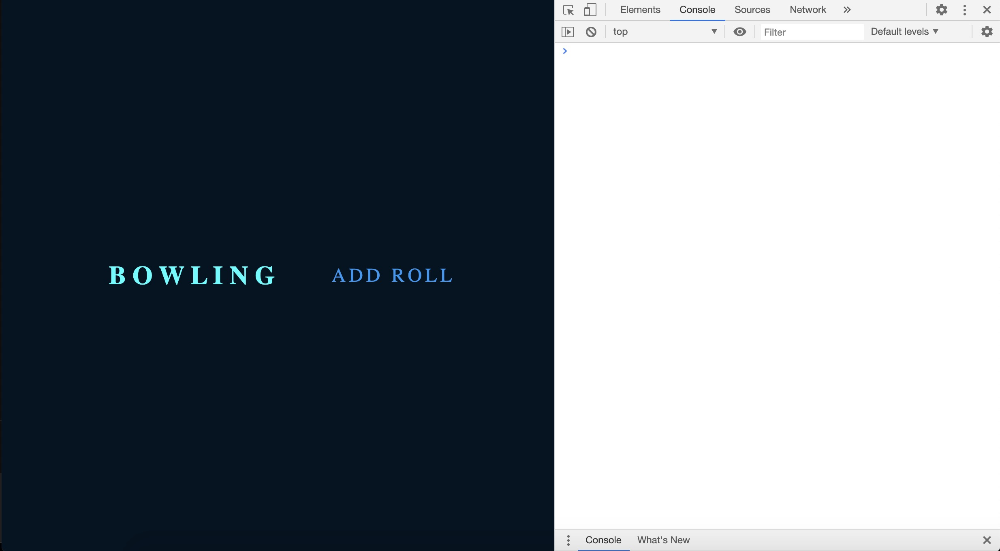
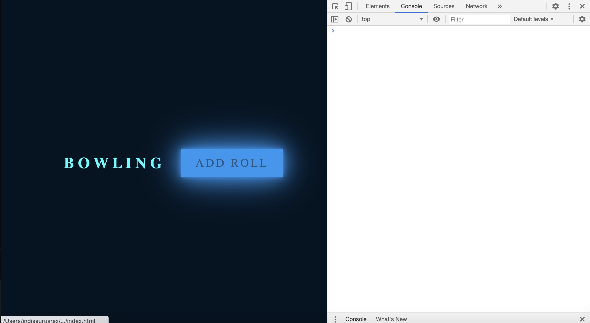
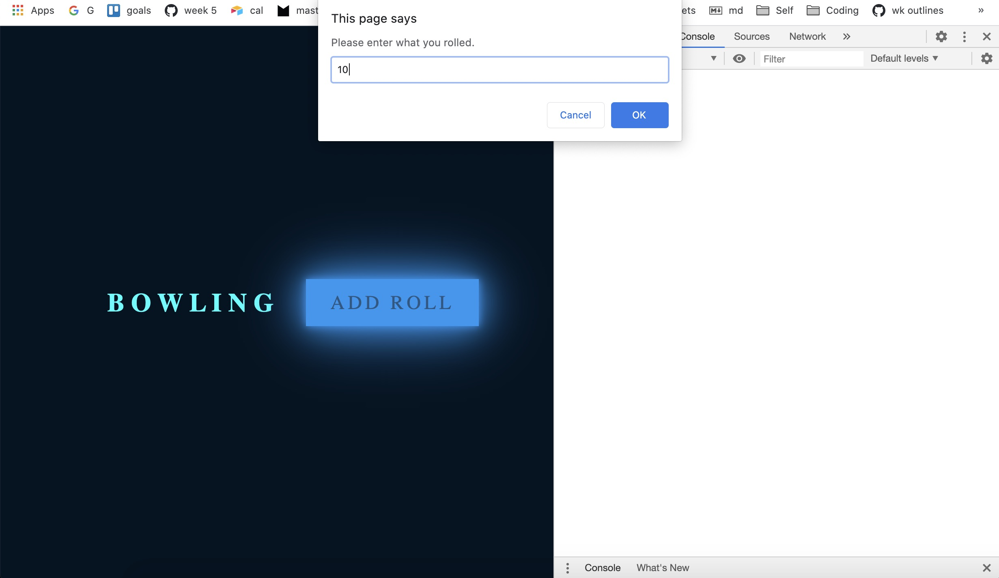
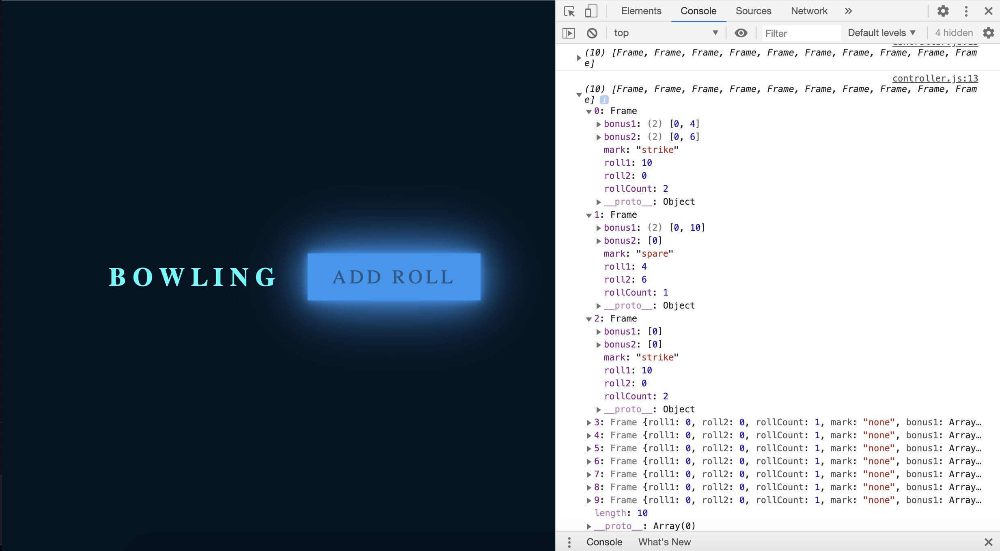

Bowling Challenge
=================
## The Task
Count and sum the scores of a bowling game for one player (in JavaScript).

A bowling game consists of 10 frames in which the player tries to knock down the 10 pins. In every frame the player can roll one or two times. The actual number depends on strikes and spares. The score of a frame is the number of knocked down pins plus bonuses for strikes and spares. After every frame the 10 pins are reset.

## User stories:
Must have

As a bowler 
So that I can see what score I have
I want to input my scores for each frame into a scorecard
_DONE_

As a keen bowler
So that I don’t have to do the maths
I want the scorecard to add my bonus points for me
_DONE_

As a super duper bowler
So that I know how I did
I want my score to be displayed to me a the end of the game

Nice to have 

As a time-pressed, cool-guy bowler
So that I can prove how cool I am
I want to put marks into my scorecard instead of numbers

As a nosey bowler
So that I can see what’s what throughout the game
I want to see my scorecard update after each roll is input

## Technologies used: 
[Jasmine](https://jasmine.github.io/pages/getting_started.html) for testing
node.js so that I could download [ES lint](https://eslint.org/docs/user-guide/getting-started)

## How to set up: 
run index.html in browser
main code in index.js

## How it works:
Add roll scores using the add roll button, view the outcome using Javascript Console, expand the frames to see the scores and marks in place. 

You can see the overall score by doing scorecard.

## Screenshots:

## Tutorials and help: 
[Neon light button animation effects on hover](https://www.youtube.com/watch?v=ex7jGbyFgpA)
[Build a simple JS app the MVC way](https://www.awwwards.com/build-a-simple-javascript-app-the-mvc-way.html) 
  This didn't run correctly. Moving on to: 
[Model View Controller in Javascript](https://alexatnet.com/model-view-controller-mvc-in-javascript/)
  This also didn't run easily when I copied it to my computer, although the live render works well, so on to: 
[getting started with the web](https://developer.mozilla.org/en-US/docs/Learn/Getting_started_with_the_web/JavaScript_basics)
[w3schools](https://www.w3schools.com/) - many, many pages

## What else
Well, the logic took me most of the time. If you run the program using the JS console only, it runs well counting scores correctly for a perfect game and all other options. 

The HTML / CSS / MVC has somewhat eluded me in the timeframe available, but I hope to complete that in the future. 

All work was TDD until the HTML got involved, so controller.js, index.html and style.css are not tested. Tests are in Jasmine. I used ES Lint with the AirBnB style guide on the .js files. 

Refactoring was tackled a little, but I haven't check for strict SRP, and I'm not sure I've got everything as spic and span as it could be. 

Improvements to be made: 
1. Display the game score at the end of the game or by clicking a button
2. Display the scores for each roll/frame as you add them
3. Display the frame scores as marks when appropriate
4. Add functionality to type in / for spare and X for strike when entering scores
5. Make flashing badges for strike, spare and the title 'bowling'
6. Don't let users enter numbers that make a frame add up to over 10 points 

## I don't understand 
What these errors really mean on ES Lint 
_for index.js_
'Card' is defined but never used
'Frame' is not defined 
_for controller.js_
  1:23   error    'Card' is not defined         no-undef
  5:21   warning  Unexpected prompt             no-alert
  10:23  error    Missing radix parameter       radix
  13:3   warning  Unexpected console statement  no-console
  16:18  warning  Unexpected unnamed function   func-names

