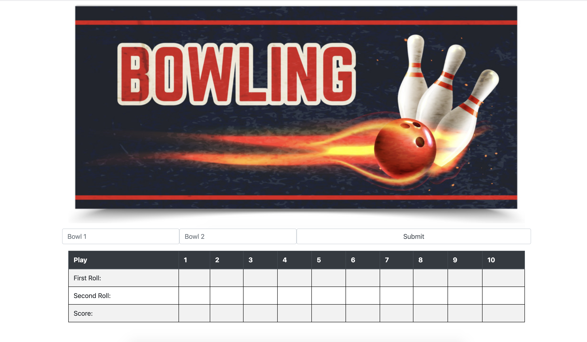

# Bowling challenge

*[Exercise instructions](instructions.md)*  

## Installation

1. Clone the repo
2. Open `index.html` from the project root
3. Enter your scores in the form

You can play with the scorer directly by opening the console in Chrome or Firefox and running `game = new Game ()`. It responds to:
- `.roll()` to add rolls
- `.runningTotals()` returns an array of the running totals of scored frames
- `.score()` returns the current total score
- `.isComplete()` returns a boolean representing the game's status

## Tests

Open `SpecRunner.html` from the project root.

Alternatively, run `npm install` in the project root, then you can run the tests in the terminal by running `npm test` (I think).

If you run `npm install` you should also be able to check test coverage by running `node_modules/.bin/nyc npm test`.

## Technology

- JavaScript
- Jasmine (browser and command line versions)
- npm:
    - `eslint` with [standard style guide](https://standardjs.com/)
    - `eslint-plugin-jasmine`
    - `jasmine` - command line jasmine
    - `jasmine-terminal-reporter` - enhanced jasmine test output in the terminal
    - `nyc` - test coverage. run with `node_modules/.bin/nyc jasmine`
- Travis CI

## Reflections

### First attempts

I had a few attempts at implementing the logic for this.

[Attempt 1](attempt-01/) was last weekend. I tried to extract a frame object, and ran into trouble, particularly when trying to ensure independence of my objects. I also got my acceptance and unit tests mixed up, so those layers of testing were not well defined.

So this weekend I made [attempt 2](attempt-02/). I planned the logic more carefully this time, thinking that my experience from the previous weekend would allow me to complete the task without getting into so much difficulty. However, I ran into serious problems again when I tried to make my test for `Game` and `Frame` independent. I ended up having to mock so much behaviour of `Frame` in my `GameSpec.js` that the tests became very complex. This indicated to me that separating `Game` and `Frame` was not a good idea as the scoring logic was too much divided between the two, without a clear separation of responsibilities.

Attempt 2 was quite painful, so just as an experiment I decded to try and implement it the same way but without test driving it. That was [attempt 3](attempt-03-no-tdd/). This was surprisingly easy.

[Attempt 4](attempt-04-no-tdd) was another attempt without test-driving, to try out a different approach to the logic. In this attempt I kept a record of the last two rolls, recording whether the last two rolls were strikes or whether the last rolls was a spare, and updating this as the game progressed. This made the scoring logic very easy. I put all the code in one file, with no attempt to separate responsibilities.

### Main attempt

For attempt 5 (the main one in the root of this repo) I fully test-drove my game logic again. This time I used another (3rd?) approach. I separated out `Scorer` and `Game` objects. The Scorer contains a pointer  `_scoringIndex` which points to the most recent ball which has not been scored. After every roll it checks to see if enough rolls have been made to score the frame to which it is pointing. If they have then it scores as many frames as it can. If not it waits. Doing it like this allowed me to not keep track of what frame we were on at all, which seemed quite clever at the time.

#### What went well

Attempt 5 was far more succesful than my previous attempts. I followed a TDD process with separate acceptance and unit test layers, iterating red->green->refactor without ever getting stuck or finding the program or tests too complicated to manage.

#### What went badly

I got so into thinking about the scoring logic I semi-consciously decided I wasn't going to make an interface. But then on Sunday night I decided that I really wanted to make an interface. At this point I discovered that I hadn't exposed in my `Game` all the information I needed, so in a rush I ended up shamelessly hacking up a bunch of the game logic again in my `index.html`, like counting frames, validating input, identifying strikes and spares... It's not pretty, and I'm not proud of it, but at least it's working. Please be kind with me, gentle Code Reviewer. It would have been *much* better to properly test-drive this logic in my `Game` and `Scorer` objects.

My `Game` object now only does one thing, which is deciding whether the game is complete, so it's hard to justify its existence. But if I was to continue with this project I would add functions into `Game` to help the interface, like returning what ball and frame we're on, which I think would make the delegation of responsibilities more appropriate.

In retrospect I think the logic in my attempt 4 is probably clearer to follow. The `._tryUpdatingScores()` function in `Scorer` is pretty complex. Some improvement is probably possible with further refactoring, but if I was going to do an attempt 6 (😱) I might start from the attempt 4-type logic.

Also I've got way too many tests I think. They need to be refactored and redundant test removed.

Just noticed... the validation on the last frame is wrong. If you roll a strike and then roll less than 10, the pins are not replaced. So you should be able to roll "X 9 /" in the last frame, but not "X 9 X". So that is just like what I noted elsewhere, that the 10th frame is like a 10th frame with an extra 11th frame which isn't scored itself, but only contributes to the score of the 10th frame.

## Code review

### Outside in usually better than inside out

Start by writing a simple feature test, and use that to spin up your unit tests. Doing it this way will help you write the smallest amount of code to implement the feature. Starting from the inside out, i.e. writing unit tests first, can lead you to write too much code, too many methods, which can be brittle and need to be deleted or rewritten later.

See [BDD pill])(https://github.com/makersacademy/course/blob/master/pills/bdd_cycle.md).

See also [Uncle Bob's test-driven bowling game kata](http://butunclebob.com/ArticleS.UncleBob.TheBowlingGameKata).
