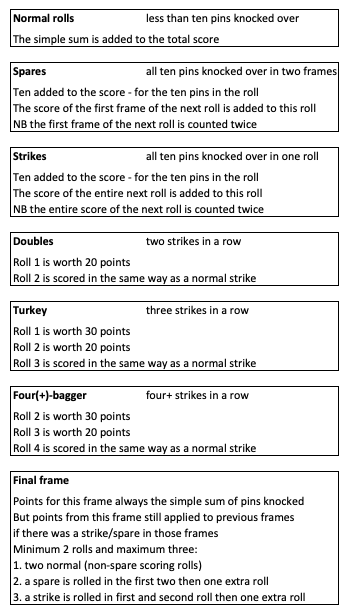

Bowling Challenge
=================

This is my solution to [this](https://github.com/makersacademy/bowling-challenge) challenge.  
I have also created a version of this in [Ruby](https://github.com/AdamusBG/bowling-challenge-ruby).  

## Scoring in Bowling  

Bowling consists of ten frames (AKA turns) in which (usually) two rolls are made to try and knock over pins.  
Scoring is not a matter of just adding up the knocked over pins.  
There are special rules to consider when:  

A spare is rolled (all ten pins in two rolls)  
A strike is rolled (all ten pins in one roll)  
A double is rolled (two strikes in a row)  
A turkey is rolled (three strikes in a row)  
A four-bagger is rolled (four strikes in a row) - also five-bagger, six-bagger and so on  
In the final frame  

### Scoring breakdown

### Example game

