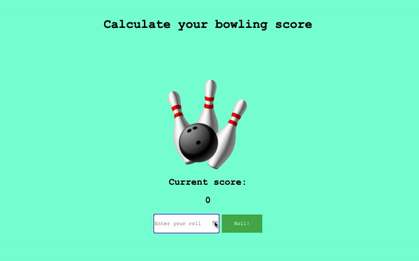

Bowling Score Calculator 🎳
========================

[](https://travis-ci.com/AJ8GH/bowling-score-calculator) [](https://coveralls.io/github/AJ8GH/bowling-score-calculator?branch=master) [](https://codeclimate.com/github/AJ8GH/bowling-challenge/maintainability)  [](https://bettercodehub.com/)

Bowling score tracker written in JavaScript

[Deployed App](#deployed-app) | [Dependencies](#dependencies) | [Getting Started](#getting-started) | [Running Tests](#runnning-tests) | [Objectives](#objectives) | [Design](#design) | [Usage](#usage) | [User Stories](#user-stories) | [Bowling Rules](#bowling--how-does-it-work)

## Example usage:

***A perfect game*** 🙂



***A gutter game*** 🙁


## Deployed app

You can use the deployed app [here](https://bowling-score-tracker.surge.sh/)

## Dependencies
- `"coveralls": "^3.1.0"`
- `"eslint": "^7.21.0"`
- `"eslint-config-airbnb-base": "^14.2.1"`
- `"eslint-plugin-import": "^2.22.1"`
- `"jasmine": "^3.6.4"`
- `"karma": "^6.2.0"`
- `"karma-chrome-launcher": "^3.1.0"`
- `"karma-cli": "^2.0.0"`
- `"karma-coverage": "^2.0.3"`
- `"karma-coveralls": "^2.1.0"`
- `"karma-jasmine": "^4.0.1"`
- `"nyc": "^15.1.0"`

## Getting Started

Start by cloning this repository

```shell
git clone git@github.com:AJ8GH/bowling-challenge.git
```

Ensure you have Node installed, by running `node -v`. If not you can download it [here](https://nodejs.org/en/download/).

Navigate to the root of the project and install the dependencies.

```shell
cd bowling-score-tracker
npm install
```

## Runnning tests:

The test suite comprises of 3 types of test:
- Unit tests, found in `spec/models/`
- Features tests, found in `spec/features/`
- Integration tests, found in `spec/integration/`

Unit and feature tests use Jasmine, whilst the intgration tests use Cypress.

### Jasmine
To run the Jasmine unit and features tests from the terminal, run `npm test`

To run these tests in the browser, open `public/js/spec/SpecRunner.html` in the browser, which also gives an overview of the public interfaces and functionality of the app.

### Cypress
To run the Cypress integration tests, first start the server with `npm start`. You should get confirmation in the terminal that it is listening on local host 3000

Once the server is running you can run Cypress from the terminal with `npm run cy`

Alternatively you can open the Cypress GUI and see it running through the app, with `npx cypress open`

## Objectives

The purpose of this project was to build a score calculator for 10 pin bowling. Bowling is a deceptively complex game and the goal here was to build a working app with high code quality, using test driven development. Once the game logic was complete I used jQuery, HTML and CSS to create a responsive UI and deployed the app through surge. I used Travis CI and Coveralls to automate testing and coverage, and ESLint, CodeClimate and Better Code to ensure high code quality and maintainability.

### Testing:
- I used Jasmine as my testing framework for unit and feature tests.
- For integration testing I used Cypress
- The Jasmine feature specs focus on running through an entire bowling game, to ensure the entire program functions as expected and that the classes are working together correctly
- The Cypress integration tests interact with the app in the browser as a user would and ensure the interface behaves as expected
- I built a simple server using Express, in `server.js`, to serve a version of that app that Cypress can run tests against
- The unit specs test individual functions and classes in isolation. I created spy objects to mock class dependencies in the tests
- In GameSpec.js I used dependency injection to mock the ScoreBoard class and ensure the classes were tested in isolation:

```js
// Dependency injection in Game.js
class Game {
  constructor (scoreBoard = new ScoreBoard()) {
    this.scoreBoard = scoreBoard
  // ...

// Mocking the implementation of ScoreBoard in GameSpec.js
describe('#totalScore()', () => {
  it('calls totalScore() on scoreBoard', () => {
    const scoreBoard = { totalScore: () => {} }
    const game = new Game(scoreBoard)

    spyOn(scoreBoard, 'totalScore')
    game.totalScore()

    expect(scoreBoard.totalScore).toHaveBeenCalledTimes(1)
  })
})
```

- I used Karma and ChromeHeadless to enable running the Jasmine tests from the terminal. This then enabled me to Implement CI using Travis.
- Using NYC and Coveralls I then set up automated test coverage reports for the codebase.
- Note - NYC currently fails to report coverage when running tests locally, however the stats are accurately sent to coveralls, reporting 98% test coverage.

### Edge cases:
- Guard conditions are implemented to prevent invalid inputs. Errors will be thrown when 'empty' rolls are entered, as well as if the roll is greater than the number of remaining pins for the frame.
- An error is also thrown when attempting to input a roll when the game is over.

### Code Quality:
- I focused on building encapsulated classes with clear responsibilities:
- For linting I used ESLint to enforce the standard JS style
- I used CodeClimate and Better Code Hub to check the repository for code smells and technical debt, with both at maximum scores.

### Workflow:
- Git: small, consistent commits at green and refactoring stages, using clear and communicative commit messages
- Agile: creating user stories from a fuzzy specification, then test driving and implementing the features

### Documentation:
- My aim was to create comprehensive and clear documentation, to ensure other developers could easily use and contribute to the project

### Design:
- Private functions are prefixed with underscores, e.g. `frame._isStrike()`
- Predicate functions which return boolean values begin with the word 'is', e.g. `game.isOver()`
- **Game class**: Responsible for tracking the frames and the progress of the game
- **Frame class**: Responsible for tracking its rolls, score and bonuses
- **ScoreBoard class**: Responsible for calculating and returning the scores
- **Interface**: Built using js and jQuery, responsible for updating the view after each roll input

## Usage

Public Interfaces:

**Game**
- `#addRoll()` -Takes integer argument between 0 and 10. checks validity of roll and adds the roll to the current frame. Throws error if the game is over or if an invalid input is entered
- `isOver()` - Returns true if game is over, false if it's not
- `#totalScore()` - Uses ScoreBoard to return the total score of the game
- `#runningTotal()` - Uses ScoreBoard to return the running total for each frame so far in the game

**Frame**
- `#addRoll()` - Takes integer argument, adds roll to `this.rolls` array
- `#score()` - Returns the total score of the frame instance
- `#makeFinal()` - sets the `this.isFinal` property to true, to adjust logic for the final frame
- `#addBonus()` - Adds bonus score if needed (frames are aware of how many bonuses they need)
- `#isOver()` - returns true if frame is over, false if it's not

**ScoreBoard**
- `#calculateTotalScore()` - Returns the sum of the scores of all frames so far
- `#calculateRunningTotal()` - Returns the running total for each frame. e.g. after 3 strikes, it would return `[30, 50, 60]`. after 4 frames with a score of 5 each, it would return `[5, 10, 15, 20]`

### Sequence Diagrams

#### Spare Bonus


#### Strike Bonus


### User Stories
```
As a bowler,
So that I can track my score while I play,
I want to be able to record a score from 1 roll.

As a bowler,
So that I can track my total score easily throughout a game,
I want my scores to automatically accumlate as I enter them.

As a bowler,
So that my score is accurate and my experience is enjoyable,
I want my bonuses to be added to frames automatically.

As a bowler,
So that I can get extra points,
I want the final frame to allow a bonus roll if I get a spare.

As a bowler,
So that I can bowl a perfect game,
I want the final frame to allow 2 bonus rolls if I get a strike.

As a bowler,
So that my game flows and I can focus on the bowling,
I want the game to automatically register when it is the final frame.
```

## Bowling — how does it work?

### Strikes

The player has a strike if they knock down all 10 pins with the first roll in a frame. The frame ends immediately (since there are no pins left for a second roll). The bonus for that frame is the number of pins knocked down by the next two rolls. That would be the next frame, unless the player rolls another strike.

### Spares

The player has a spare if they knock down all 10 pins with the two rolls of a frame. The bonus for that frame is the number of pins knocked down by the next roll (first roll of next frame).

### 10th frame

If the player rolls a strike or spare in the 10th frame they can roll the additional balls for the bonus. But they can never roll more than 3 balls in the 10th frame. The additional rolls only count for the bonus not for the regular frame count.

    10, 10, 10 in the 10th frame gives 30 points (10 points for the regular first strike and 20 points for the bonus).
    1, 9, 10 in the 10th frame gives 20 points (10 points for the regular spare and 10 points for the bonus).

### Gutter Game

A Gutter Game is when the player never hits a pin (20 zero scores).

### Perfect Game

A Perfect Game is when the player rolls 12 strikes (10 regular strikes and 2 strikes for the bonus in the 10th frame). The Perfect Game scores 300 points.
