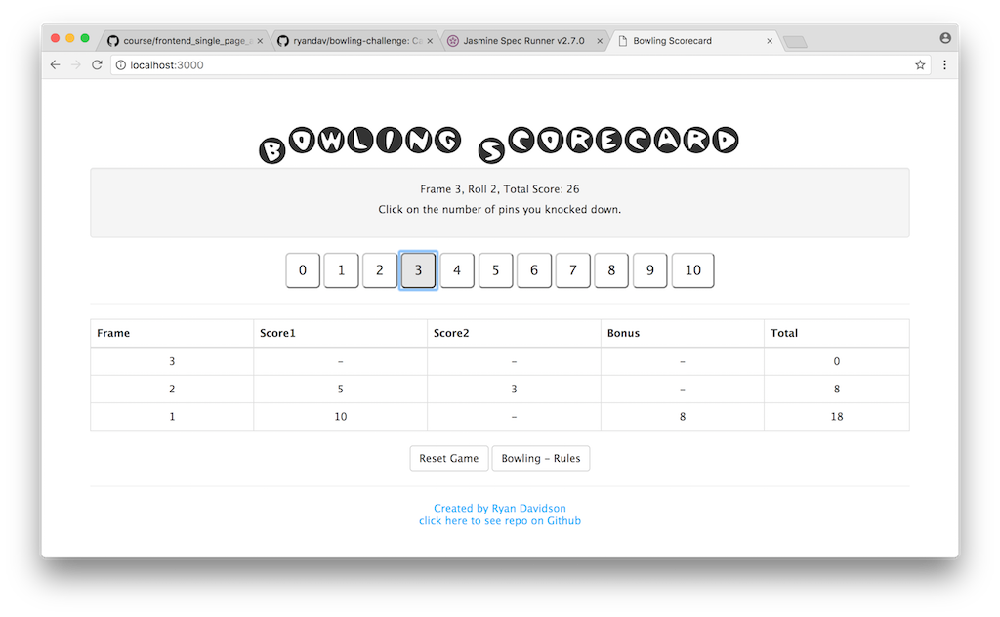

Bowling Challenge
=================

Makers Academy week 5 weekend challenge.



## The Task

Count and sum the scores of a bowling game for one player (in JavaScript).

A bowling game consists of 10 frames in which the player tries to knock down the 10 pins. In every frame the player can roll one or two times. The actual number depends on strikes and spares. The score of a frame is the number of knocked down pins plus bonuses for strikes and spares. After every frame the 10 pins are reset.

Full instructions and rules of bowling can be read in [INSTRUCTIONS.md](INSTRUCTIONS.md).

## Technologies
- HTML, CSS and Bootstrap for display
- JavaScript for BowlingScorecard, Frame and Display functions
- JQuery for interface.js controller.
- Deployed as a node and express app on heroku.
- Jasmine for test framework

## Domain Models

```dm
Page(click on score button) ---> Interface(sends score to) ---> BowlingScorecard(add score to) ---> Frame(add score)
BowlingScorecard(add bonus to) ---> Frame(add bonus)
Page <-- Display(update info) <-- Interface <-- BowlingScorecard
```

Frame responsibilities: to keep track of the score for the frame and add scores and bonus according to bowling logic. It is used by the BowlingScorecard function.

|Frame | Responsibilities |
|--|--|
| Variables: |  |
| score1 | holds score for first bowl |
| score2 | holds score for second bowl |
| bonus | holds score for bonus |
| Methods: | |
| addScore() | adds a score to score 1 or score2 depending if it is the first or second bowl|
| isComplete() | returns true if the frame has a score for first and second bowl or is a strike or spare |
| isStrike() | returns true if the frame is a strike |
| isSpare() | returns true if the frame is a spare |
| addBonus(score) | adds a bonus score if the frame is a strike or spare, one score for spare and two for strike |
| score() | returns total score for the frame |

Frame responsibilities: to keep track of the score for the frame and add scores and bonus according to bowling logic. It is used by the BowlingScorecard function.

| BowlingScorecard | Responsibilities |
|-|-|
| Variables: | |
| _frames | contains the frames in an array |
| Methods: | |
| score() | returns a current total score |
| isGameComplete() | returns true if the game is complete |
| pinsAvailableToHit() | returns the amount of pins available, used by the interface for displaying score buttons for the current bowl
| updateFrames | this adds a frame if the current frame is less than 10 and the frame is complete |
| frameNumber() | returns the current frame number |
| frame() | returns the current frame |
| isBonusRoll() | returns true if it is the last frame and the third bowl |
| checkBonus(score) | checks the last 3 frames to see if they need a bonus added, score is passed to the frame.addBonus(score) method |
| addScore(score) | passes the score to the frame.addScore(score) method, also calls checkBonus() and updateFrames() |

Display responsibilities: to return info from the bowlingScorecard instance to present in the html page. It is used by interface.js.

| Display | Responsibilities |
|-|-|
| scoreInfo(bowlingScorecard) | returns a string of the current roll and score |
| framesToHTMLTable(frames) | formats the frame data into an HTML table for the HTML page |
| gameInstructions(bowlingScorecard) | returns a string of to instruct the user how to play the game |

Interface responsibilities: uses JQuery to load the page info on start up, as well as the methods below...

| Interface | Responsibilities |
|-|-|
| updateDisplay | updates the instructions, score info and frames info on the html page |
| click on buttons with .score class | passes the score of the buttons clicked to the bowling scorecard and changes the status of score buttons to be available or disabled depending on current pins available to hit |
| reset | reloads the page for a new game |


## Instructions

Use the app online at [bowling-scorecard-app.herokuapp.com](https://bowling-scorecard-app.herokuapp.com/).

To use locally, first install npm, then in the terminal:
```
git clone git@github.com:ryandav/bowling-challenge.git
cd bowling-challenge
npm install
npm start
```

Then enter `localhost:3000` in your browser to play.

To run the tests: `open SpecRunner.html`. The using tests are in the `spec` folder and feature tests in the `spec/features` folder.

To use the app you click on the number of pins you score each bowl. Click on `Reset` to play again. Instructions can be ready by clicking on the `Bowling - Rules` button in the app.

## Code Review

[code review rubric](docs/review.md)
